Analysis of Bauer et al. (2023) bioRxiv: <br> Favourable Conservation
Status (FCS)
================
<b>Markus Bauer</b> <br>
<b>2025-07-11</b>

- [Preparation](#preparation)
- [Statistics](#statistics)
  - [Data exploration](#data-exploration)
    - [Graphs of raw data](#graphs-of-raw-data)
    - [Outliers, zero-inflation,
      transformations?](#outliers-zero-inflation-transformations)
  - [Models](#models)
    - [Load models (BARG 6.G)](#load-models-barg-6g)
    - [Model specifications (BARG 1.D)](#model-specifications-barg-1d)
    - [Preparation for analysis](#preparation-for-analysis)
    - [Priors (BARG 1.D/E)](#priors-barg-1de)
  - [Model check](#model-check)
    - [Check computation (MCMC diagnostics, BARG
      2.B/C)](#check-computation-mcmc-diagnostics-barg-2bc)
    - [Posterior predictive check (BARG
      3.A)](#posterior-predictive-check-barg-3a)
    - [DHARMa](#dharma)
  - [Model comparison](#model-comparison)
    - [Conditional <i>R</i><sup>2</sup> values](#conditional-r2-values)
    - [Marginal <i>R</i><sup>2</sup> values](#marginal-r2-values)
    - [Bayes factor (BARG 3.C)](#bayes-factor-barg-3c)
  - [Posterior distributions (BARG
    3.B)](#posterior-distributions-barg-3b)
    - [Forest plot of effect sizes (BARG
      3.B/5.B)](#forest-plot-of-effect-sizes-barg-3b5b)
    - [Effect sizes](#effect-sizes)
- [Session info (BARG 2.A/6.A/6.B)](#session-info-barg-2a6a6b)

<br/> <br/> <b>Markus Bauer</b>

Technichal University of Munich, TUM School of Life Sciences, Chair of
Restoration Ecology, Emil-Ramann-Straße 6, 85354 Freising, Germany

<markus1.bauer@tum.de>

ORCiD ID: [0000-0001-5372-4174](https://orcid.org/0000-0001-5372-4174)
<br> [Google
Scholar](https://scholar.google.de/citations?user=oHhmOkkAAAAJ&hl=de&oi=ao)
<br> GitHub: [markus1bauer](https://github.com/markus1bauer)

To compare different models, you only have to change the models in
section `Load models`

# Preparation

Favourable Conservation Status (FCS) sensu Helm et al. (2015) Divers
Distrib [DOI: 10.1111/ddi.12285](https://doi.org/10.1111/ddi.12285)

Bayesian analysis motivated by Applestein et al. (2021) Restor Ecol
[DOI: 10.1111/rec.13596](https://doi.org/10.1111/rec.13596)

Analysis guided by <br> <b>BARG</b> (Bayesian Analysis Reporting
Guidelines): Kruschke (2021) Nat Hum Behav [DOI:
10.1038/s41562-021-01177-7](https://doi.org/10.1038/s41562-021-01177-7)
<br> Model check: Gabry et al. (2019) J R Stat Soc A Stat [DOI:
10.1111/rssa.12378](https://doi.org/10.1111/rssa.12378) <br> Priors:
Lemoine (2019) Oikos [DOI:
10.1111/oik.05985](https://doi.org/10.1111/oik.05985) <br> Model check:
Deapoli & Schoot (2017) Psychol Methods [DOI:
10.1037/met0000065](https://doi.org/10.1037/met0000065)

#### Packages (BARG 2.A)

``` r
library(here)
library(tidyverse)
library(ggbeeswarm)
library(patchwork)
library(brms)
#remotes::install_github("Pakillo/DHARMa.helpers")
library(DHARMa.helpers)
library(bayesplot)
library(loo)
library(emmeans)
```

#### Load data

``` r
sites <- read_csv(
  here("data", "processed", "data_processed_sites.csv"),
  col_names = TRUE, na = c("na", "NA", ""), col_types = cols(
    .default = "?",
    id_plot_year = "f",
    id_plot = "f",
    site = col_factor(
      levels = c("NW Station", "Lux Arbor", "SW Station"), ordered = FALSE
    ),
    year = "f",
    seeding_time = col_factor(
      levels = c("unseeded", "fall", "spring"), ordered = FALSE
      ),
    herbicide = col_factor(levels = c("0", "1"), ordered = FALSE),
    seeded_pool = col_factor(
      levels = c("0", "6", "12", "18", "33"), ordered = TRUE
      ),
    treatment_id = "f",
    treatment_description = "c",
    richness_type = "f"
  )
) %>%
  filter(
    year %in% c("2015", "2016", "2017", "2018"),
    richness_type == "seeded_richness",
    !(treatment_id %in% c("2", "4"))
  ) %>%
  select(
    id_plot_year, id_plot, site, year, herbicide, seeding_time, seeded_pool,
    richness_1qm, richness_25qm, treatment_id
    ) %>%
  mutate(y = richness_1qm + richness_25qm)
sites
```

    ## # A tibble: 575 × 11
    ##    id_plot_year id_plot site      year  herbicide seeding_time seeded_pool
    ##    <fct>        <fct>   <fct>     <fct> <fct>     <fct>        <ord>      
    ##  1 Lux_10_2015  Lux_10  Lux Arbor 2015  1         spring       6          
    ##  2 Lux_10_2016  Lux_10  Lux Arbor 2016  1         spring       6          
    ##  3 Lux_10_2017  Lux_10  Lux Arbor 2017  1         spring       6          
    ##  4 Lux_10_2018  Lux_10  Lux Arbor 2018  1         spring       6          
    ##  5 Lux_11_2015  Lux_11  Lux Arbor 2015  1         spring       6          
    ##  6 Lux_11_2016  Lux_11  Lux Arbor 2016  1         spring       6          
    ##  7 Lux_11_2017  Lux_11  Lux Arbor 2017  1         spring       6          
    ##  8 Lux_11_2018  Lux_11  Lux Arbor 2018  1         spring       6          
    ##  9 Lux_12_2015  Lux_12  Lux Arbor 2015  0         fall         33         
    ## 10 Lux_12_2016  Lux_12  Lux Arbor 2016  0         fall         33         
    ## # ℹ 565 more rows
    ## # ℹ 4 more variables: richness_1qm <dbl>, richness_25qm <dbl>,
    ## #   treatment_id <fct>, y <dbl>

# Statistics

## Data exploration

### Graphs of raw data

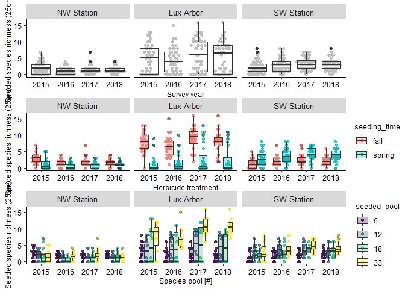<!-- -->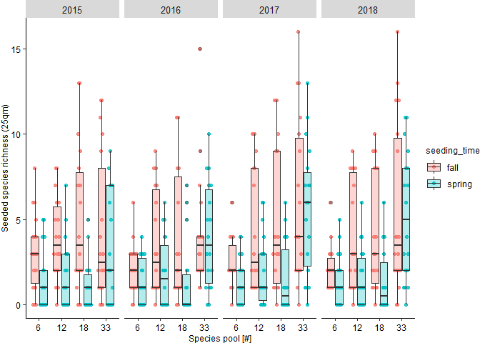<!-- -->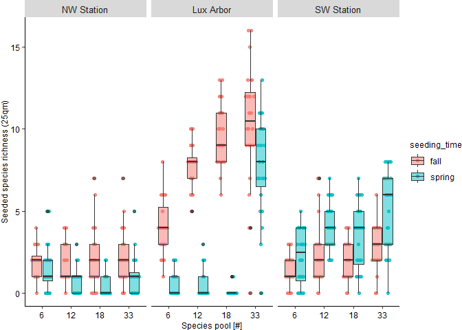<!-- -->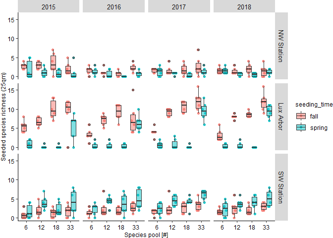<!-- -->

### Outliers, zero-inflation, transformations?

    ## # A tibble: 12 × 3
    ##    site       year      n
    ##    <fct>      <fct> <int>
    ##  1 NW Station 2015     48
    ##  2 NW Station 2016     48
    ##  3 NW Station 2017     48
    ##  4 NW Station 2018     48
    ##  5 Lux Arbor  2015     47
    ##  6 Lux Arbor  2016     48
    ##  7 Lux Arbor  2017     48
    ##  8 Lux Arbor  2018     48
    ##  9 SW Station 2015     48
    ## 10 SW Station 2016     48
    ## 11 SW Station 2017     48
    ## 12 SW Station 2018     48

    ## # A tibble: 4 × 2
    ##   seeded_pool     n
    ##   <ord>       <int>
    ## 1 6             144
    ## 2 12            144
    ## 3 18            144
    ## 4 33            143

    ## # A tibble: 2 × 2
    ##   seeding_time     n
    ##   <fct>        <int>
    ## 1 fall           288
    ## 2 spring         287

    ## # A tibble: 2 × 2
    ##   herbicide     n
    ##   <fct>     <int>
    ## 1 0           288
    ## 2 1           287

    ## Warning: Removed 121 rows containing non-finite outside the scale range
    ## (`stat_density()`).

<!-- -->

## Models

### Load models (BARG 6.G)

Only here you have to modify the script to compare other models

``` r
load(file = here("outputs", "models", "model_pool_1_flat.Rdata"))
load(file = here("outputs", "models", "model_pool_full.Rdata"))
# BARG 5.A/B/C
load(file = here("outputs", "models", "model_pool_1_flat.Rdata"))
load(file = here("outputs", "models", "model_pool_1_prior.Rdata"))
m_1 <- m1_flat
m_2 <- m_full
m_prior <- m1_prior
m_flat <- m1_flat
```

### Model specifications (BARG 1.D)

``` r
m_1$formula
## y ~ seeded_pool * herbicide * site + (1 | year)
m_2$formula
## y ~ seeded_pool * herbicide * site + (1 | year)
```

``` r
m_1$family
## 
## Family: poisson 
## Link function: log
m_2$family
## 
## Family: gaussian 
## Link function: identity
```

Markov Chain Monte Carlo (MCMC) method used with No-U-Turn Sampler
(NUTS) which is an extension of Hamiltonian Monte Carlo (HMC).

Amount of chains for MCMC

``` r
m_1$fit@sim$chains
## [1] 4
m_2$fit@sim$chains
## [1] 4
```

Total amount of iterations for MCMC

``` r
m_1$fit@sim$iter
## [1] 10000
m_2$fit@sim$iter
## [1] 10000
```

Amount of iterations before burn-in

``` r
m_1$fit@sim$warmup
## [1] 5000
m_2$fit@sim$warmup
## [1] 5000
```

Thinning rate

``` r
m_1$fit@sim$thin
## [1] 2
m_2$fit@sim$thin
## [1] 2
```

### Preparation for analysis

``` r
# Chose variables
variables <- c(
      "Intercept",
      "b_herbicide1",
      "b_seeded_pool.C",
      "b_seeded_pool.L",
      "b_seeded_pool.Q",
      "b_siteLuxArbor",
      "b_siteSWStation",
      "b_seeded_pool.L:herbicide1:siteLuxArbor"#,
      #"sd_year__Intercept"#,
      #"sigma"
    )
# Subset draws
posterior1 <- m_1 %>%
  posterior::as_draws() %>%
  posterior::subset_draws(variable = variables)
posterior2 <- m_2 %>%
  posterior::as_draws() %>%
  posterior::subset_draws(variable = variables)
posterior_prior <- m_prior %>%
  posterior::as_draws() %>%
  posterior::subset_draws(variable = variables)
posterior_flat <- m_flat %>%
  posterior::as_draws() %>%
  posterior::subset_draws(variable = variables)
# Long format of draws
hmc_diagnostics1 <- m_1 %>% brms::nuts_params()
hmc_diagnostics2 <- m_2 %>% brms::nuts_params()
y <- sites$y
# Posterior predictive distribution
yrep1 <- m_1 %>% brms::posterior_predict(draws = 500)
yrep2 <- m_2 %>% brms::posterior_predict(draws = 500)
yrep_prior <- m_prior %>% brms::posterior_predict(draws = 500)
# Summary statistics
draws1 <- m_1 %>%
  posterior::as_draws() %>%
  posterior::summarize_draws() %>%
  filter(str_starts(variable, "b_"))
draws2 <- m_2 %>%
  posterior::as_draws() %>%
  posterior::summarize_draws() %>%
  filter(str_starts(variable, "b_"))
```

### Priors (BARG 1.D/E)

#### Possible prior distributions

``` r
brms::get_prior(
  y ~ seeded_pool * herbicide * site + (1 | year), 
  data = sites
  )
```

    ##               prior     class                                   coef group resp
    ##              (flat)         b                                                  
    ##              (flat)         b                             herbicide1           
    ##              (flat)         b                herbicide1:siteLuxArbor           
    ##              (flat)         b               herbicide1:siteSWStation           
    ##              (flat)         b                          seeded_pool.C           
    ##              (flat)         b               seeded_pool.C:herbicide1           
    ##              (flat)         b  seeded_pool.C:herbicide1:siteLuxArbor           
    ##              (flat)         b seeded_pool.C:herbicide1:siteSWStation           
    ##              (flat)         b             seeded_pool.C:siteLuxArbor           
    ##              (flat)         b            seeded_pool.C:siteSWStation           
    ##              (flat)         b                          seeded_pool.L           
    ##              (flat)         b               seeded_pool.L:herbicide1           
    ##              (flat)         b  seeded_pool.L:herbicide1:siteLuxArbor           
    ##              (flat)         b seeded_pool.L:herbicide1:siteSWStation           
    ##              (flat)         b             seeded_pool.L:siteLuxArbor           
    ##              (flat)         b            seeded_pool.L:siteSWStation           
    ##              (flat)         b                          seeded_pool.Q           
    ##              (flat)         b               seeded_pool.Q:herbicide1           
    ##              (flat)         b  seeded_pool.Q:herbicide1:siteLuxArbor           
    ##              (flat)         b seeded_pool.Q:herbicide1:siteSWStation           
    ##              (flat)         b             seeded_pool.Q:siteLuxArbor           
    ##              (flat)         b            seeded_pool.Q:siteSWStation           
    ##              (flat)         b                           siteLuxArbor           
    ##              (flat)         b                          siteSWStation           
    ##  student_t(3, 2, 3) Intercept                                                  
    ##  student_t(3, 0, 3)        sd                                                  
    ##  student_t(3, 0, 3)        sd                                         year     
    ##  student_t(3, 0, 3)        sd                              Intercept  year     
    ##  student_t(3, 0, 3)     sigma                                                  
    ##  dpar nlpar lb ub       source
    ##                        default
    ##                   (vectorized)
    ##                   (vectorized)
    ##                   (vectorized)
    ##                   (vectorized)
    ##                   (vectorized)
    ##                   (vectorized)
    ##                   (vectorized)
    ##                   (vectorized)
    ##                   (vectorized)
    ##                   (vectorized)
    ##                   (vectorized)
    ##                   (vectorized)
    ##                   (vectorized)
    ##                   (vectorized)
    ##                   (vectorized)
    ##                   (vectorized)
    ##                   (vectorized)
    ##                   (vectorized)
    ##                   (vectorized)
    ##                   (vectorized)
    ##                   (vectorized)
    ##                   (vectorized)
    ##                   (vectorized)
    ##                        default
    ##              0         default
    ##              0    (vectorized)
    ##              0    (vectorized)
    ##              0         default

``` r
data <- data.frame(x = c(-10, 10))
ggplot(data, aes(x = x)) +
  stat_function(fun = dnorm, n = 101, args = list(mean = 0, sd = 10)) +
  expand_limits(y = 0) +
  ggtitle("Normal distribution for Intercept")
```

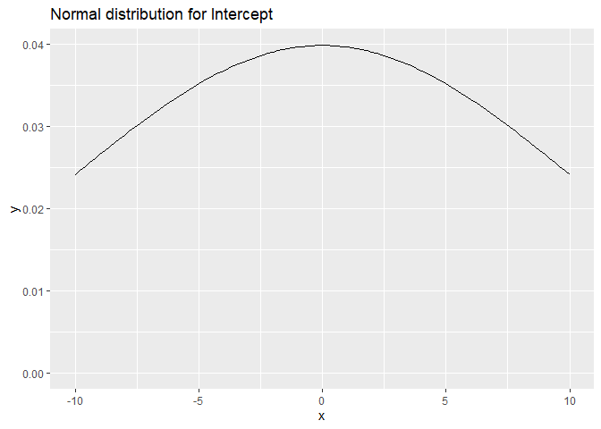<!-- -->

``` r
ggplot(data, aes(x = x)) +
  stat_function(fun = dnorm, n = 101, args = list(mean = 0.5, sd = 10)) +
  expand_limits(y = 0) +
  ggtitle("Normal distribution for treatments")
```

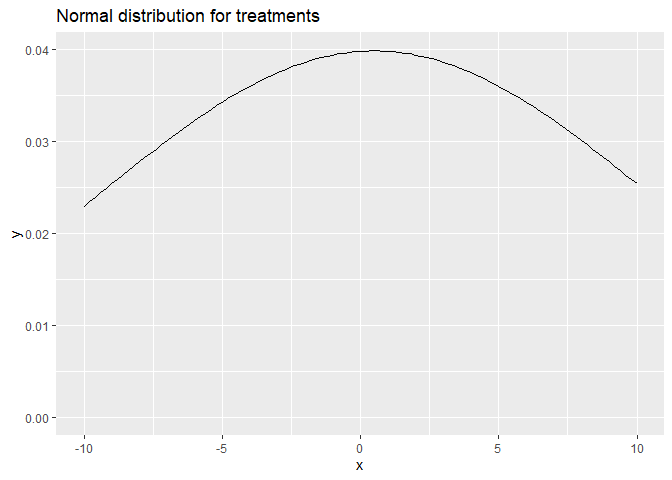<!-- -->

``` r
ggplot(data, aes(x = x)) +
  stat_function(fun = dcauchy, n = 101, args = list(location = 0, scale = 1)) +
  expand_limits(y = 0) +
  ggtitle("Cauchy distribution")
```

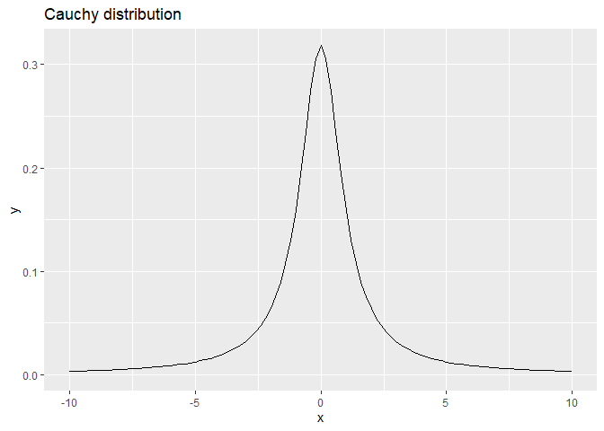<!-- -->

``` r
ggplot(data, aes(x = x)) +
  stat_function(fun = dstudent_t, args = list(df = 3, mu = 0, sigma = 2.5)) +
  expand_limits(y = 0) +
  ggtitle(expression(Student ~ italic(t) * "-distribution"))
```

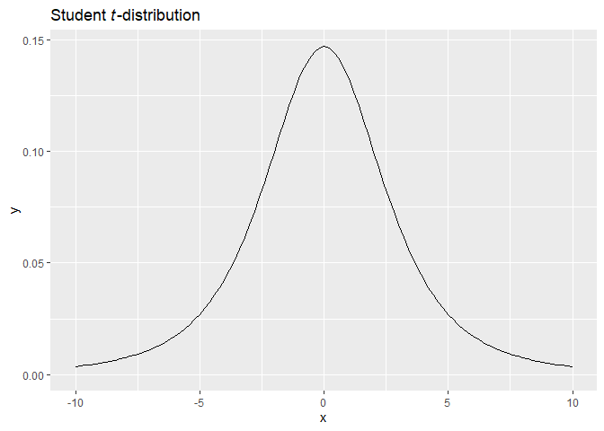<!-- -->

#### Prior summary (BARG 1.D)

``` r
m_1 %>%
  brms::prior_summary(all = FALSE) %>%
  select(prior, class, coef, group, source)
```

    ##                 prior     class coef group  source
    ##         normal(0, 10)         b               user
    ##         normal(0, 10) Intercept               user
    ##  student_t(3, 0, 2.5)        sd            default

#### Prior predictive check (BARG 1.E)

The blue line (observed value) should be in the center of the
distribution of 500 simulated data sets.

``` r
bayesplot::ppc_stat(y, yrep_prior[1:500, ], binwidth = 0.5) +
  coord_cartesian(xlim = c(-4, 4)) + bayesplot::theme_default()
```

    ## Note: in most cases the default test statistic 'mean' is too weak to detect anything of interest.

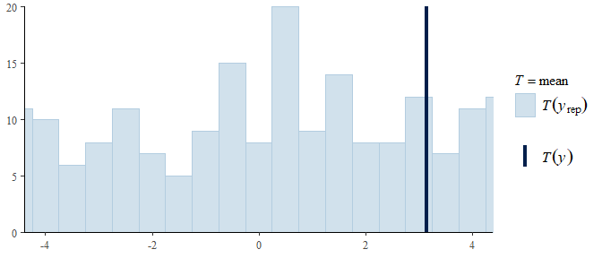<!-- -->

``` r
ppc_stat_grouped(
  y, yrep_prior[1:500, ], group = sites$year, binwidth = 0.5
  ) +
  coord_cartesian(xlim = c(-4, 4)) + bayesplot::theme_default()
```

    ## Note: in most cases the default test statistic 'mean' is too weak to detect anything of interest.

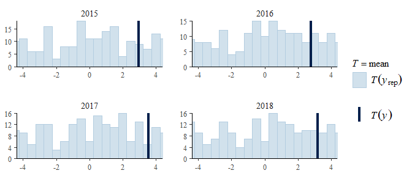<!-- -->

``` r
ppc_stat_grouped(
  y, yrep_prior[1:500, ], group = sites$site, binwidth = 0.5
  ) +
  coord_cartesian(xlim = c(-4, 4)) + bayesplot::theme_default()
```

    ## Note: in most cases the default test statistic 'mean' is too weak to detect anything of interest.

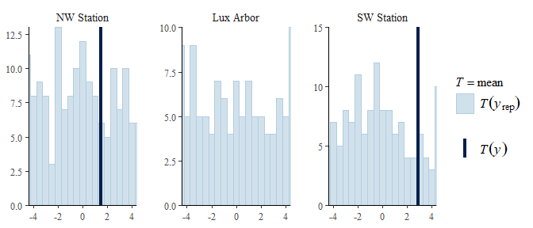<!-- -->

``` r
ppc_stat_grouped(
  y, yrep_prior[1:500, ], group = sites$herbicide, binwidth = 0.5
  ) +
  coord_cartesian(xlim = c(-4, 4)) + bayesplot::theme_default()
```

    ## Note: in most cases the default test statistic 'mean' is too weak to detect anything of interest.

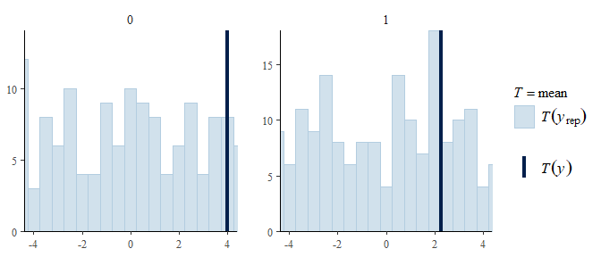<!-- -->

``` r
ppc_stat_grouped(
  y, yrep_prior[1:500, ], group = sites$seeded_pool, binwidth = 0.5
  ) +
  coord_cartesian(xlim = c(-4, 4)) + bayesplot::theme_default()
```

    ## Note: in most cases the default test statistic 'mean' is too weak to detect anything of interest.

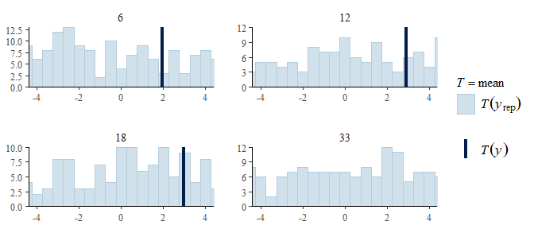<!-- -->

## Model check

### Check computation (MCMC diagnostics, BARG 2.B/C)

#### Trace plots

The traces of the four chains should overlap each other.

``` r
bayesplot::mcmc_trace(
  posterior1, np = hmc_diagnostics1, facet_args = list(ncol = 2)
  ) + bayesplot::theme_default()
```

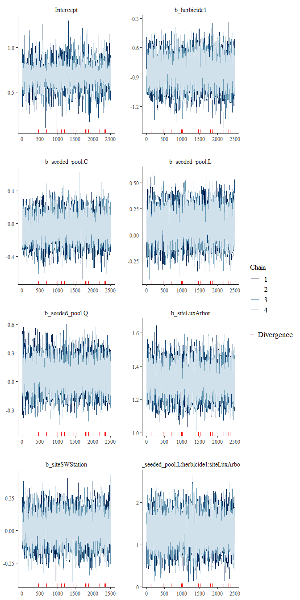<!-- -->

``` r
bayesplot::mcmc_trace(
  posterior2, np = hmc_diagnostics2, facet_args = list(ncol = 2)
  ) + bayesplot::theme_default()
```

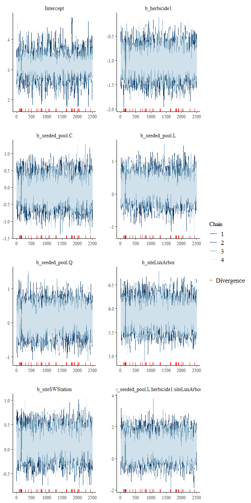<!-- -->

#### Sampling efficency: R-hat (BARG 2.B)

R-hat values should be lower than 1.1.

``` r
m_1 %>% brms::rhat() %>% bayesplot::mcmc_rhat() + bayesplot::theme_default() + theme(axis.text.y = element_blank(), axis.ticks.y = element_blank())
```

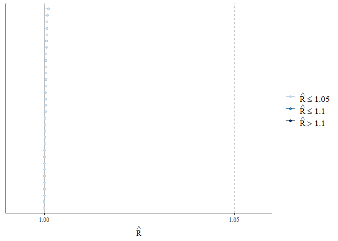<!-- -->

``` r
m_2 %>% brms::rhat() %>% bayesplot::mcmc_rhat() + bayesplot::theme_default() + theme(axis.text.y = element_blank(), axis.ticks.y = element_blank())
```

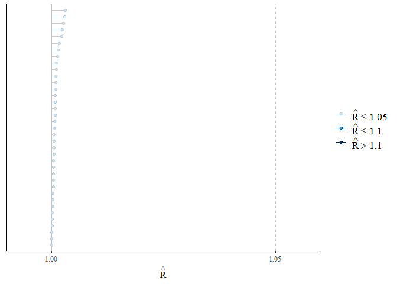<!-- -->

#### Sampling effectiveness: Effective sampling size (ESS) (BARG 2.C)

ESS should be greater than 0.1.

``` r
m_1 %>% brms::neff_ratio() %>% bayesplot::mcmc_neff() + bayesplot::theme_default() + theme(axis.text.y = element_blank(), axis.ticks.y = element_blank())
```

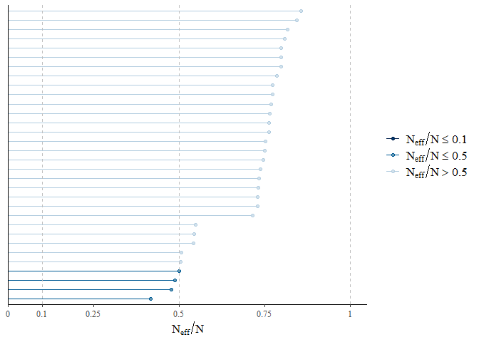<!-- -->

``` r
m_2 %>% brms::neff_ratio() %>% bayesplot::mcmc_neff() + bayesplot::theme_default() + theme(axis.text.y = element_blank(), axis.ticks.y = element_blank())
```

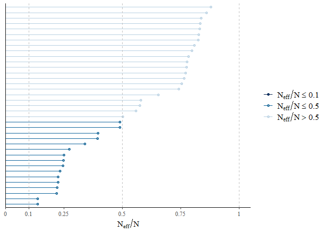<!-- -->

#### Pairs plot

If the technical problem of divergent transitions occurs, points would
be highlighted in green.

``` r
m_1 %>% bayesplot::mcmc_pairs(
  off_diag_args = list(size = 1.2),
  pars = c(
    "b_herbicide1", "b_seeded_pool.C", "b_seeded_pool.L",
    "b_seeded_pool.Q", "b_siteLuxArbor",
    "b_siteSWStation"
           )
)
```

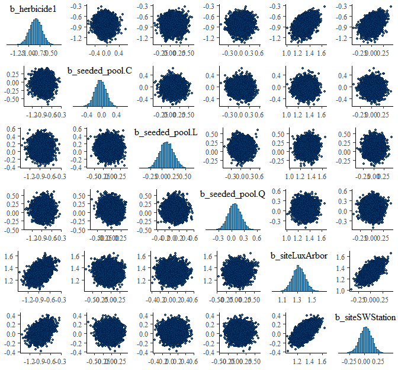<!-- -->

``` r
m_2 %>% bayesplot::mcmc_pairs(
  off_diag_args = list(size = 1.2),
  pars = c(
    "b_herbicide1", "b_seeded_pool.C", "b_seeded_pool.L",
    "b_seeded_pool.Q", "b_siteLuxArbor",
    "b_seeded_pool.Q:herbicide1:siteLuxArbor",
    "b_siteSWStation", "sigma"
           )
)
```

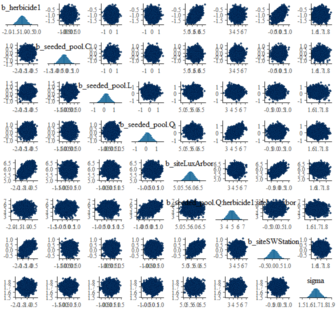<!-- -->

#### Parallel coordinate plot

If the technical problem of divergent transitions occurs, points would
be highlighted in green.

``` r
posterior1 %>% bayesplot::mcmc_parcoord(np = hmc_diagnostics1) + bayesplot::theme_default() + theme(axis.text.x = element_text(angle = 45))
```

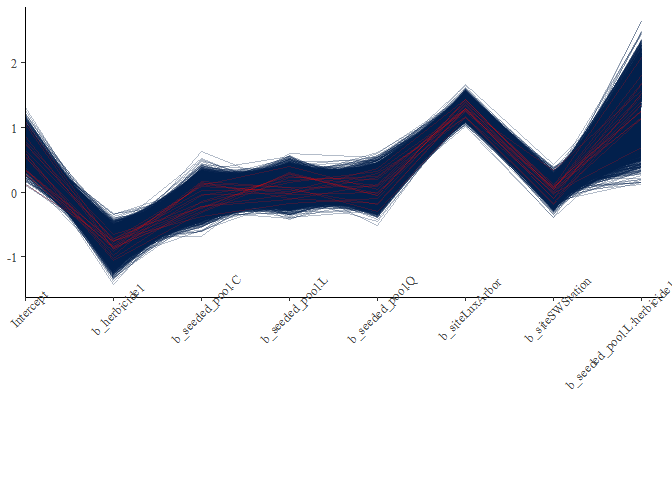<!-- -->

``` r
posterior2 %>% bayesplot::mcmc_parcoord(np = hmc_diagnostics2) + bayesplot::theme_default() + theme(axis.text.x = element_text(angle = 45))
```

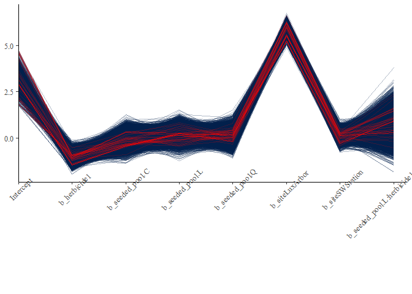<!-- -->

#### Autocorrelation check

Autocorrelation should go down to zero very fast.

``` r
posterior1 %>% bayesplot::mcmc_acf(lags = 10) + bayesplot::theme_default()
```

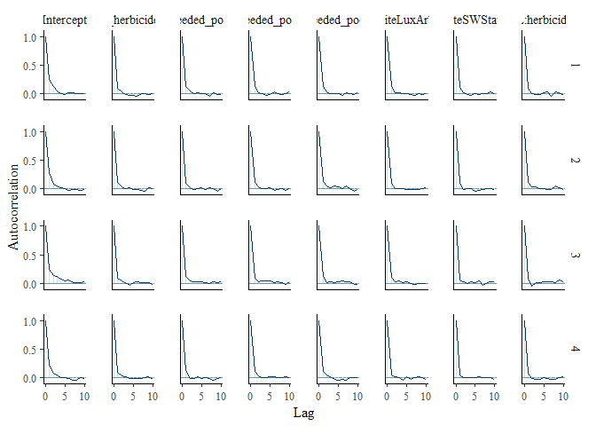<!-- -->

``` r
posterior2 %>% bayesplot::mcmc_acf(lags = 10) + bayesplot::theme_default()
```

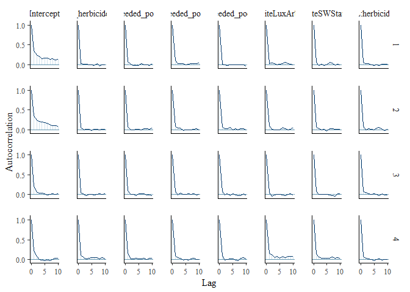<!-- -->

### Posterior predictive check (BARG 3.A)

#### Kernel density

The kernel density estimate of the observed data (dark line) compared
with estimates for 50 simulated data sets drawn from the posterior
predictive distribution (thinner and lighter lines). The dark line
should be near the simulated curves.

``` r
p1 <- bayesplot::ppc_dens_overlay(y, yrep1[1:50, ]) + bayesplot::theme_default()
p2 <- bayesplot::ppc_dens_overlay(y, yrep2[1:50, ]) + bayesplot::theme_default()
p1 / p2
```

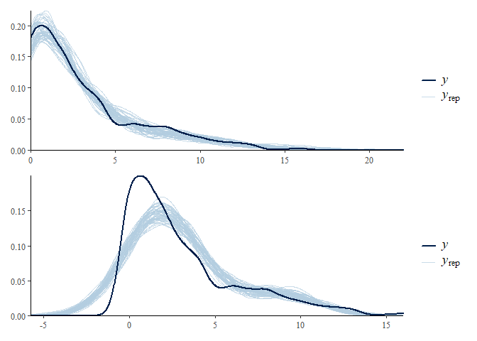<!-- -->

``` r
p1 <- ppc_dens_overlay_grouped(y, yrep1[1:50, ], group = sites$site) + bayesplot::theme_default()
p2 <- ppc_dens_overlay_grouped(y, yrep2[1:50, ], group = sites$site) + bayesplot::theme_default()
p1 / p2
```

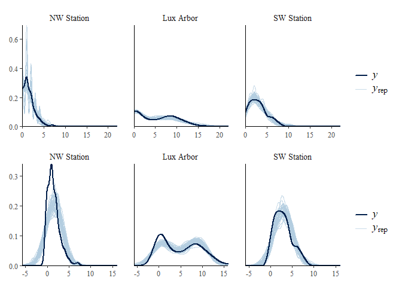<!-- -->

``` r
p1 <- ppc_dens_overlay_grouped(y, yrep1[1:50, ], group = sites$herbicide) + bayesplot::theme_default()
p2 <- ppc_dens_overlay_grouped(y, yrep2[1:50, ], group = sites$herbicide) + bayesplot::theme_default()
p1 / p2
```

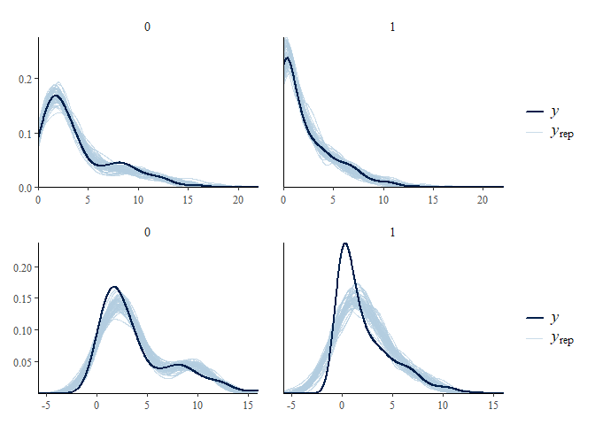<!-- -->

``` r
p1 <- ppc_dens_overlay_grouped(y, yrep1[1:50, ], group = sites$seeded_pool) + bayesplot::theme_default()
p2 <- ppc_dens_overlay_grouped(y, yrep2[1:50, ], group = sites$seeded_pool) + bayesplot::theme_default()
p1 / p2
```

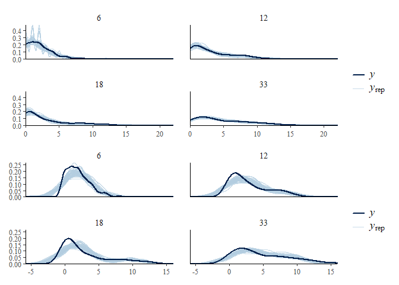<!-- -->

``` r
p1 <- ppc_dens_overlay_grouped(y, yrep1[1:50, ], group = sites$year) + bayesplot::theme_default()
p2 <- ppc_dens_overlay_grouped(y, yrep2[1:50, ], group = sites$year) + bayesplot::theme_default()
p1 / p2
```

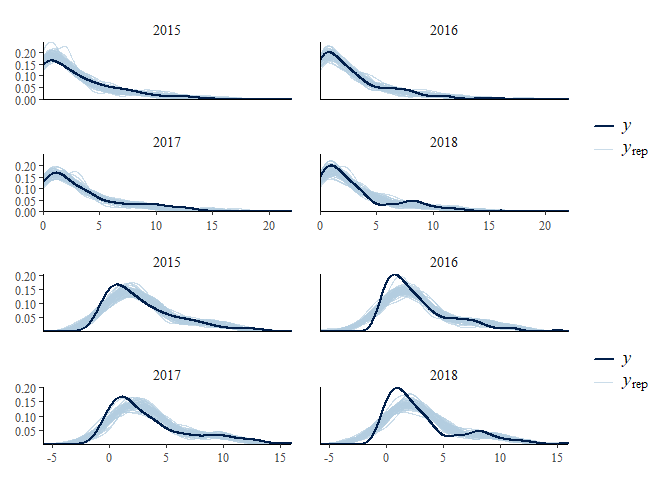<!-- -->

#### Histograms of statistics skew

The dark line (computed from the observed data) should be in the center
of the posterior predictive distribution.

``` r
p1 <- bayesplot::ppc_stat(y, yrep1, binwidth = 0.001) + bayesplot::theme_default()
```

    ## Note: in most cases the default test statistic 'mean' is too weak to detect anything of interest.

``` r
p2 <- bayesplot::ppc_stat(y, yrep2, binwidth = 0.001) + bayesplot::theme_default()
```

    ## Note: in most cases the default test statistic 'mean' is too weak to detect anything of interest.

``` r
p1 / p2
```

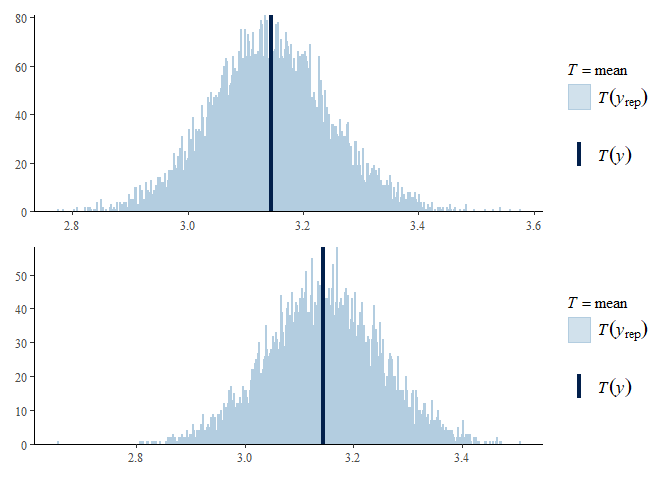<!-- -->

``` r
p1 <- ppc_stat_grouped(y, yrep1, group = sites$site, binwidth = 0.001) + bayesplot::theme_default()
```

    ## Note: in most cases the default test statistic 'mean' is too weak to detect anything of interest.

``` r
p2 <- ppc_stat_grouped(y, yrep2, group = sites$site, binwidth = 0.001) + bayesplot::theme_default()
```

    ## Note: in most cases the default test statistic 'mean' is too weak to detect anything of interest.

``` r
p1 / p2
```

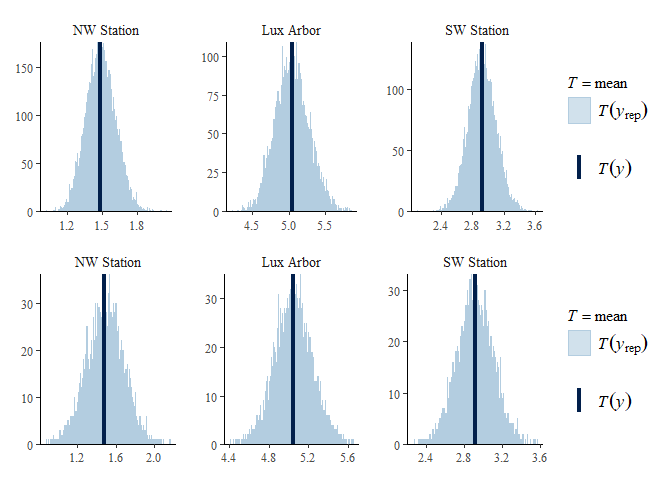<!-- -->

``` r
p1 <- ppc_stat_grouped(y, yrep1, group = sites$herbicide, binwidth = 0.001) + bayesplot::theme_default()
```

    ## Note: in most cases the default test statistic 'mean' is too weak to detect anything of interest.

``` r
p2 <- ppc_stat_grouped(y, yrep2, group = sites$herbicide, binwidth = 0.001) + bayesplot::theme_default()
```

    ## Note: in most cases the default test statistic 'mean' is too weak to detect anything of interest.

``` r
p1 / p2
```

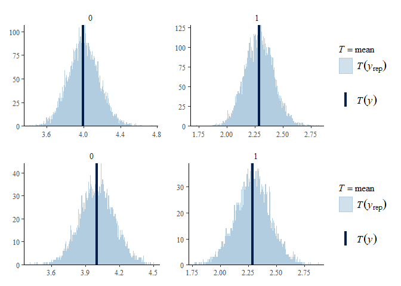<!-- -->

``` r
p1 <- ppc_stat_grouped(y, yrep1, group = sites$seeded_pool, binwidth = 0.001) + bayesplot::theme_default()
```

    ## Note: in most cases the default test statistic 'mean' is too weak to detect anything of interest.

``` r
p2 <- ppc_stat_grouped(y, yrep2, group = sites$seeded_pool, binwidth = 0.001) + bayesplot::theme_default()
```

    ## Note: in most cases the default test statistic 'mean' is too weak to detect anything of interest.

``` r
p1 / p2
```

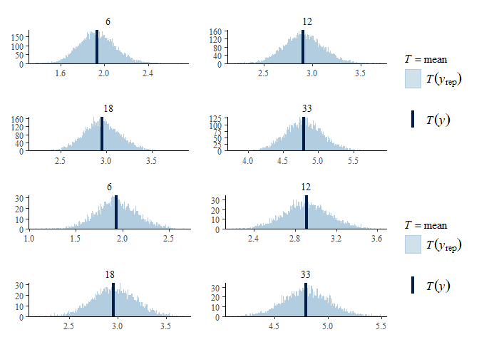<!-- -->

#### LOO cross-validation (Leave one out)

All Pareto-k estimates should be \< 0.7.

``` r
# loo1 <- m_1 %>% brms::loo(save_psis = TRUE, moment_match = TRUE)
# loo2 <- m_2 %>% brms::loo(save_psis = TRUE, moment_match = TRUE)
# loo1
# loo2
# plot(loo1)
# plot(loo2)
```

Density of the computed leave one out probability integral transform
(LOO PIT; dark curve) compared with the posterior predictive
distribution (light curves). The LOO PIT curve should be within the
range of light curves.

``` r
# p1 <- bayesplot::ppc_loo_pit_overlay(y, yrep1, lw = weights(loo1$psis_object)) + bayesplot::theme_default()
# p2 <- bayesplot::ppc_loo_pit_overlay(y, yrep2, lw = weights(loo2$psis_object)) + bayesplot::theme_default()
# p1 / p2
```

### DHARMa

``` r
m_1 %>% DHARMa.helpers::dh_check_brms(integer = TRUE)
```

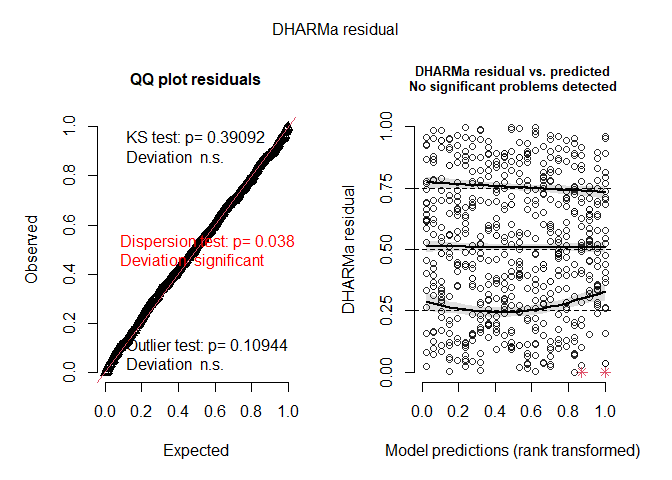<!-- -->

``` r
m_2 %>% DHARMa.helpers::dh_check_brms(integer = TRUE)
## DHARMa:testOutliers with type = binomial may have inflated Type I error rates for integer-valued distributions. To get a more exact result, it is recommended to re-run testOutliers with type = 'bootstrap'. See ?testOutliers for details
```

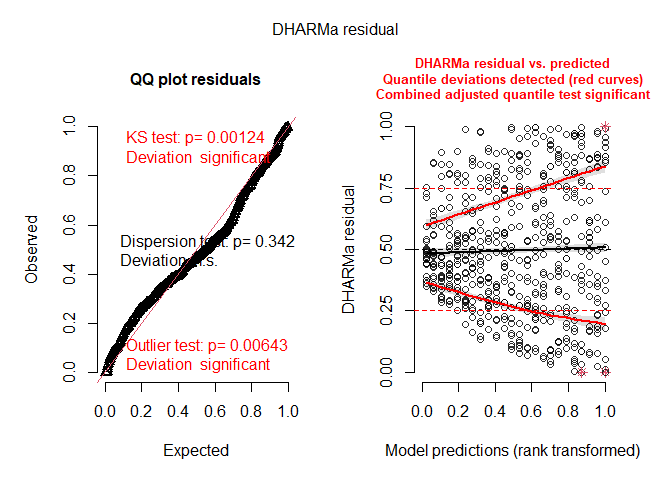<!-- -->

## Model comparison

### Conditional <i>R</i><sup>2</sup> values

``` r
m_1 %>% brms::bayes_R2(
  probs = c(0.05, 0.5, 0.95), re_formula =  ~ (1 | year)
  )
##     Estimate  Est.Error        Q5      Q50      Q95
## R2 0.7484755 0.01508606 0.7215466 0.749601 0.770853
m_2 %>% brms::bayes_R2(
  probs = c(0.05, 0.5, 0.95), re_formula =  ~ (1 | year)
  )
##     Estimate   Est.Error       Q5       Q50       Q95
## R2 0.7415648 0.009632571 0.724823 0.7421447 0.7565782
```

### Marginal <i>R</i><sup>2</sup> values

``` r
m_1 %>% brms::bayes_R2(
  probs = c(0.05, 0.5, 0.95), re_formula = 1 ~ 1
  )
##     Estimate  Est.Error        Q5       Q50      Q95
## R2 0.7267352 0.04327356 0.6501627 0.7344278 0.777533
m_2 %>% brms::bayes_R2(
  probs = c(0.05, 0.5, 0.95), re_formula = 1 ~ 1
  )
##     Estimate   Est.Error        Q5       Q50       Q95
## R2 0.7354532 0.009739856 0.7184195 0.7359257 0.7506851
```

### Bayes factor (BARG 3.C)

``` r
# bayes_factor <- brms::bayes_factor(m_1, m_2)
```

``` r
# bayes_factor
```

## Posterior distributions (BARG 3.B)

### Forest plot of effect sizes (BARG 3.B/5.B)

``` r
combined_models <- bind_rows(
  bayesplot::mcmc_intervals_data(
    posterior1, prob = 0.66, prob_outer = 0.95
    ) %>%
    mutate(model = "m_1"),
  bayesplot::mcmc_intervals_data(
    posterior2, prob = 0.66, prob_outer = 0.95
    ) %>%
    mutate(model = "m_2"),
  bayesplot::mcmc_intervals_data(
    posterior_flat, prob = 0.66, prob_outer = 0.95
    ) %>%
    mutate(model = "m_flat"),
  bayesplot::mcmc_intervals_data(
    posterior_prior, prob = 0.66, prob_outer = 0.95
    ) %>%
    mutate(model = "m_prior")
  )

pos <- position_nudge(
  y = if_else(
    combined_models$model == "m_2", -.2, if_else(
      combined_models$model == "m_flat", -.4, if_else(
        combined_models$model == "m_prior", -.6, 0
        )
      )
    )
  )

ggplot(
  data = combined_models,
  aes(x = m, y = forcats::fct_rev(factor(parameter)), color = model)
  ) +
  geom_vline(xintercept = 0, color = "grey") +
  geom_linerange(aes(xmin = l, xmax = h), position = pos, linewidth = 2) +
  geom_linerange(aes(xmin = ll, xmax = hh), position = pos) +
  geom_point(position = pos, color = "black") +
  coord_cartesian(xlim = c(-.65, 1)) +
  bayesplot::theme_default() +
  ggtitle("Posterior distbributions (mean, CI66, CI95)")
```

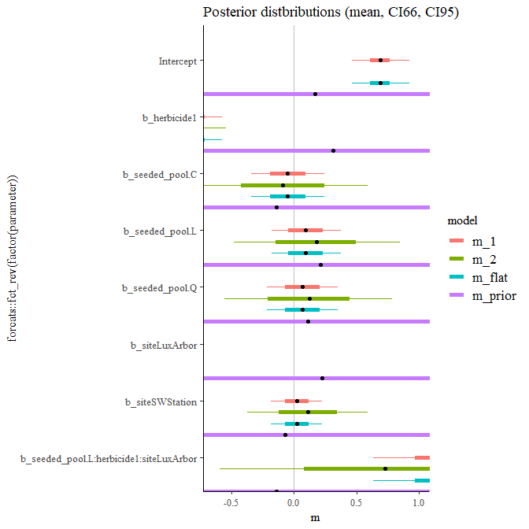<!-- -->

### Effect sizes

Effect sizes of chosen model just to get exact values of means etc. if
necessary.

``` r
posterior1 %>%
  posterior::summarize_draws() %>%
  knitr::kable()
```

| variable | mean | median | sd | mad | q5 | q95 | rhat | ess_bulk | ess_tail |
|:---|---:|---:|---:|---:|---:|---:|---:|---:|---:|
| Intercept | 0.6913281 | 0.6918586 | 0.1071797 | 0.0808503 | 0.5230310 | 0.8587916 | 1.000252 | 6105.911 | 4860.452 |
| b_herbicide1 | -0.8457459 | -0.8438400 | 0.1380508 | 0.1388577 | -1.0713752 | -0.6210611 | 0.999990 | 7851.165 | 8899.093 |
| b_seeded_pool.C | -0.0509896 | -0.0508372 | 0.1496918 | 0.1506370 | -0.2957835 | 0.1930452 | 1.000072 | 7673.837 | 7982.763 |
| b_seeded_pool.L | 0.0939654 | 0.0925646 | 0.1434179 | 0.1443582 | -0.1425429 | 0.3315133 | 1.000032 | 7285.617 | 8231.430 |
| b_seeded_pool.Q | 0.0642505 | 0.0637136 | 0.1455677 | 0.1443249 | -0.1746165 | 0.3039259 | 1.000132 | 7283.107 | 7631.257 |
| b_siteLuxArbor | 1.3191671 | 1.3180061 | 0.0831813 | 0.0831380 | 1.1835142 | 1.4581350 | 1.000199 | 7981.463 | 8364.080 |
| b_siteSWStation | 0.0220627 | 0.0224030 | 0.1022755 | 0.1004299 | -0.1466729 | 0.1876996 | 1.000019 | 8556.794 | 8778.351 |
| b_seeded_pool.L:herbicide1:siteLuxArbor | 1.3083362 | 1.3052246 | 0.3496599 | 0.3489939 | 0.7364466 | 1.8821306 | 1.000775 | 8436.136 | 8754.956 |

``` r
emm <- m_1 %>% emmeans(
  revpairwise ~ seeded_pool + herbicide | site,
  type = "response"
  )
emm$emmeans
```

    ## site = NW Station:
    ##  seeded_pool herbicide   rate lower.HPD upper.HPD
    ##  6           0          1.940    1.2774     2.606
    ##  12          0          1.808    1.2090     2.518
    ##  18          0          2.021    1.3896     2.769
    ##  33          0          2.146    1.4434     2.886
    ##  6           1          1.522    0.9998     2.152
    ##  12          1          0.814    0.4488     1.251
    ##  18          1          0.400    0.1768     0.697
    ##  33          1          1.064    0.6329     1.548
    ## 
    ## site = Lux Arbor:
    ##  seeded_pool herbicide   rate lower.HPD upper.HPD
    ##  6           0          3.968    2.9159     5.175
    ##  12          0          7.712    5.9135     9.723
    ##  18          0          9.586    7.3405    12.081
    ##  33          0         10.078    7.6863    12.548
    ##  6           1          0.567    0.2859     0.921
    ##  12          1          0.482    0.2264     0.805
    ##  18          1          0.154    0.0302     0.335
    ##  33          1          7.633    5.7030     9.559
    ## 
    ## site = SW Station:
    ##  seeded_pool herbicide   rate lower.HPD upper.HPD
    ##  6           0          1.317    0.8516     1.890
    ##  12          0          2.395    1.6780     3.228
    ##  18          0          1.933    1.3352     2.677
    ##  33          0          2.729    1.9417     3.658
    ##  6           1          2.146    1.4622     2.898
    ##  12          1          4.095    3.0039     5.330
    ##  18          1          3.463    2.5191     4.569
    ##  33          1          5.048    3.7873     6.518
    ## 
    ## Point estimate displayed: median 
    ## Results are back-transformed from the log scale 
    ## HPD interval probability: 0.95

# Session info (BARG 2.A/6.A/6.B)

    ## R version 4.5.0 (2025-04-11 ucrt)
    ## Platform: x86_64-w64-mingw32/x64
    ## Running under: Windows 11 x64 (build 26100)
    ## 
    ## Matrix products: default
    ##   LAPACK version 3.12.1
    ## 
    ## locale:
    ## [1] LC_COLLATE=German_Germany.utf8  LC_CTYPE=German_Germany.utf8   
    ## [3] LC_MONETARY=German_Germany.utf8 LC_NUMERIC=C                   
    ## [5] LC_TIME=German_Germany.utf8    
    ## 
    ## time zone: America/New_York
    ## tzcode source: internal
    ## 
    ## attached base packages:
    ## [1] stats     graphics  grDevices utils     datasets  methods   base     
    ## 
    ## other attached packages:
    ##  [1] emmeans_1.11.1       loo_2.8.0            bayesplot_1.13.0    
    ##  [4] DHARMa.helpers_0.0.2 brms_2.22.0          Rcpp_1.1.0          
    ##  [7] patchwork_1.3.1      ggbeeswarm_0.7.2     lubridate_1.9.4     
    ## [10] forcats_1.0.0        stringr_1.5.1        dplyr_1.1.4         
    ## [13] purrr_1.1.0          readr_2.1.5          tidyr_1.3.1         
    ## [16] tibble_3.3.0         ggplot2_3.5.2        tidyverse_2.0.0     
    ## [19] here_1.0.1          
    ## 
    ## loaded via a namespace (and not attached):
    ##  [1] tidyselect_1.2.1     viridisLite_0.4.2    DHARMa_0.4.7        
    ##  [4] vipor_0.4.7          farver_2.1.2         fastmap_1.2.0       
    ##  [7] tensorA_0.36.2.1     promises_1.3.3       digest_0.6.37       
    ## [10] mime_0.13            estimability_1.5.1   timechange_0.3.0    
    ## [13] lifecycle_1.0.4      StanHeaders_2.32.10  magrittr_2.0.3      
    ## [16] posterior_1.6.1      compiler_4.5.0       rlang_1.1.6         
    ## [19] tools_4.5.0          utf8_1.2.6           yaml_2.3.10         
    ## [22] knitr_1.50           labeling_0.4.3       bridgesampling_1.1-2
    ## [25] bit_4.6.0            pkgbuild_1.4.8       plyr_1.8.9          
    ## [28] RColorBrewer_1.1-3   gap.datasets_0.0.6   abind_1.4-8         
    ## [31] withr_3.0.2          grid_4.5.0           stats4_4.5.0        
    ## [34] xtable_1.8-4         inline_0.3.21        iterators_1.0.14    
    ## [37] scales_1.4.0         MASS_7.3-65          cli_3.6.5           
    ## [40] mvtnorm_1.3-3        rmarkdown_2.29       crayon_1.5.3        
    ## [43] reformulas_0.4.1     generics_0.1.4       RcppParallel_5.1.10 
    ## [46] rstudioapi_0.17.1    reshape2_1.4.4       tzdb_0.5.0          
    ## [49] minqa_1.2.8          rstan_2.32.7         splines_4.5.0       
    ## [52] parallel_4.5.0       matrixStats_1.5.0    vctrs_0.6.5         
    ## [55] boot_1.3-31          Matrix_1.7-3         hms_1.1.3           
    ## [58] bit64_4.6.0-1        qgam_2.0.0           beeswarm_0.4.0      
    ## [61] foreach_1.5.2        gap_1.6              glue_1.8.0          
    ## [64] nloptr_2.2.1         codetools_0.2-20     distributional_0.5.0
    ## [67] stringi_1.8.7        gtable_0.3.6         later_1.4.2         
    ## [70] QuickJSR_1.8.0       lme4_1.1-37          pillar_1.11.0       
    ## [73] htmltools_0.5.8.1    Brobdingnag_1.2-9    R6_2.6.1            
    ## [76] Rdpack_2.6.4         doParallel_1.0.17    rprojroot_2.0.4     
    ## [79] shiny_1.11.1         vroom_1.6.5          evaluate_1.0.4      
    ## [82] lattice_0.22-7       rbibutils_2.3        backports_1.5.0     
    ## [85] httpuv_1.6.16        rstantools_2.4.0     gridExtra_2.3       
    ## [88] coda_0.19-4.1        nlme_3.1-168         checkmate_2.3.2     
    ## [91] mgcv_1.9-3           xfun_0.52            pkgconfig_2.0.3
