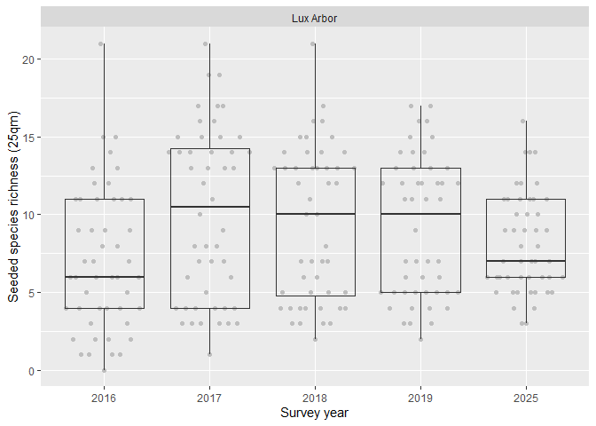
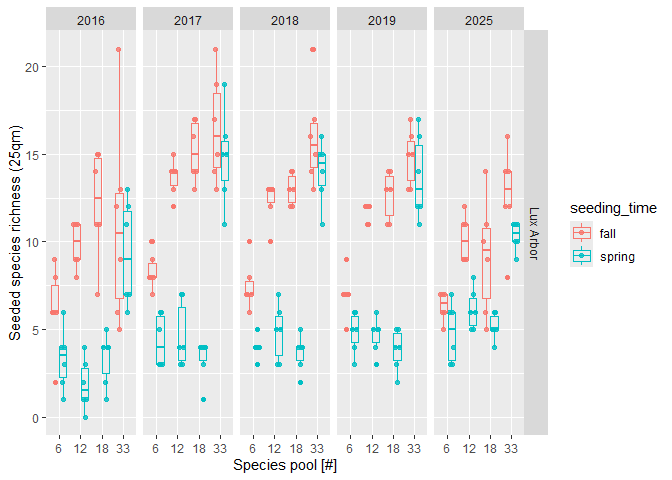
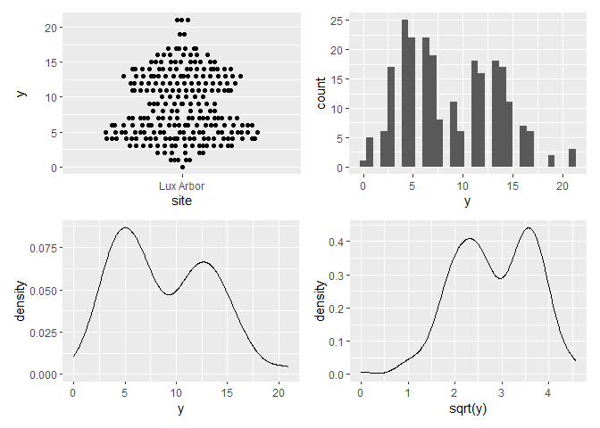
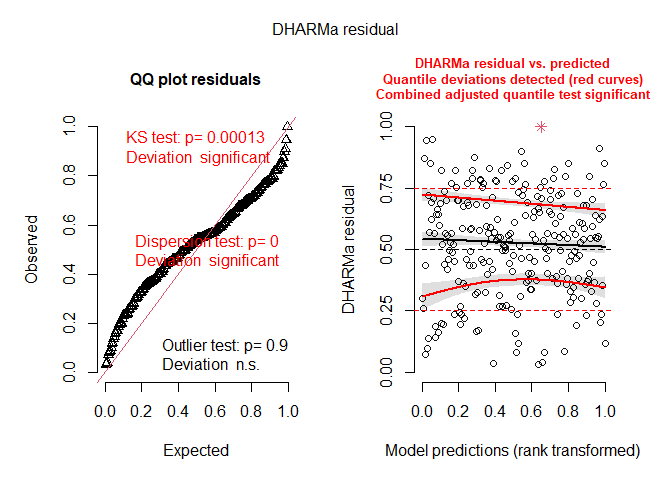
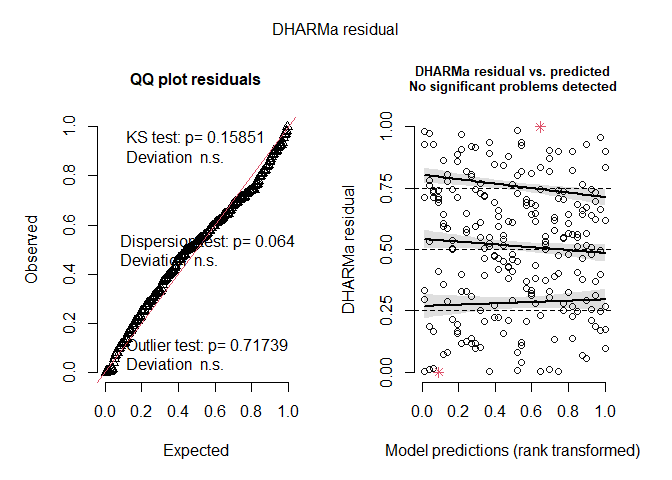
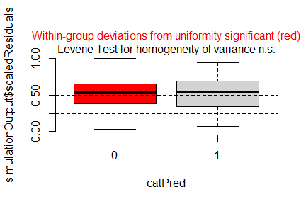
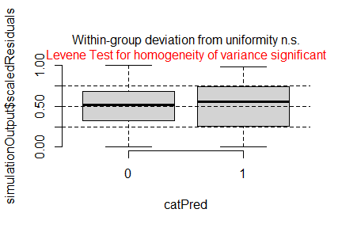
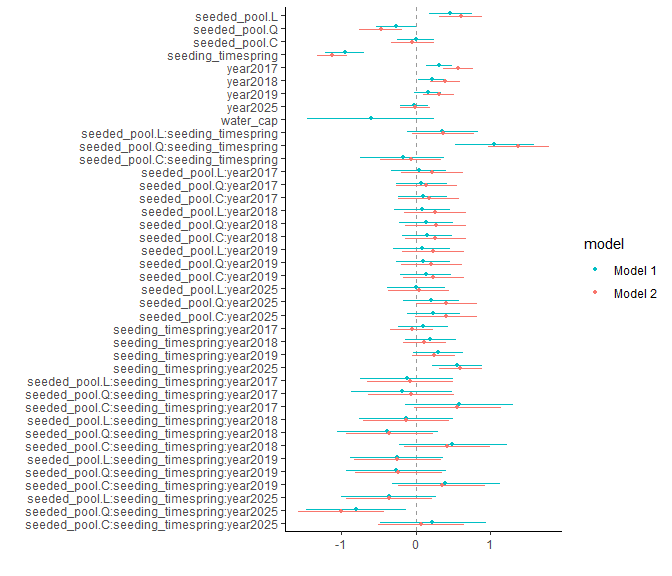
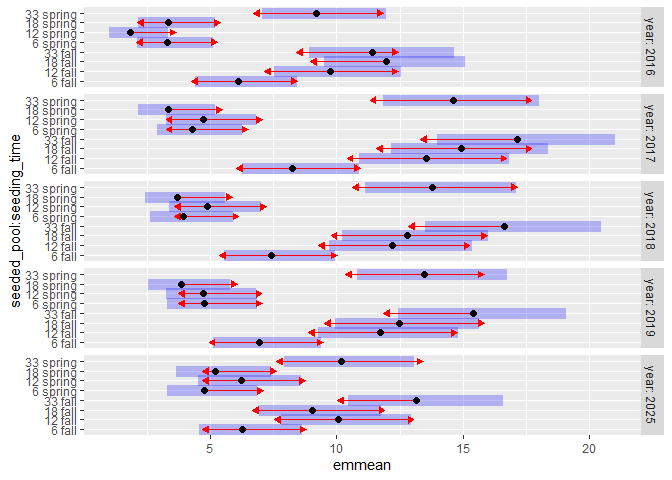

Analysis of XXX et al. (submitted) GREEEN project: <br> Effects of
species pool size and seeding approach on establishment of seeded
species
================
<b>Markus Bauer</b> <br>
<b>2025-08-19</b>

- [Preparation](#preparation)
- [Statistics](#statistics)
  - [Data exploration](#data-exploration)
    - [Means and deviations](#means-and-deviations)
    - [Graphs of raw data (Step 2, 6,
      7)](#graphs-of-raw-data-step-2-6-7)
    - [Outliers, zero-inflation, transformations? (Step 1, 3,
      4)](#outliers-zero-inflation-transformations-step-1-3-4)
    - [Check collinearity part 1 (Step
      5)](#check-collinearity-part-1-step-5)
  - [Models](#models)
  - [Model check](#model-check)
    - [DHARMa](#dharma)
    - [Check collinearity part 2 (Step
      5)](#check-collinearity-part-2-step-5)
  - [Model comparison](#model-comparison)
    - [<i>R</i><sup>2</sup> values](#r2-values)
    - [AICc](#aicc)
  - [Predicted values](#predicted-values)
    - [Summary table](#summary-table)
    - [Forest plot](#forest-plot)
    - [Effect sizes](#effect-sizes)
- [Session info](#session-info)

<br/> <br/> <b>Markus Bauer</b>

Technichal University of Munich, TUM School of Life Sciences, Chair of
Restoration Ecology, Emil-Ramann-Straße 6, 85354 Freising, Germany

<markus1.bauer@tum.de>

ORCiD ID: [0000-0001-5372-4174](https://orcid.org/0000-0001-5372-4174)
<br> [Google
Scholar](https://scholar.google.de/citations?user=oHhmOkkAAAAJ&hl=de&oi=ao)
<br> GitHub: [markus1bauer](https://github.com/markus1bauer)

> **NOTE:** To compare different models, you only have to change the
> models in the section ‘Load models’

# Preparation

Protocol of data exploration (Steps 1-8) used from Zuur et al. (2010)
Methods Ecol Evol [DOI:
10.1111/2041-210X.12577](https://doi.org/10.1111/2041-210X.12577)

#### Packages

``` r
library(here)
library(tidyverse)
library(ggbeeswarm)
library(patchwork)
library(lme4)
library(DHARMa)
library(emmeans)
```

#### Load data

``` r
sites <- read_csv(
  here("data", "processed", "data_processed_sites.csv"),
  col_names = TRUE, na = c("na", "NA", ""), col_types = cols(
    .default = "?",
    id_plot_year = "f",
    id_plot = "f",
    site = col_factor(
      levels = c("NW Station", "Lux Arbor", "SW Station"), ordered = FALSE
    ),
    year = "f",
    seeding_time = col_factor(
      levels = c("unseeded", "fall", "spring"), ordered = FALSE
      ),
    herbicide = col_factor(levels = c("0", "1"), ordered = FALSE),
    seeded_pool = col_factor(
      levels = c("0", "6", "12", "18", "33"), ordered = TRUE
      ),
    treatment_id = "f",
    treatment_description = "c",
    richness_type = "f"
  )
) %>%
  filter(
    year != "2015",
    site == "Lux Arbor",
    richness_type == "seeded_richness",
    !(treatment_id %in% c("2", "4"))
  ) %>%
  mutate(y = richness_1qm + richness_25qm)
```

# Statistics

## Data exploration

### Means and deviations

``` r
Rmisc::CI(sites$y, ci = .95)
```

    ##    upper     mean    lower 
    ## 9.379009 8.783333 8.187657

``` r
median(sites$y)
```

    ## [1] 8

``` r
sd(sites$y)
```

    ## [1] 4.684495

``` r
quantile(sites$y, probs = c(0.05, 0.95), na.rm = TRUE)
```

    ##    5%   95% 
    ##  2.95 16.00

``` r
sites %>% count(year)
```

    ## # A tibble: 5 × 2
    ##   year      n
    ##   <fct> <int>
    ## 1 2016     48
    ## 2 2017     48
    ## 3 2018     48
    ## 4 2019     48
    ## 5 2025     48

``` r
sites %>% count(seeded_pool)
```

    ## # A tibble: 4 × 2
    ##   seeded_pool     n
    ##   <ord>       <int>
    ## 1 6              60
    ## 2 12             60
    ## 3 18             60
    ## 4 33             60

``` r
sites %>% count(seeding_time)
```

    ## # A tibble: 2 × 2
    ##   seeding_time     n
    ##   <fct>        <int>
    ## 1 fall           120
    ## 2 spring         120

``` r
sites %>% count(herbicide)
```

    ## # A tibble: 2 × 2
    ##   herbicide     n
    ##   <fct>     <int>
    ## 1 0           120
    ## 2 1           120

### Graphs of raw data (Step 2, 6, 7)

<!-- --><!-- -->

### Outliers, zero-inflation, transformations? (Step 1, 3, 4)

<!-- -->

### Check collinearity part 1 (Step 5)

Exclude r \> 0.7 <br> Dormann et al. 2013 Ecography [DOI:
10.1111/j.1600-0587.2012.07348.x](https://doi.org/10.1111/j.1600-0587.2012.07348.x)

``` r
# sites %>%
#   select(where(is.numeric), -y, -starts_with("cwm.")) %>%
#   GGally::ggpairs(
#     lower = list(continuous = "smooth_loess")
#     ) +
#   theme(strip.text = element_text(size = 7))

# -> no continuous variables
```

## Models

> **NOTE:** Only here you have to modify the script to compare other
> models

``` r
load(file = here("outputs", "models", "model_richness_pool_long_full.Rdata"))
load(file = here("outputs", "models", "model_richness_pool_long_1.Rdata"))
m_1 <- m_full
m_2 <- m1
```

``` r
formula(m_1)
## y ~ seeded_pool * seeding_time * year + water_cap
formula(m_2)
## sqrt(y) ~ seeded_pool * seeding_time * year
```

## Model check

### DHARMa

``` r
simulation_output_1 <- simulateResiduals(m_1, plot = TRUE)
```

<!-- -->

``` r
simulation_output_2 <- simulateResiduals(m_2, plot = TRUE)
```

<!-- -->

``` r
plotResiduals(simulation_output_1$scaledResiduals, sites$herbicide)
```

<!-- -->

``` r
plotResiduals(simulation_output_2$scaledResiduals, sites$herbicide)
```

<!-- -->

``` r
# plotResiduals(simulation_output_1$scaledResiduals, sites$seeding_time)
# plotResiduals(simulation_output_2$scaledResiduals, sites$seeding_time)
# plotResiduals(simulation_output_1$scaledResiduals, sites$year)
# plotResiduals(simulation_output_2$scaledResiduals, sites$year)
# plotResiduals(simulation_output_1$scaledResiduals, sites$water_cap)
# plotResiduals(simulation_output_2$scaledResiduals, sites$water_cap)
```

### Check collinearity part 2 (Step 5)

Remove VIF \> 3 or \> 10 <br> Zuur et al. 2010 Methods Ecol Evol [DOI:
10.1111/j.2041-210X.2009.00001.x](https://doi.org/10.1111/j.2041-210X.2009.00001.x)

``` r
car::vif(m_1)
```

    ## there are higher-order terms (interactions) in this model
    ## consider setting type = 'predictor'; see ?vif

    ##                                       GVIF Df GVIF^(1/(2*Df))
    ## seeded_pool                   7.186202e+02  3        2.992838
    ## seeding_time                  8.506192e+00  1        2.916538
    ## year                          7.746991e+00  4        1.291640
    ## water_cap                     1.458369e+00  1        1.207630
    ## seeded_pool:seeding_time      1.413943e+03  3        3.350210
    ## seeded_pool:year              4.806929e+04 12        1.567032
    ## seeding_time:year             6.214030e+01  4        1.675605
    ## seeded_pool:seeding_time:year 1.234766e+05 12        1.629856

``` r
car::vif(m_2)
```

    ## there are higher-order terms (interactions) in this model
    ## consider setting type = 'predictor'; see ?vif

    ##                                 GVIF Df GVIF^(1/(2*Df))
    ## seeded_pool                     1000  3        3.162278
    ## seeding_time                       5  1        2.236068
    ## year                              16  4        1.414214
    ## seeded_pool:seeding_time        1000  3        3.162278
    ## seeded_pool:year              512000 12        1.729363
    ## seeding_time:year                 48  4        1.622390
    ## seeded_pool:seeding_time:year 512000 12        1.729363

## Model comparison

### <i>R</i><sup>2</sup> values

``` r
MuMIn::r.squaredGLMM(m_1)
## Warning: the null model is only correct if all the variables it uses are identical 
## to those used in fitting the original model.
##                 R2m       R2c
## delta     0.7370139 0.7370139
## lognormal 0.7474205 0.7474205
## trigamma  0.7257378 0.7257378
MuMIn::r.squaredGLMM(m_2)
##            R2m       R2c
## [1,] 0.8210265 0.8210265
```

### AICc

Use AICc and not AIC since ratio n/K \< 40 <br> Burnahm & Anderson 2002
p. 66 ISBN: 978-0-387-95364-9

``` r
MuMIn::AICc(m_1, m_2) %>%
  arrange(AICc)
##     df      AICc
## m_2 41  246.5292
## m_1 41 1121.2707
```

## Predicted values

### Summary table

``` r
car::Anova(m_2, type = 3)
```

    ## Anova Table (Type III tests)
    ## 
    ## Response: sqrt(y)
    ##                                Sum Sq  Df   F value    Pr(>F)    
    ## (Intercept)                   224.933   1 1734.1913 < 2.2e-16 ***
    ## seeded_pool                     3.521   3    9.0492 1.202e-05 ***
    ## seeding_time                   15.136   1  116.6961 < 2.2e-16 ***
    ## year                            6.081   4   11.7215 1.426e-08 ***
    ## seeded_pool:seeding_time        6.120   3   15.7280 3.194e-09 ***
    ## seeded_pool:year                1.435  12    0.9222   0.52573    
    ## seeding_time:year               3.245   4    6.2537 9.232e-05 ***
    ## seeded_pool:seeding_time:year   2.842  12    1.8262   0.04605 *  
    ## Residuals                      25.941 200                        
    ## ---
    ## Signif. codes:  0 '***' 0.001 '**' 0.01 '*' 0.05 '.' 0.1 ' ' 1

``` r
summary(m_2)
```

    ## 
    ## Call:
    ## lm(formula = sqrt(y) ~ seeded_pool * seeding_time * year, data = sites)
    ## 
    ## Residuals:
    ##      Min       1Q   Median       3Q      Max 
    ## -1.19104 -0.18566  0.02458  0.20167  1.35961 
    ## 
    ## Coefficients:
    ##                                            Estimate Std. Error t value Pr(>|t|)
    ## (Intercept)                                3.061409   0.073514  41.644  < 2e-16
    ## seeded_pool.L                              0.604795   0.147029   4.113 5.69e-05
    ## seeded_pool.Q                             -0.468003   0.147029  -3.183 0.001690
    ## seeded_pool.C                             -0.045403   0.147029  -0.309 0.757792
    ## seeding_timespring                        -1.123094   0.103965 -10.803  < 2e-16
    ## year2017                                   0.566956   0.103965   5.453 1.45e-07
    ## year2018                                   0.395863   0.103965   3.808 0.000187
    ## year2019                                   0.307926   0.103965   2.962 0.003429
    ## year2025                                  -0.006588   0.103965  -0.063 0.949539
    ## seeded_pool.L:seeding_timespring           0.367841   0.207930   1.769 0.078408
    ## seeded_pool.Q:seeding_timespring           1.378542   0.207930   6.630 3.06e-10
    ## seeded_pool.C:seeding_timespring          -0.065675   0.207930  -0.316 0.752445
    ## seeded_pool.L:year2017                     0.220383   0.207930   1.060 0.290473
    ## seeded_pool.Q:year2017                     0.140952   0.207930   0.678 0.498630
    ## seeded_pool.C:year2017                     0.175433   0.207930   0.844 0.399840
    ## seeded_pool.L:year2018                     0.260538   0.207930   1.253 0.211667
    ## seeded_pool.Q:year2018                     0.270679   0.207930   1.302 0.194490
    ## seeded_pool.C:year2018                     0.262537   0.207930   1.263 0.208196
    ## seeded_pool.L:year2019                     0.232756   0.207930   1.119 0.264316
    ## seeded_pool.Q:year2019                     0.212540   0.207930   1.022 0.307936
    ## seeded_pool.C:year2019                     0.238804   0.207930   1.148 0.252141
    ## seeded_pool.L:year2025                     0.040374   0.207930   0.194 0.846240
    ## seeded_pool.Q:year2025                     0.410401   0.207930   1.974 0.049788
    ## seeded_pool.C:year2025                     0.408442   0.207930   1.964 0.050878
    ## seeding_timespring:year2017               -0.053359   0.147029  -0.363 0.717051
    ## seeding_timespring:year2018                0.115477   0.147029   0.785 0.433145
    ## seeding_timespring:year2019                0.242129   0.147029   1.647 0.101166
    ## seeding_timespring:year2025                0.598928   0.147029   4.074 6.67e-05
    ## seeded_pool.L:seeding_timespring:year2017 -0.072601   0.294058  -0.247 0.805243
    ## seeded_pool.Q:seeding_timespring:year2017 -0.062277   0.294058  -0.212 0.832492
    ## seeded_pool.C:seeding_timespring:year2017  0.560496   0.294058   1.906 0.058075
    ## seeded_pool.L:seeding_timespring:year2018 -0.127218   0.294058  -0.433 0.665750
    ## seeded_pool.Q:seeding_timespring:year2018 -0.350876   0.294058  -1.193 0.234196
    ## seeded_pool.C:seeding_timespring:year2018  0.422060   0.294058   1.435 0.152765
    ## seeded_pool.L:seeding_timespring:year2019 -0.245823   0.294058  -0.836 0.404171
    ## seeded_pool.Q:seeding_timespring:year2019 -0.231029   0.294058  -0.786 0.432998
    ## seeded_pool.C:seeding_timespring:year2019  0.350064   0.294058   1.190 0.235277
    ## seeded_pool.L:seeding_timespring:year2025 -0.358637   0.294058  -1.220 0.224048
    ## seeded_pool.Q:seeding_timespring:year2025 -1.001708   0.294058  -3.407 0.000795
    ## seeded_pool.C:seeding_timespring:year2025  0.074566   0.294058   0.254 0.800083
    ##                                              
    ## (Intercept)                               ***
    ## seeded_pool.L                             ***
    ## seeded_pool.Q                             ** 
    ## seeded_pool.C                                
    ## seeding_timespring                        ***
    ## year2017                                  ***
    ## year2018                                  ***
    ## year2019                                  ** 
    ## year2025                                     
    ## seeded_pool.L:seeding_timespring          .  
    ## seeded_pool.Q:seeding_timespring          ***
    ## seeded_pool.C:seeding_timespring             
    ## seeded_pool.L:year2017                       
    ## seeded_pool.Q:year2017                       
    ## seeded_pool.C:year2017                       
    ## seeded_pool.L:year2018                       
    ## seeded_pool.Q:year2018                       
    ## seeded_pool.C:year2018                       
    ## seeded_pool.L:year2019                       
    ## seeded_pool.Q:year2019                       
    ## seeded_pool.C:year2019                       
    ## seeded_pool.L:year2025                       
    ## seeded_pool.Q:year2025                    *  
    ## seeded_pool.C:year2025                    .  
    ## seeding_timespring:year2017                  
    ## seeding_timespring:year2018                  
    ## seeding_timespring:year2019                  
    ## seeding_timespring:year2025               ***
    ## seeded_pool.L:seeding_timespring:year2017    
    ## seeded_pool.Q:seeding_timespring:year2017    
    ## seeded_pool.C:seeding_timespring:year2017 .  
    ## seeded_pool.L:seeding_timespring:year2018    
    ## seeded_pool.Q:seeding_timespring:year2018    
    ## seeded_pool.C:seeding_timespring:year2018    
    ## seeded_pool.L:seeding_timespring:year2019    
    ## seeded_pool.Q:seeding_timespring:year2019    
    ## seeded_pool.C:seeding_timespring:year2019    
    ## seeded_pool.L:seeding_timespring:year2025    
    ## seeded_pool.Q:seeding_timespring:year2025 ***
    ## seeded_pool.C:seeding_timespring:year2025    
    ## ---
    ## Signif. codes:  0 '***' 0.001 '**' 0.01 '*' 0.05 '.' 0.1 ' ' 1
    ## 
    ## Residual standard error: 0.3601 on 200 degrees of freedom
    ## Multiple R-squared:  0.8457, Adjusted R-squared:  0.8156 
    ## F-statistic: 28.11 on 39 and 200 DF,  p-value: < 2.2e-16

### Forest plot

``` r
dotwhisker::dwplot(
  list(m_1, m_2),
  ci = 0.95,
  show_intercept = FALSE,
  vline = geom_vline(xintercept = 0, colour = "grey60", linetype = 2)) +
  theme_classic()
```

<!-- -->

### Effect sizes

Effect sizes of chosen model just to get exact values of means etc. if
necessary.

#### ESY EUNIS Habitat type

``` r
(emm <- emmeans(
  m_1,
  revpairwise ~ seeded_pool * seeding_time | year,
  type = "response"
  ))
```

    ## $emmeans
    ## year = 2016:
    ##  seeded_pool seeding_time  rate    SE  df asymp.LCL asymp.UCL
    ##  6           fall          6.11 1.010 Inf      4.43      8.44
    ##  12          fall          9.74 1.270 Inf      7.54     12.58
    ##  18          fall         11.98 1.410 Inf      9.52     15.09
    ##  33          fall         11.43 1.440 Inf      8.93     14.64
    ##  6           spring        3.29 0.737 Inf      2.12      5.11
    ##  12          spring        1.85 0.559 Inf      1.03      3.35
    ##  18          spring        3.36 0.751 Inf      2.17      5.20
    ##  33          spring        9.20 1.230 Inf      7.07     11.96
    ## 
    ## year = 2017:
    ##  seeded_pool seeding_time  rate    SE  df asymp.LCL asymp.UCL
    ##  6           fall          8.26 1.170 Inf      6.26     10.90
    ##  12          fall         13.54 1.500 Inf     10.90     16.81
    ##  18          fall         14.94 1.570 Inf     12.15     18.37
    ##  33          fall         17.15 1.790 Inf     13.98     21.03
    ##  6           spring        4.28 0.841 Inf      2.91      6.29
    ##  12          spring        4.72 0.892 Inf      3.26      6.84
    ##  18          spring        3.36 0.751 Inf      2.17      5.20
    ##  33          spring       14.62 1.560 Inf     11.86     18.01
    ## 
    ## year = 2018:
    ##  seeded_pool seeding_time  rate    SE  df asymp.LCL asymp.UCL
    ##  6           fall          7.44 1.110 Inf      5.55      9.96
    ##  12          fall         12.21 1.420 Inf      9.72     15.35
    ##  18          fall         12.80 1.460 Inf     10.24     16.00
    ##  33          fall         16.63 1.760 Inf     13.52     20.45
    ##  6           spring        3.95 0.808 Inf      2.65      5.90
    ##  12          spring        4.89 0.908 Inf      3.39      7.03
    ##  18          spring        3.69 0.787 Inf      2.43      5.61
    ##  33          spring       13.80 1.510 Inf     11.13     17.10
    ## 
    ## year = 2019:
    ##  seeded_pool seeding_time  rate    SE  df asymp.LCL asymp.UCL
    ##  6           fall          6.94 1.070 Inf      5.13      9.39
    ##  12          fall         11.72 1.390 Inf      9.28     14.80
    ##  18          fall         12.48 1.440 Inf      9.95     15.64
    ##  33          fall         15.41 1.690 Inf     12.44     19.10
    ##  6           spring        4.78 0.888 Inf      3.32      6.88
    ##  12          spring        4.72 0.892 Inf      3.26      6.84
    ##  18          spring        3.86 0.805 Inf      2.57      5.81
    ##  33          spring       13.47 1.490 Inf     10.84     16.74
    ## 
    ## year = 2025:
    ##  seeded_pool seeding_time  rate    SE  df asymp.LCL asymp.UCL
    ##  6           fall          6.28 1.020 Inf      4.57      8.63
    ##  12          fall         10.07 1.290 Inf      7.83     12.95
    ##  18          fall          9.03 1.220 Inf      6.93     11.77
    ##  33          fall         13.16 1.550 Inf     10.45     16.58
    ##  6           spring        4.78 0.888 Inf      3.32      6.88
    ##  12          spring        6.23 1.030 Inf      4.52      8.61
    ##  18          spring        5.20 0.935 Inf      3.66      7.40
    ##  33          spring       10.18 1.300 Inf      7.93     13.07
    ## 
    ## Confidence level used: 0.95 
    ## Intervals are back-transformed from the log scale 
    ## 
    ## $contrasts
    ## year = 2016:
    ##  contrast                                    ratio     SE  df null z.ratio
    ##  seeded_pool12 fall / seeded_pool6 fall      1.593 0.3340 Inf    1   2.220
    ##  seeded_pool18 fall / seeded_pool6 fall      1.960 0.3960 Inf    1   3.333
    ##  seeded_pool18 fall / seeded_pool12 fall     1.230 0.2150 Inf    1   1.184
    ##  seeded_pool33 fall / seeded_pool6 fall      1.870 0.3890 Inf    1   3.006
    ##  seeded_pool33 fall / seeded_pool12 fall     1.174 0.2140 Inf    1   0.877
    ##  seeded_pool33 fall / seeded_pool18 fall     0.954 0.1660 Inf    1  -0.271
    ##  seeded_pool6 spring / seeded_pool6 fall     0.539 0.1500 Inf    1  -2.228
    ##  seeded_pool6 spring / seeded_pool12 fall    0.338 0.0875 Inf    1  -4.190
    ##  seeded_pool6 spring / seeded_pool18 fall    0.275 0.0694 Inf    1  -5.117
    ##  seeded_pool6 spring / seeded_pool33 fall    0.288 0.0743 Inf    1  -4.826
    ##  seeded_pool12 spring / seeded_pool6 fall    0.303 0.1040 Inf    1  -3.472
    ##  seeded_pool12 spring / seeded_pool12 fall   0.190 0.0626 Inf    1  -5.046
    ##  seeded_pool12 spring / seeded_pool18 fall   0.155 0.0501 Inf    1  -5.761
    ##  seeded_pool12 spring / seeded_pool33 fall   0.162 0.0529 Inf    1  -5.575
    ##  seeded_pool12 spring / seeded_pool6 spring  0.563 0.2110 Inf    1  -1.530
    ##  seeded_pool18 spring / seeded_pool6 fall    0.549 0.1530 Inf    1  -2.159
    ##  seeded_pool18 spring / seeded_pool12 fall   0.345 0.0893 Inf    1  -4.112
    ##  seeded_pool18 spring / seeded_pool18 fall   0.280 0.0708 Inf    1  -5.032
    ##  seeded_pool18 spring / seeded_pool33 fall   0.294 0.0753 Inf    1  -4.781
    ##  seeded_pool18 spring / seeded_pool6 spring  1.019 0.3230 Inf    1   0.060
    ##  seeded_pool18 spring / seeded_pool12 spring 1.811 0.6800 Inf    1   1.582
    ##  seeded_pool33 spring / seeded_pool6 fall    1.504 0.3190 Inf    1   1.927
    ##  seeded_pool33 spring / seeded_pool12 fall   0.944 0.1760 Inf    1  -0.307
    ##  seeded_pool33 spring / seeded_pool18 fall   0.768 0.1360 Inf    1  -1.489
    ##  seeded_pool33 spring / seeded_pool33 fall   0.805 0.1490 Inf    1  -1.171
    ##  seeded_pool33 spring / seeded_pool6 spring  2.792 0.7270 Inf    1   3.942
    ##  seeded_pool33 spring / seeded_pool12 spring 4.962 1.6400 Inf    1   4.850
    ##  seeded_pool33 spring / seeded_pool18 spring 2.740 0.7150 Inf    1   3.862
    ##  p.value
    ##   0.3396
    ##   0.0194
    ##   0.9366
    ##   0.0537
    ##   0.9881
    ##   1.0000
    ##   0.3344
    ##   0.0007
    ##   <.0001
    ##   <.0001
    ##   0.0121
    ##   <.0001
    ##   <.0001
    ##   <.0001
    ##   0.7912
    ##   0.3772
    ##   0.0010
    ##   <.0001
    ##   <.0001
    ##   1.0000
    ##   0.7613
    ##   0.5322
    ##   1.0000
    ##   0.8135
    ##   0.9403
    ##   0.0021
    ##   <.0001
    ##   0.0028
    ## 
    ## year = 2017:
    ##  contrast                                    ratio     SE  df null z.ratio
    ##  seeded_pool12 fall / seeded_pool6 fall      1.638 0.2940 Inf    1   2.751
    ##  seeded_pool18 fall / seeded_pool6 fall      1.808 0.3180 Inf    1   3.363
    ##  seeded_pool18 fall / seeded_pool12 fall     1.104 0.1680 Inf    1   0.647
    ##  seeded_pool33 fall / seeded_pool6 fall      2.075 0.3670 Inf    1   4.130
    ##  seeded_pool33 fall / seeded_pool12 fall     1.267 0.1940 Inf    1   1.542
    ##  seeded_pool33 fall / seeded_pool18 fall     1.148 0.1720 Inf    1   0.917
    ##  seeded_pool6 spring / seeded_pool6 fall     0.518 0.1250 Inf    1  -2.718
    ##  seeded_pool6 spring / seeded_pool12 fall    0.316 0.0712 Inf    1  -5.113
    ##  seeded_pool6 spring / seeded_pool18 fall    0.287 0.0638 Inf    1  -5.618
    ##  seeded_pool6 spring / seeded_pool33 fall    0.250 0.0558 Inf    1  -6.212
    ##  seeded_pool12 spring / seeded_pool6 fall    0.571 0.1350 Inf    1  -2.370
    ##  seeded_pool12 spring / seeded_pool12 fall   0.349 0.0765 Inf    1  -4.804
    ##  seeded_pool12 spring / seeded_pool18 fall   0.316 0.0685 Inf    1  -5.313
    ##  seeded_pool12 spring / seeded_pool33 fall   0.275 0.0592 Inf    1  -6.002
    ##  seeded_pool12 spring / seeded_pool6 spring  1.102 0.3010 Inf    1   0.356
    ##  seeded_pool18 spring / seeded_pool6 fall    0.406 0.1080 Inf    1  -3.401
    ##  seeded_pool18 spring / seeded_pool12 fall   0.248 0.0619 Inf    1  -5.584
    ##  seeded_pool18 spring / seeded_pool18 fall   0.225 0.0556 Inf    1  -6.032
    ##  seeded_pool18 spring / seeded_pool33 fall   0.196 0.0482 Inf    1  -6.623
    ##  seeded_pool18 spring / seeded_pool6 spring  0.784 0.2330 Inf    1  -0.818
    ##  seeded_pool18 spring / seeded_pool12 spring 0.711 0.2080 Inf    1  -1.163
    ##  seeded_pool33 spring / seeded_pool6 fall    1.769 0.3130 Inf    1   3.227
    ##  seeded_pool33 spring / seeded_pool12 fall   1.080 0.1650 Inf    1   0.502
    ##  seeded_pool33 spring / seeded_pool18 fall   0.979 0.1460 Inf    1  -0.146
    ##  seeded_pool33 spring / seeded_pool33 fall   0.853 0.1290 Inf    1  -1.057
    ##  seeded_pool33 spring / seeded_pool6 spring  3.414 0.7610 Inf    1   5.507
    ##  seeded_pool33 spring / seeded_pool12 spring 3.098 0.6740 Inf    1   5.200
    ##  seeded_pool33 spring / seeded_pool18 spring 4.354 1.0800 Inf    1   5.933
    ##  p.value
    ##   0.1077
    ##   0.0176
    ##   0.9982
    ##   0.0009
    ##   0.7848
    ##   0.9845
    ##   0.1170
    ##   <.0001
    ##   <.0001
    ##   <.0001
    ##   0.2564
    ##   <.0001
    ##   <.0001
    ##   <.0001
    ##   1.0000
    ##   0.0155
    ##   <.0001
    ##   <.0001
    ##   <.0001
    ##   0.9922
    ##   0.9424
    ##   0.0274
    ##   0.9997
    ##   1.0000
    ##   0.9655
    ##   <.0001
    ##   <.0001
    ##   <.0001
    ## 
    ## year = 2018:
    ##  contrast                                    ratio     SE  df null z.ratio
    ##  seeded_pool12 fall / seeded_pool6 fall      1.643 0.3110 Inf    1   2.625
    ##  seeded_pool18 fall / seeded_pool6 fall      1.722 0.3220 Inf    1   2.902
    ##  seeded_pool18 fall / seeded_pool12 fall     1.048 0.1700 Inf    1   0.290
    ##  seeded_pool33 fall / seeded_pool6 fall      2.236 0.4110 Inf    1   4.378
    ##  seeded_pool33 fall / seeded_pool12 fall     1.361 0.2160 Inf    1   1.944
    ##  seeded_pool33 fall / seeded_pool18 fall     1.299 0.2040 Inf    1   1.661
    ##  seeded_pool6 spring / seeded_pool6 fall     0.532 0.1340 Inf    1  -2.500
    ##  seeded_pool6 spring / seeded_pool12 fall    0.324 0.0760 Inf    1  -4.803
    ##  seeded_pool6 spring / seeded_pool18 fall    0.309 0.0721 Inf    1  -5.035
    ##  seeded_pool6 spring / seeded_pool33 fall    0.238 0.0549 Inf    1  -6.217
    ##  seeded_pool12 spring / seeded_pool6 fall    0.657 0.1570 Inf    1  -1.760
    ##  seeded_pool12 spring / seeded_pool12 fall   0.400 0.0879 Inf    1  -4.172
    ##  seeded_pool12 spring / seeded_pool18 fall   0.382 0.0833 Inf    1  -4.413
    ##  seeded_pool12 spring / seeded_pool33 fall   0.294 0.0626 Inf    1  -5.753
    ##  seeded_pool12 spring / seeded_pool6 spring  1.236 0.3420 Inf    1   0.767
    ##  seeded_pool18 spring / seeded_pool6 fall    0.497 0.1290 Inf    1  -2.688
    ##  seeded_pool18 spring / seeded_pool12 fall   0.302 0.0735 Inf    1  -4.920
    ##  seeded_pool18 spring / seeded_pool18 fall   0.288 0.0698 Inf    1  -5.139
    ##  seeded_pool18 spring / seeded_pool33 fall   0.222 0.0527 Inf    1  -6.336
    ##  seeded_pool18 spring / seeded_pool6 spring  0.934 0.2760 Inf    1  -0.230
    ##  seeded_pool18 spring / seeded_pool12 spring 0.756 0.2140 Inf    1  -0.991
    ##  seeded_pool33 spring / seeded_pool6 fall    1.855 0.3430 Inf    1   3.345
    ##  seeded_pool33 spring / seeded_pool12 fall   1.129 0.1800 Inf    1   0.763
    ##  seeded_pool33 spring / seeded_pool18 fall   1.077 0.1690 Inf    1   0.475
    ##  seeded_pool33 spring / seeded_pool33 fall   0.830 0.1280 Inf    1  -1.210
    ##  seeded_pool33 spring / seeded_pool6 spring  3.490 0.8080 Inf    1   5.400
    ##  seeded_pool33 spring / seeded_pool12 spring 2.823 0.6100 Inf    1   4.802
    ##  seeded_pool33 spring / seeded_pool18 spring 3.736 0.8970 Inf    1   5.492
    ##  p.value
    ##   0.1467
    ##   0.0722
    ##   1.0000
    ##   0.0003
    ##   0.5204
    ##   0.7125
    ##   0.1952
    ##   <.0001
    ##   <.0001
    ##   <.0001
    ##   0.6474
    ##   0.0008
    ##   0.0003
    ##   <.0001
    ##   0.9947
    ##   0.1260
    ##   <.0001
    ##   <.0001
    ##   <.0001
    ##   1.0000
    ##   0.9758
    ##   0.0187
    ##   0.9949
    ##   0.9998
    ##   0.9293
    ##   <.0001
    ##   <.0001
    ##   <.0001
    ## 
    ## year = 2019:
    ##  contrast                                    ratio     SE  df null z.ratio
    ##  seeded_pool12 fall / seeded_pool6 fall      1.689 0.3290 Inf    1   2.691
    ##  seeded_pool18 fall / seeded_pool6 fall      1.798 0.3460 Inf    1   3.049
    ##  seeded_pool18 fall / seeded_pool12 fall     1.065 0.1760 Inf    1   0.379
    ##  seeded_pool33 fall / seeded_pool6 fall      2.221 0.4220 Inf    1   4.195
    ##  seeded_pool33 fall / seeded_pool12 fall     1.315 0.2140 Inf    1   1.682
    ##  seeded_pool33 fall / seeded_pool18 fall     1.236 0.1990 Inf    1   1.314
    ##  seeded_pool6 spring / seeded_pool6 fall     0.688 0.1660 Inf    1  -1.548
    ##  seeded_pool6 spring / seeded_pool12 fall    0.408 0.0898 Inf    1  -4.073
    ##  seeded_pool6 spring / seeded_pool18 fall    0.383 0.0836 Inf    1  -4.399
    ##  seeded_pool6 spring / seeded_pool33 fall    0.310 0.0672 Inf    1  -5.403
    ##  seeded_pool12 spring / seeded_pool6 fall    0.680 0.1660 Inf    1  -1.579
    ##  seeded_pool12 spring / seeded_pool12 fall   0.403 0.0900 Inf    1  -4.068
    ##  seeded_pool12 spring / seeded_pool18 fall   0.378 0.0839 Inf    1  -4.383
    ##  seeded_pool12 spring / seeded_pool33 fall   0.306 0.0666 Inf    1  -5.440
    ##  seeded_pool12 spring / seeded_pool6 spring  0.988 0.2620 Inf    1  -0.046
    ##  seeded_pool18 spring / seeded_pool6 fall    0.556 0.1440 Inf    1  -2.259
    ##  seeded_pool18 spring / seeded_pool12 fall   0.329 0.0791 Inf    1  -4.622
    ##  seeded_pool18 spring / seeded_pool18 fall   0.309 0.0738 Inf    1  -4.918
    ##  seeded_pool18 spring / seeded_pool33 fall   0.250 0.0589 Inf    1  -5.891
    ##  seeded_pool18 spring / seeded_pool6 spring  0.808 0.2260 Inf    1  -0.761
    ##  seeded_pool18 spring / seeded_pool12 spring 0.818 0.2300 Inf    1  -0.713
    ##  seeded_pool33 spring / seeded_pool6 fall    1.940 0.3680 Inf    1   3.493
    ##  seeded_pool33 spring / seeded_pool12 fall   1.149 0.1860 Inf    1   0.857
    ##  seeded_pool33 spring / seeded_pool18 fall   1.080 0.1720 Inf    1   0.481
    ##  seeded_pool33 spring / seeded_pool33 fall   0.874 0.1380 Inf    1  -0.855
    ##  seeded_pool33 spring / seeded_pool6 spring  2.820 0.6090 Inf    1   4.798
    ##  seeded_pool33 spring / seeded_pool12 spring 2.854 0.6270 Inf    1   4.775
    ##  seeded_pool33 spring / seeded_pool18 spring 3.489 0.8250 Inf    1   5.284
    ##  p.value
    ##   0.1251
    ##   0.0474
    ##   0.9999
    ##   0.0007
    ##   0.6993
    ##   0.8937
    ##   0.7813
    ##   0.0012
    ##   0.0003
    ##   <.0001
    ##   0.7630
    ##   0.0012
    ##   0.0003
    ##   <.0001
    ##   1.0000
    ##   0.3165
    ##   0.0001
    ##   <.0001
    ##   <.0001
    ##   0.9950
    ##   0.9967
    ##   0.0113
    ##   0.9896
    ##   0.9997
    ##   0.9897
    ##   <.0001
    ##   <.0001
    ##   <.0001
    ## 
    ## year = 2025:
    ##  contrast                                    ratio     SE  df null z.ratio
    ##  seeded_pool12 fall / seeded_pool6 fall      1.604 0.3310 Inf    1   2.285
    ##  seeded_pool18 fall / seeded_pool6 fall      1.438 0.3030 Inf    1   1.721
    ##  seeded_pool18 fall / seeded_pool12 fall     0.897 0.1670 Inf    1  -0.587
    ##  seeded_pool33 fall / seeded_pool6 fall      2.096 0.4220 Inf    1   3.672
    ##  seeded_pool33 fall / seeded_pool12 fall     1.307 0.2290 Inf    1   1.527
    ##  seeded_pool33 fall / seeded_pool18 fall     1.458 0.2640 Inf    1   2.080
    ##  seeded_pool6 spring / seeded_pool6 fall     0.761 0.1880 Inf    1  -1.110
    ##  seeded_pool6 spring / seeded_pool12 fall    0.474 0.1070 Inf    1  -3.306
    ##  seeded_pool6 spring / seeded_pool18 fall    0.529 0.1210 Inf    1  -2.774
    ##  seeded_pool6 spring / seeded_pool33 fall    0.363 0.0803 Inf    1  -4.582
    ##  seeded_pool12 spring / seeded_pool6 fall    0.993 0.2300 Inf    1  -0.031
    ##  seeded_pool12 spring / seeded_pool12 fall   0.619 0.1290 Inf    1  -2.294
    ##  seeded_pool12 spring / seeded_pool18 fall   0.691 0.1470 Inf    1  -1.735
    ##  seeded_pool12 spring / seeded_pool33 fall   0.474 0.0954 Inf    1  -3.709
    ##  seeded_pool12 spring / seeded_pool6 spring  1.305 0.3240 Inf    1   1.072
    ##  seeded_pool18 spring / seeded_pool6 fall    0.829 0.2010 Inf    1  -0.776
    ##  seeded_pool18 spring / seeded_pool12 fall   0.517 0.1140 Inf    1  -2.988
    ##  seeded_pool18 spring / seeded_pool18 fall   0.576 0.1300 Inf    1  -2.448
    ##  seeded_pool18 spring / seeded_pool33 fall   0.395 0.0847 Inf    1  -4.330
    ##  seeded_pool18 spring / seeded_pool6 spring  1.089 0.2820 Inf    1   0.331
    ##  seeded_pool18 spring / seeded_pool12 spring 0.835 0.2030 Inf    1  -0.743
    ##  seeded_pool33 spring / seeded_pool6 fall    1.622 0.3340 Inf    1   2.346
    ##  seeded_pool33 spring / seeded_pool12 fall   1.011 0.1820 Inf    1   0.062
    ##  seeded_pool33 spring / seeded_pool18 fall   1.128 0.2090 Inf    1   0.650
    ##  seeded_pool33 spring / seeded_pool33 fall   0.774 0.1360 Inf    1  -1.464
    ##  seeded_pool33 spring / seeded_pool6 spring  2.132 0.4800 Inf    1   3.365
    ##  seeded_pool33 spring / seeded_pool12 spring 1.633 0.3410 Inf    1   2.352
    ##  seeded_pool33 spring / seeded_pool18 spring 1.957 0.4320 Inf    1   3.045
    ##  p.value
    ##   0.3019
    ##   0.6736
    ##   0.9990
    ##   0.0059
    ##   0.7930
    ##   0.4276
    ##   0.9550
    ##   0.0212
    ##   0.1014
    ##   0.0001
    ##   1.0000
    ##   0.2966
    ##   0.6645
    ##   0.0051
    ##   0.9625
    ##   0.9943
    ##   0.0566
    ##   0.2185
    ##   0.0004
    ##   1.0000
    ##   0.9957
    ##   0.2686
    ##   1.0000
    ##   0.9981
    ##   0.8268
    ##   0.0175
    ##   0.2653
    ##   0.0480
    ## 
    ## P value adjustment: tukey method for comparing a family of 8 estimates 
    ## Tests are performed on the log scale

``` r
plot(emm, comparison = TRUE)
```

<!-- -->

# Session info

    ## R version 4.5.0 (2025-04-11 ucrt)
    ## Platform: x86_64-w64-mingw32/x64
    ## Running under: Windows 11 x64 (build 26100)
    ## 
    ## Matrix products: default
    ##   LAPACK version 3.12.1
    ## 
    ## locale:
    ## [1] LC_COLLATE=German_Germany.utf8  LC_CTYPE=German_Germany.utf8   
    ## [3] LC_MONETARY=German_Germany.utf8 LC_NUMERIC=C                   
    ## [5] LC_TIME=German_Germany.utf8    
    ## 
    ## time zone: America/New_York
    ## tzcode source: internal
    ## 
    ## attached base packages:
    ## [1] stats     graphics  grDevices utils     datasets  methods   base     
    ## 
    ## other attached packages:
    ##  [1] emmeans_1.11.1   DHARMa_0.4.7     lme4_1.1-37      Matrix_1.7-3    
    ##  [5] patchwork_1.3.1  ggbeeswarm_0.7.2 lubridate_1.9.4  forcats_1.0.0   
    ##  [9] stringr_1.5.1    dplyr_1.1.4      purrr_1.1.0      readr_2.1.5     
    ## [13] tidyr_1.3.1      tibble_3.3.0     ggplot2_3.5.2    tidyverse_2.0.0 
    ## [17] here_1.0.1      
    ## 
    ## loaded via a namespace (and not attached):
    ##  [1] Rdpack_2.6.4           gridExtra_2.3          rlang_1.1.6           
    ##  [4] magrittr_2.0.3         compiler_4.5.0         mgcv_1.9-3            
    ##  [7] vctrs_0.6.5            pkgconfig_2.0.3        crayon_1.5.3          
    ## [10] fastmap_1.2.0          backports_1.5.0        labeling_0.4.3        
    ## [13] utf8_1.2.6             ggstance_0.3.7         promises_1.3.3        
    ## [16] rmarkdown_2.29         tzdb_0.5.0             nloptr_2.2.1          
    ## [19] bit_4.6.0              xfun_0.52              later_1.4.2           
    ## [22] parallel_4.5.0         R6_2.6.1               gap.datasets_0.0.6    
    ## [25] stringi_1.8.7          qgam_2.0.0             RColorBrewer_1.1-3    
    ## [28] car_3.1-3              boot_1.3-31            estimability_1.5.1    
    ## [31] Rcpp_1.1.0             iterators_1.0.14       knitr_1.50            
    ## [34] parameters_0.27.0      httpuv_1.6.16          splines_4.5.0         
    ## [37] timechange_0.3.0       tidyselect_1.2.1       rstudioapi_0.17.1     
    ## [40] abind_1.4-8            yaml_2.3.10            MuMIn_1.48.11         
    ## [43] doParallel_1.0.17      codetools_0.2-20       lattice_0.22-7        
    ## [46] plyr_1.8.9             shiny_1.11.1           withr_3.0.2           
    ## [49] bayestestR_0.16.1      coda_0.19-4.1          evaluate_1.0.4        
    ## [52] marginaleffects_0.28.0 pillar_1.11.0          gap_1.6               
    ## [55] carData_3.0-5          foreach_1.5.2          stats4_4.5.0          
    ## [58] reformulas_0.4.1       insight_1.3.1          generics_0.1.4        
    ## [61] vroom_1.6.5            rprojroot_2.0.4        hms_1.1.3             
    ## [64] scales_1.4.0           minqa_1.2.8            xtable_1.8-4          
    ## [67] glue_1.8.0             tools_4.5.0            data.table_1.17.8     
    ## [70] mvtnorm_1.3-3          grid_4.5.0             rbibutils_2.3         
    ## [73] datawizard_1.1.0       nlme_3.1-168           Rmisc_1.5.1           
    ## [76] performance_0.15.0     beeswarm_0.4.0         vipor_0.4.7           
    ## [79] Formula_1.2-5          cli_3.6.5              gtable_0.3.6          
    ## [82] digest_0.6.37          farver_2.1.2           htmltools_0.5.8.1     
    ## [85] lifecycle_1.0.4        mime_0.13              bit64_4.6.0-1         
    ## [88] dotwhisker_0.8.4       MASS_7.3-65
