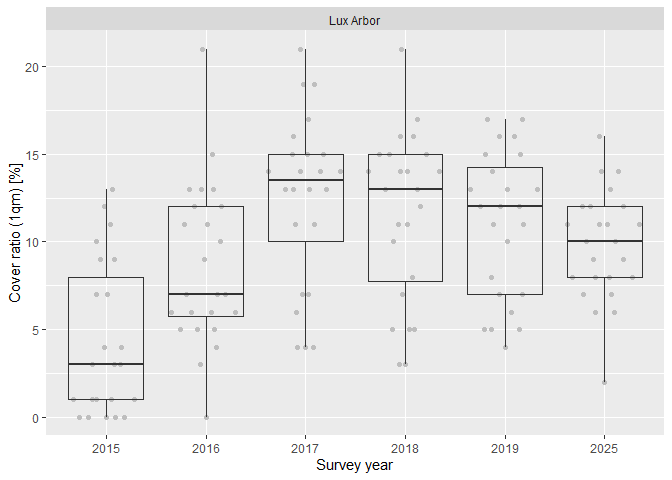
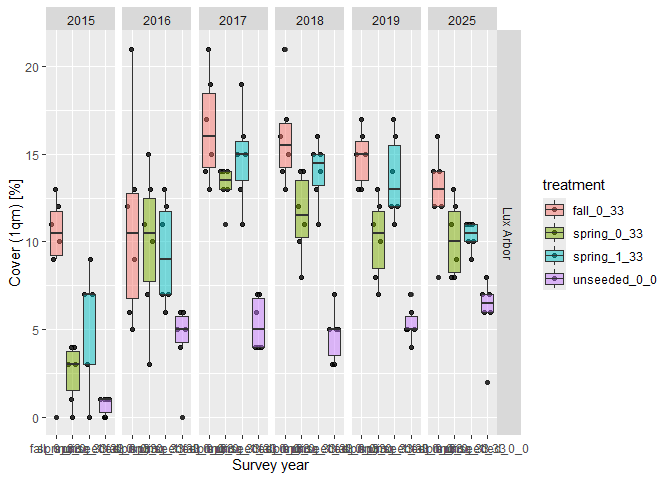
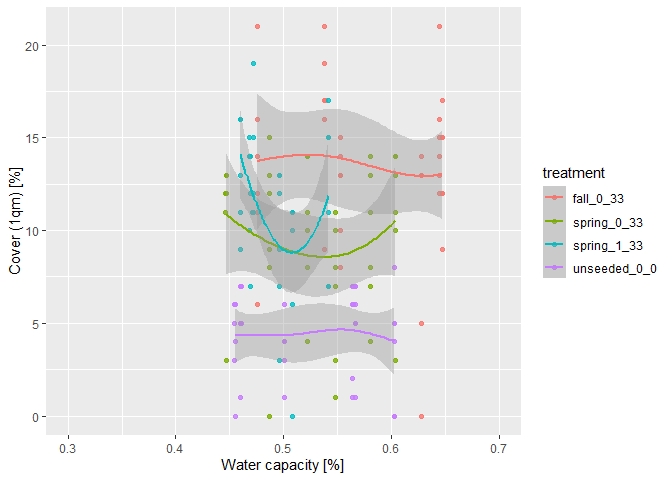
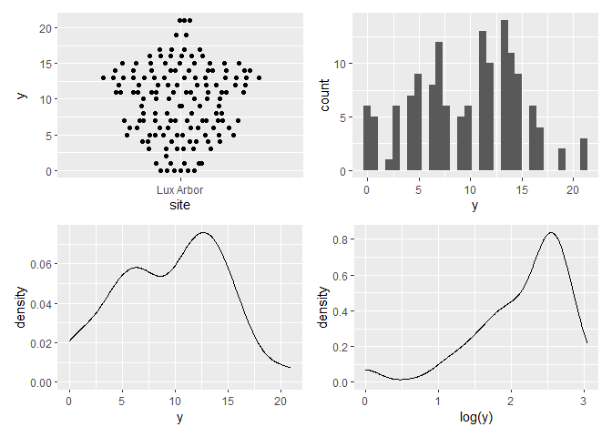
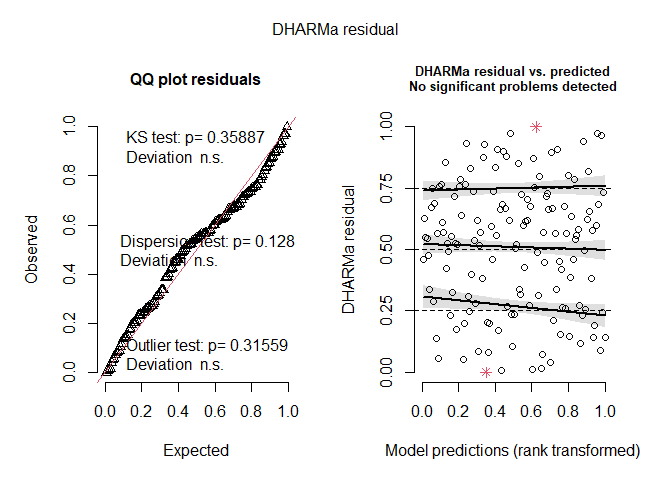
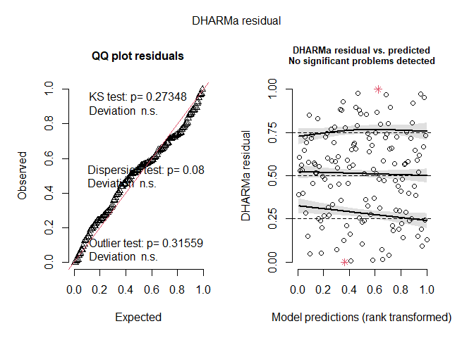
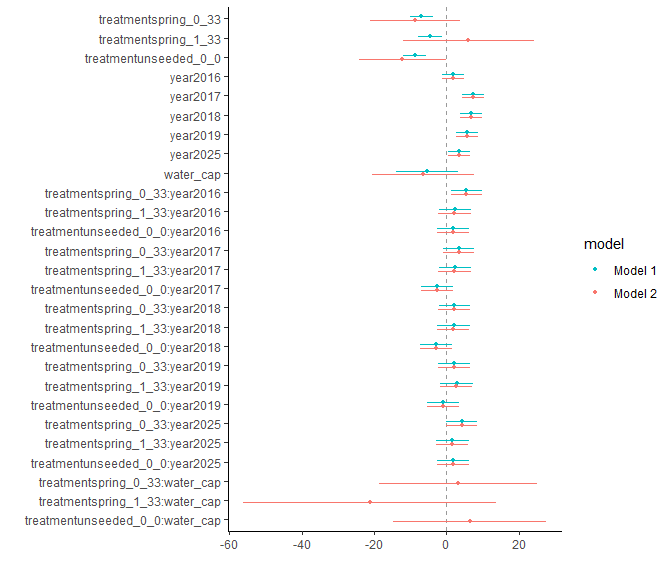
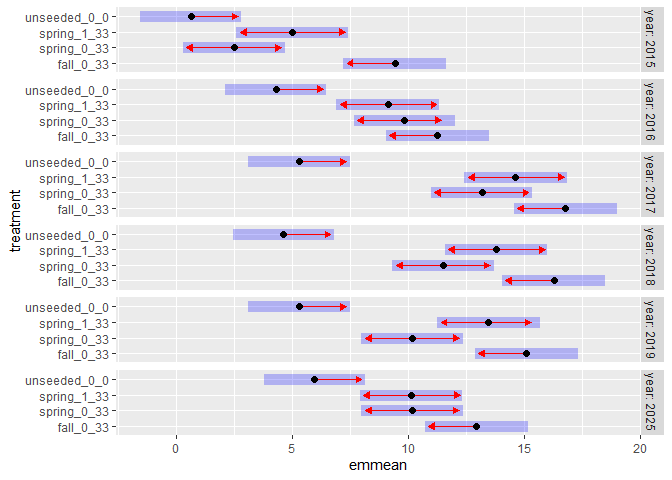

Analysis of XXX et al. (submitted) GREEEN project: <br> Effects of extra
herbicide treatment and seeding time on establishment of seeded species
================
<b>Markus Bauer</b> <br>
<b>2025-08-19</b>

- [Preparation](#preparation)
- [Statistics](#statistics)
  - [Data exploration](#data-exploration)
    - [Means and deviations](#means-and-deviations)
    - [Graphs of raw data (Step 2, 6,
      7)](#graphs-of-raw-data-step-2-6-7)
    - [Outliers, zero-inflation, transformations? (Step 1, 3,
      4)](#outliers-zero-inflation-transformations-step-1-3-4)
    - [Check collinearity part 1 (Step
      5)](#check-collinearity-part-1-step-5)
  - [Models](#models)
  - [Model check](#model-check)
    - [DHARMa](#dharma)
    - [Check collinearity part 2 (Step
      5)](#check-collinearity-part-2-step-5)
  - [Model comparison](#model-comparison)
    - [<i>R</i><sup>2</sup> values](#r2-values)
    - [AICc](#aicc)
  - [Predicted values](#predicted-values)
    - [Summary table](#summary-table)
    - [Forest plot](#forest-plot)
    - [Effect sizes](#effect-sizes)
- [Session info](#session-info)

<br/> <br/> <b>Markus Bauer</b>

Technichal University of Munich, TUM School of Life Sciences, Chair of
Restoration Ecology, Emil-Ramann-Straße 6, 85354 Freising, Germany

<markus1.bauer@tum.de>

ORCiD ID: [0000-0001-5372-4174](https://orcid.org/0000-0001-5372-4174)
<br> [Google
Scholar](https://scholar.google.de/citations?user=oHhmOkkAAAAJ&hl=de&oi=ao)
<br> GitHub: [markus1bauer](https://github.com/markus1bauer)

> **NOTE:** To compare different models, you only have to change the
> models in the section ‘Load models’

# Preparation

Protocol of data exploration (Steps 1-8) used from Zuur et al. (2010)
Methods Ecol Evol [DOI:
10.1111/2041-210X.12577](https://doi.org/10.1111/2041-210X.12577)

#### Packages

``` r
library(here)
library(tidyverse)
library(ggbeeswarm)
library(patchwork)
library(lme4)
library(DHARMa)
library(emmeans)
```

#### Load data

``` r
sites <- read_csv(
  here("data", "processed", "data_processed_sites.csv"),
  col_names = TRUE, na = c("na", "NA", ""), col_types = cols(
    .default = "?",
    id_plot_year = "f",
    id_plot = "f",
    site = col_factor(
      levels = c("NW Station", "Lux Arbor", "SW Station"), ordered = FALSE
    ),
    year = "f",
    seeding_time = col_factor(
      levels = c("unseeded", "fall", "spring"), ordered = FALSE
      ),
    herbicide = col_factor(levels = c("0", "1"), ordered = FALSE),
    seeded_pool = col_factor(
      levels = c("0", "6", "12", "18", "33"), ordered = TRUE
      ),
    treatment_id = "f",
    treatment_description = "c",
    richness_type = "f"
  )
) %>%
  filter(
    # year != "2015",
    site == "Lux Arbor",
    richness_type == "seeded_richness",
    treatment_id %in% c("1", "2", "3", "4")
  ) %>%
  mutate(
    treatment = str_c(seeding_time, herbicide, seeded_pool, sep = "_"),
    treatment = factor(treatment),
    y = richness_1qm + richness_25qm
    )
```

# Statistics

## Data exploration

### Means and deviations

``` r
Rmisc::CI(sites$y, ci = .95)
```

    ##     upper      mean     lower 
    ## 10.497363  9.664336  8.831309

``` r
median(sites$y)
```

    ## [1] 11

``` r
sd(sites$y)
```

    ## [1] 5.039204

``` r
quantile(sites$y, probs = c(0.05, 0.95), na.rm = TRUE)
```

    ##  5% 95% 
    ##   1  17

``` r
sites %>% count(site, year)
```

    ## # A tibble: 6 × 3
    ##   site      year      n
    ##   <fct>     <fct> <int>
    ## 1 Lux Arbor 2015     23
    ## 2 Lux Arbor 2016     24
    ## 3 Lux Arbor 2017     24
    ## 4 Lux Arbor 2018     24
    ## 5 Lux Arbor 2019     24
    ## 6 Lux Arbor 2025     24

``` r
sites %>% count(seeded_pool)
```

    ## # A tibble: 2 × 2
    ##   seeded_pool     n
    ##   <ord>       <int>
    ## 1 0              36
    ## 2 33            107

``` r
sites %>% count(seeding_time)
```

    ## # A tibble: 3 × 2
    ##   seeding_time     n
    ##   <fct>        <int>
    ## 1 unseeded        36
    ## 2 fall            36
    ## 3 spring          71

``` r
sites %>% count(herbicide)
```

    ## # A tibble: 2 × 2
    ##   herbicide     n
    ##   <fct>     <int>
    ## 1 0           108
    ## 2 1            35

### Graphs of raw data (Step 2, 6, 7)

<!-- --><!-- --><!-- -->

### Outliers, zero-inflation, transformations? (Step 1, 3, 4)

<!-- -->

### Check collinearity part 1 (Step 5)

Exclude r \> 0.7 <br> Dormann et al. 2013 Ecography [DOI:
10.1111/j.1600-0587.2012.07348.x](https://doi.org/10.1111/j.1600-0587.2012.07348.x)

``` r
# sites %>%
#   select(where(is.numeric), -y, -starts_with("cwm.")) %>%
#   GGally::ggpairs(
#     lower = list(continuous = "smooth_loess")
#     ) +
#   theme(strip.text = element_text(size = 7))

# -> no continuous variables
```

## Models

> **NOTE:** Only here you have to modify the script to compare other
> models

``` r
load(file = here("outputs", "models", "model_seeding_time_herbicide_long_1.Rdata"))
load(file = here("outputs", "models", "model_seeding_time_herbicide_long_2.Rdata"))
m_1 <- m1
m_2 <- m2
```

``` r
formula(m_1)
## y ~ treatment * year + water_cap
formula(m_2)
## y ~ treatment * (year + water_cap)
```

## Model check

### DHARMa

``` r
simulation_output_1 <- simulateResiduals(m_1, plot = TRUE)
```

<!-- -->

``` r
simulation_output_2 <- simulateResiduals(m_2, plot = TRUE)
```

<!-- -->

``` r
# plotResiduals(simulation_output_1$scaledResiduals, sites$herbicide)
# plotResiduals(simulation_output_2$scaledResiduals, sites$herbicide)
# plotResiduals(simulation_output_1$scaledResiduals, sites$seeding_time)
# plotResiduals(simulation_output_2$scaledResiduals, sites$seeding_time)
# plotResiduals(simulation_output_1$scaledResiduals, sites$year)
# plotResiduals(simulation_output_2$scaledResiduals, sites$year)
# plotResiduals(simulation_output_1$scaledResiduals, sites$water_cap)
# plotResiduals(simulation_output_2$scaledResiduals, sites$water_cap)
```

### Check collinearity part 2 (Step 5)

Remove VIF \> 3 or \> 10 <br> Zuur et al. 2010 Methods Ecol Evol [DOI:
10.1111/j.2041-210X.2009.00001.x](https://doi.org/10.1111/j.2041-210X.2009.00001.x)

``` r
car::vif(m_1)
```

    ## there are higher-order terms (interactions) in this model
    ## consider setting type = 'predictor'; see ?vif

    ##                        GVIF Df GVIF^(1/(2*Df))
    ## treatment        256.494300  3        2.520652
    ## year             988.195804  5        1.992894
    ## water_cap          1.371548  1        1.171131
    ## treatment:year 92236.364539 15        1.463851

``` r
car::vif(m_2)
```

    ## there are higher-order terms (interactions) in this model
    ## consider setting type = 'predictor'; see ?vif

    ##                             GVIF Df GVIF^(1/(2*Df))
    ## treatment           2.364650e+06  3       11.542356
    ## year                9.881958e+02  5        1.992894
    ## water_cap           3.673895e+00  1        1.916741
    ## treatment:year      9.239013e+04 15        1.463932
    ## treatment:water_cap 1.831351e+06  3       11.061023

## Model comparison

### <i>R</i><sup>2</sup> values

``` r
MuMIn::r.squaredGLMM(m_1)
##            R2m       R2c
## [1,] 0.7268048 0.7268048
MuMIn::r.squaredGLMM(m_2)
##            R2m       R2c
## [1,] 0.7271762 0.7271762
```

### AICc

Use AICc and not AIC since ratio n/K \< 40 <br> Burnahm & Anderson 2002
p. 66 ISBN: 978-0-387-95364-9

``` r
MuMIn::AICc(m_1, m_2) %>%
  arrange(AICc)
##     df     AICc
## m_1 26 726.1818
## m_2 29 732.4567
```

## Predicted values

### Summary table

``` r
car::Anova(m_1, type = 2)
```

    ## Anova Table (Type II tests)
    ## 
    ## Response: y
    ##                 Sum Sq  Df F value Pr(>F)    
    ## treatment      1569.65   3 71.9374 <2e-16 ***
    ## year            972.40   5 26.7391 <2e-16 ***
    ## water_cap        10.89   1  1.4974 0.2235    
    ## treatment:year  163.31  15  1.4969 0.1171    
    ## Residuals       858.24 118                   
    ## ---
    ## Signif. codes:  0 '***' 0.001 '**' 0.01 '*' 0.05 '.' 0.1 ' ' 1

``` r
summary(m_1)
```

    ## 
    ## Call:
    ## lm(formula = y ~ treatment * year + water_cap, data = sites)
    ## 
    ## Residuals:
    ##    Min     1Q Median     3Q    Max 
    ## -8.920 -1.613  0.297  1.419  9.774 
    ## 
    ## Coefficients:
    ##                                Estimate Std. Error t value Pr(>|t|)    
    ## (Intercept)                      12.233      2.737   4.469 1.81e-05 ***
    ## treatmentspring_0_33             -6.929      1.572  -4.409 2.31e-05 ***
    ## treatmentspring_1_33             -4.421      1.675  -2.640 0.009419 ** 
    ## treatmentunseeded_0_0            -8.796      1.576  -5.582 1.54e-07 ***
    ## year2016                          1.833      1.557   1.177 0.241390    
    ## year2017                          7.333      1.557   4.710 6.83e-06 ***
    ## year2018                          6.833      1.557   4.389 2.50e-05 ***
    ## year2019                          5.667      1.557   3.639 0.000407 ***
    ## year2025                          3.500      1.557   2.248 0.026444 *  
    ## water_cap                        -5.279      4.314  -1.224 0.223504    
    ## treatmentspring_0_33:year2016     5.500      2.202   2.498 0.013877 *  
    ## treatmentspring_1_33:year2016     2.280      2.256   1.010 0.314468    
    ## treatmentunseeded_0_0:year2016    1.833      2.202   0.833 0.406767    
    ## treatmentspring_0_33:year2017     3.333      2.202   1.514 0.132758    
    ## treatmentspring_1_33:year2017     2.280      2.256   1.010 0.314468    
    ## treatmentunseeded_0_0:year2017   -2.667      2.202  -1.211 0.228309    
    ## treatmentspring_0_33:year2018     2.167      2.202   0.984 0.327152    
    ## treatmentspring_1_33:year2018     1.946      2.256   0.862 0.390178    
    ## treatmentunseeded_0_0:year2018   -2.833      2.202  -1.287 0.200715    
    ## treatmentspring_0_33:year2019     2.000      2.202   0.908 0.365590    
    ## treatmentspring_1_33:year2019     2.780      2.256   1.232 0.220479    
    ## treatmentunseeded_0_0:year2019   -1.000      2.202  -0.454 0.650568    
    ## treatmentspring_0_33:year2025     4.167      2.202   1.892 0.060913 .  
    ## treatmentspring_1_33:year2025     1.613      2.256   0.715 0.476178    
    ## treatmentunseeded_0_0:year2025    1.833      2.202   0.833 0.406767    
    ## ---
    ## Signif. codes:  0 '***' 0.001 '**' 0.01 '*' 0.05 '.' 0.1 ' ' 1
    ## 
    ## Residual standard error: 2.697 on 118 degrees of freedom
    ## Multiple R-squared:  0.762,  Adjusted R-squared:  0.7136 
    ## F-statistic: 15.74 on 24 and 118 DF,  p-value: < 2.2e-16

### Forest plot

``` r
dotwhisker::dwplot(
  list(m_1, m_2),
  ci = 0.95,
  show_intercept = FALSE,
  vline = geom_vline(xintercept = 0, colour = "grey60", linetype = 2)) +
  theme_classic()
```

<!-- -->

### Effect sizes

Effect sizes of chosen model just to get exact values of means etc. if
necessary.

``` r
(emm <- emmeans(
  m_1,
  revpairwise ~ treatment | year,
  type = "response"
  ))
```

    ## $emmeans
    ## year = 2015:
    ##  treatment    emmean   SE  df lower.CL upper.CL
    ##  fall_0_33     9.423 1.12 118    7.203    11.64
    ##  spring_0_33   2.493 1.10 118    0.313     4.67
    ##  spring_1_33   5.002 1.22 118    2.592     7.41
    ##  unseeded_0_0  0.627 1.10 118   -1.554     2.81
    ## 
    ## year = 2016:
    ##  treatment    emmean   SE  df lower.CL upper.CL
    ##  fall_0_33    11.256 1.12 118    9.037    13.48
    ##  spring_0_33   9.827 1.10 118    7.646    12.01
    ##  spring_1_33   9.115 1.12 118    6.906    11.32
    ##  unseeded_0_0  4.293 1.10 118    2.112     6.47
    ## 
    ## year = 2017:
    ##  treatment    emmean   SE  df lower.CL upper.CL
    ##  fall_0_33    16.756 1.12 118   14.537    18.98
    ##  spring_0_33  13.160 1.10 118   10.980    15.34
    ##  spring_1_33  14.615 1.12 118   12.406    16.82
    ##  unseeded_0_0  5.293 1.10 118    3.112     7.47
    ## 
    ## year = 2018:
    ##  treatment    emmean   SE  df lower.CL upper.CL
    ##  fall_0_33    16.256 1.12 118   14.037    18.48
    ##  spring_0_33  11.493 1.10 118    9.313    13.67
    ##  spring_1_33  13.782 1.12 118   11.573    15.99
    ##  unseeded_0_0  4.627 1.10 118    2.446     6.81
    ## 
    ## year = 2019:
    ##  treatment    emmean   SE  df lower.CL upper.CL
    ##  fall_0_33    15.089 1.12 118   12.870    17.31
    ##  spring_0_33  10.160 1.10 118    7.980    12.34
    ##  spring_1_33  13.448 1.12 118   11.239    15.66
    ##  unseeded_0_0  5.293 1.10 118    3.112     7.47
    ## 
    ## year = 2025:
    ##  treatment    emmean   SE  df lower.CL upper.CL
    ##  fall_0_33    12.923 1.12 118   10.703    15.14
    ##  spring_0_33  10.160 1.10 118    7.980    12.34
    ##  spring_1_33  10.115 1.12 118    7.906    12.32
    ##  unseeded_0_0  5.960 1.10 118    3.779     8.14
    ## 
    ## Confidence level used: 0.95 
    ## 
    ## $contrasts
    ## year = 2015:
    ##  contrast                   estimate   SE  df t.ratio p.value
    ##  spring_0_33 - fall_0_33     -6.9293 1.57 118  -4.409  0.0001
    ##  spring_1_33 - fall_0_33     -4.4206 1.67 118  -2.640  0.0459
    ##  spring_1_33 - spring_0_33    2.5087 1.64 118   1.529  0.4234
    ##  unseeded_0_0 - fall_0_33    -8.7959 1.58 118  -5.582  <.0001
    ##  unseeded_0_0 - spring_0_33  -1.8665 1.56 118  -1.199  0.6290
    ##  unseeded_0_0 - spring_1_33  -4.3752 1.64 118  -2.671  0.0423
    ## 
    ## year = 2016:
    ##  contrast                   estimate   SE  df t.ratio p.value
    ##  spring_0_33 - fall_0_33     -1.4293 1.57 118  -0.909  0.7999
    ##  spring_1_33 - fall_0_33     -2.1412 1.60 118  -1.334  0.5430
    ##  spring_1_33 - spring_0_33   -0.7119 1.57 118  -0.454  0.9687
    ##  unseeded_0_0 - fall_0_33    -6.9625 1.58 118  -4.419  0.0001
    ##  unseeded_0_0 - spring_0_33  -5.5332 1.56 118  -3.553  0.0030
    ##  unseeded_0_0 - spring_1_33  -4.8214 1.56 118  -3.083  0.0134
    ## 
    ## year = 2017:
    ##  contrast                   estimate   SE  df t.ratio p.value
    ##  spring_0_33 - fall_0_33     -3.5960 1.57 118  -2.288  0.1067
    ##  spring_1_33 - fall_0_33     -2.1412 1.60 118  -1.334  0.5430
    ##  spring_1_33 - spring_0_33    1.4548 1.57 118   0.929  0.7896
    ##  unseeded_0_0 - fall_0_33   -11.4625 1.58 118  -7.275  <.0001
    ##  unseeded_0_0 - spring_0_33  -7.8665 1.56 118  -5.051  <.0001
    ##  unseeded_0_0 - spring_1_33  -9.3214 1.56 118  -5.960  <.0001
    ## 
    ## year = 2018:
    ##  contrast                   estimate   SE  df t.ratio p.value
    ##  spring_0_33 - fall_0_33     -4.7627 1.57 118  -3.030  0.0157
    ##  spring_1_33 - fall_0_33     -2.4745 1.60 118  -1.542  0.4158
    ##  spring_1_33 - spring_0_33    2.2881 1.57 118   1.461  0.4646
    ##  unseeded_0_0 - fall_0_33   -11.6292 1.58 118  -7.380  <.0001
    ##  unseeded_0_0 - spring_0_33  -6.8665 1.56 118  -4.409  0.0001
    ##  unseeded_0_0 - spring_1_33  -9.1547 1.56 118  -5.854  <.0001
    ## 
    ## year = 2019:
    ##  contrast                   estimate   SE  df t.ratio p.value
    ##  spring_0_33 - fall_0_33     -4.9293 1.57 118  -3.136  0.0115
    ##  spring_1_33 - fall_0_33     -1.6412 1.60 118  -1.023  0.7365
    ##  spring_1_33 - spring_0_33    3.2881 1.57 118   2.099  0.1595
    ##  unseeded_0_0 - fall_0_33    -9.7959 1.58 118  -6.217  <.0001
    ##  unseeded_0_0 - spring_0_33  -4.8665 1.56 118  -3.125  0.0118
    ##  unseeded_0_0 - spring_1_33  -8.1547 1.56 118  -5.214  <.0001
    ## 
    ## year = 2025:
    ##  contrast                   estimate   SE  df t.ratio p.value
    ##  spring_0_33 - fall_0_33     -2.7627 1.57 118  -1.758  0.2990
    ##  spring_1_33 - fall_0_33     -2.8079 1.60 118  -1.750  0.3029
    ##  spring_1_33 - spring_0_33   -0.0452 1.57 118  -0.029  1.0000
    ##  unseeded_0_0 - fall_0_33    -6.9625 1.58 118  -4.419  0.0001
    ##  unseeded_0_0 - spring_0_33  -4.1999 1.56 118  -2.697  0.0395
    ##  unseeded_0_0 - spring_1_33  -4.1547 1.56 118  -2.657  0.0439
    ## 
    ## P value adjustment: tukey method for comparing a family of 4 estimates

``` r
plot(emm, comparison = TRUE)
```

<!-- -->

# Session info

    ## R version 4.5.0 (2025-04-11 ucrt)
    ## Platform: x86_64-w64-mingw32/x64
    ## Running under: Windows 11 x64 (build 26100)
    ## 
    ## Matrix products: default
    ##   LAPACK version 3.12.1
    ## 
    ## locale:
    ## [1] LC_COLLATE=German_Germany.utf8  LC_CTYPE=German_Germany.utf8   
    ## [3] LC_MONETARY=German_Germany.utf8 LC_NUMERIC=C                   
    ## [5] LC_TIME=German_Germany.utf8    
    ## 
    ## time zone: America/New_York
    ## tzcode source: internal
    ## 
    ## attached base packages:
    ## [1] stats     graphics  grDevices utils     datasets  methods   base     
    ## 
    ## other attached packages:
    ##  [1] emmeans_1.11.1   DHARMa_0.4.7     lme4_1.1-37      Matrix_1.7-3    
    ##  [5] patchwork_1.3.1  ggbeeswarm_0.7.2 lubridate_1.9.4  forcats_1.0.0   
    ##  [9] stringr_1.5.1    dplyr_1.1.4      purrr_1.1.0      readr_2.1.5     
    ## [13] tidyr_1.3.1      tibble_3.3.0     ggplot2_3.5.2    tidyverse_2.0.0 
    ## [17] here_1.0.1      
    ## 
    ## loaded via a namespace (and not attached):
    ##  [1] Rdpack_2.6.4           gridExtra_2.3          rlang_1.1.6           
    ##  [4] magrittr_2.0.3         compiler_4.5.0         mgcv_1.9-3            
    ##  [7] vctrs_0.6.5            pkgconfig_2.0.3        crayon_1.5.3          
    ## [10] fastmap_1.2.0          backports_1.5.0        labeling_0.4.3        
    ## [13] utf8_1.2.6             ggstance_0.3.7         promises_1.3.3        
    ## [16] rmarkdown_2.29         tzdb_0.5.0             nloptr_2.2.1          
    ## [19] bit_4.6.0              xfun_0.52              later_1.4.2           
    ## [22] parallel_4.5.0         R6_2.6.1               gap.datasets_0.0.6    
    ## [25] stringi_1.8.7          qgam_2.0.0             RColorBrewer_1.1-3    
    ## [28] car_3.1-3              boot_1.3-31            estimability_1.5.1    
    ## [31] Rcpp_1.1.0             iterators_1.0.14       knitr_1.50            
    ## [34] parameters_0.27.0      httpuv_1.6.16          splines_4.5.0         
    ## [37] timechange_0.3.0       tidyselect_1.2.1       rstudioapi_0.17.1     
    ## [40] abind_1.4-8            yaml_2.3.10            MuMIn_1.48.11         
    ## [43] doParallel_1.0.17      codetools_0.2-20       lattice_0.22-7        
    ## [46] plyr_1.8.9             shiny_1.11.1           withr_3.0.2           
    ## [49] bayestestR_0.16.1      coda_0.19-4.1          evaluate_1.0.4        
    ## [52] marginaleffects_0.28.0 pillar_1.11.0          gap_1.6               
    ## [55] carData_3.0-5          foreach_1.5.2          stats4_4.5.0          
    ## [58] reformulas_0.4.1       insight_1.3.1          generics_0.1.4        
    ## [61] vroom_1.6.5            rprojroot_2.0.4        hms_1.1.3             
    ## [64] scales_1.4.0           minqa_1.2.8            xtable_1.8-4          
    ## [67] glue_1.8.0             tools_4.5.0            data.table_1.17.8     
    ## [70] mvtnorm_1.3-3          grid_4.5.0             rbibutils_2.3         
    ## [73] datawizard_1.1.0       nlme_3.1-168           Rmisc_1.5.1           
    ## [76] performance_0.15.0     beeswarm_0.4.0         vipor_0.4.7           
    ## [79] Formula_1.2-5          cli_3.6.5              gtable_0.3.6          
    ## [82] digest_0.6.37          farver_2.1.2           htmltools_0.5.8.1     
    ## [85] lifecycle_1.0.4        mime_0.13              bit64_4.6.0-1         
    ## [88] dotwhisker_0.8.4       MASS_7.3-65
