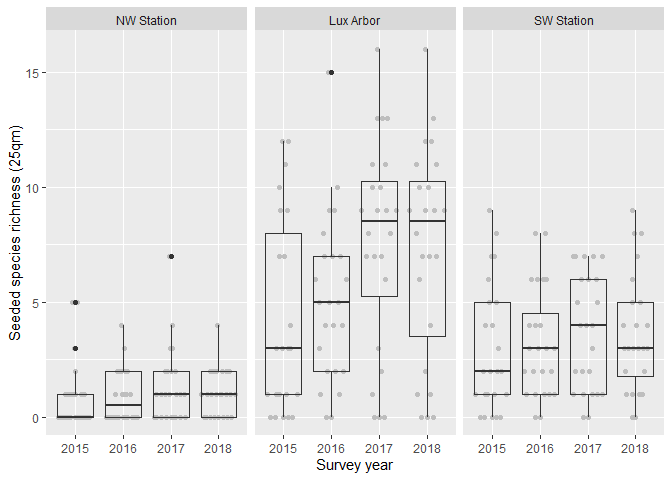
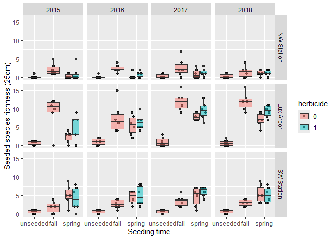
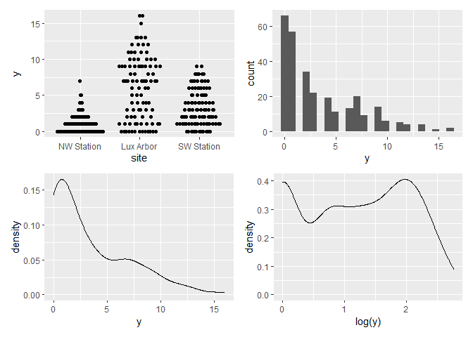
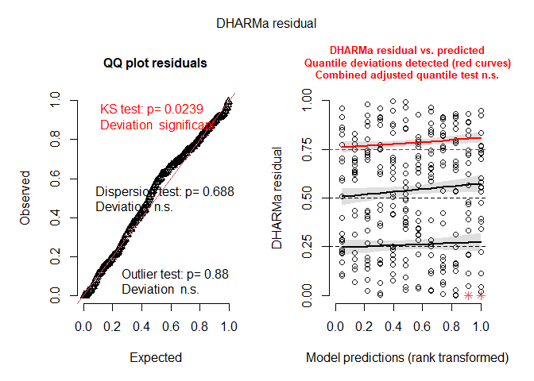
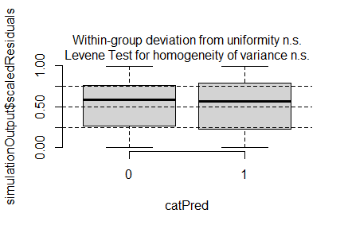
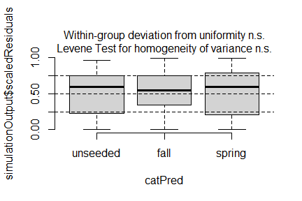
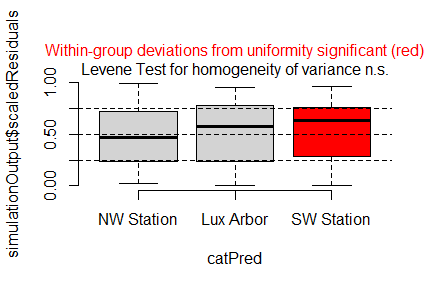
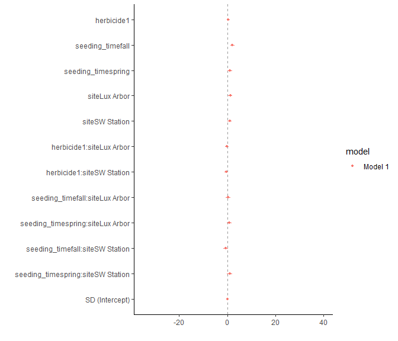
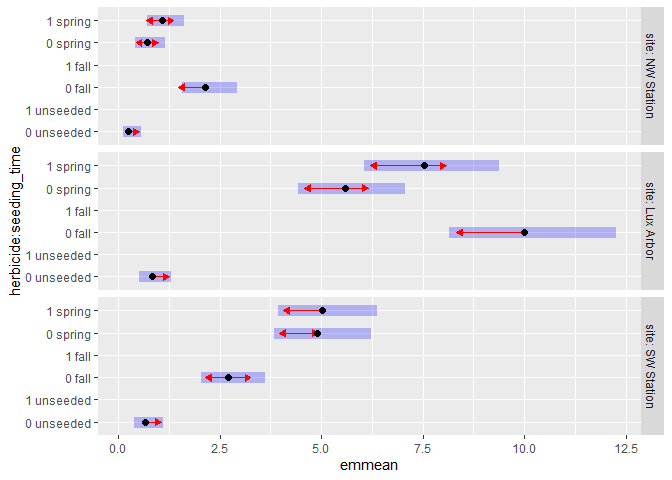

Analysis of Bauer et al. (submitted) GREEEN project: <br> Effect of
extra herbicide treatment and seeding time on establishment of seeded
species
================
<b>Markus Bauer</b> <br>
<b>2025-07-16</b>

- [Preparation](#preparation)
- [Statistics](#statistics)
  - [Data exploration](#data-exploration)
    - [Means and deviations](#means-and-deviations)
    - [Graphs of raw data (Step 2, 6,
      7)](#graphs-of-raw-data-step-2-6-7)
    - [Outliers, zero-inflation, transformations? (Step 1, 3,
      4)](#outliers-zero-inflation-transformations-step-1-3-4)
    - [Check collinearity part 1 (Step
      5)](#check-collinearity-part-1-step-5)
  - [Models](#models)
  - [Model check](#model-check)
    - [DHARMa](#dharma)
    - [Check collinearity part 2 (Step
      5)](#check-collinearity-part-2-step-5)
  - [Model comparison](#model-comparison)
    - [<i>R</i><sup>2</sup> values](#r2-values)
    - [AICc](#aicc)
  - [Predicted values](#predicted-values)
    - [Summary table](#summary-table)
    - [Forest plot](#forest-plot)
    - [Effect sizes](#effect-sizes)
- [Session info](#session-info)

<br/> <br/> <b>Markus Bauer</b>

Technichal University of Munich, TUM School of Life Sciences, Chair of
Restoration Ecology, Emil-Ramann-Straße 6, 85354 Freising, Germany

<markus1.bauer@tum.de>

ORCiD ID: [0000-0001-5372-4174](https://orcid.org/0000-0001-5372-4174)
<br> [Google
Scholar](https://scholar.google.de/citations?user=oHhmOkkAAAAJ&hl=de&oi=ao)
<br> GitHub: [markus1bauer](https://github.com/markus1bauer)

> **NOTE:** To compare different models, you only have to change the
> models in the section ‘Load models’

# Preparation

Protocol of data exploration (Steps 1-8) used from Zuur et al. (2010)
Methods Ecol Evol [DOI:
10.1111/2041-210X.12577](https://doi.org/10.1111/2041-210X.12577)

#### Packages

``` r
library(here)
library(tidyverse)
library(ggbeeswarm)
library(patchwork)
library(lme4)
library(DHARMa)
library(emmeans)
```

#### Load data

``` r
sites <- read_csv(
  here("data", "processed", "data_processed_sites.csv"),
  col_names = TRUE, na = c("na", "NA", ""), col_types = cols(
    .default = "?",
    id_plot_year = "f",
    id_plot = "f",
    site = col_factor(
      levels = c("NW Station", "Lux Arbor", "SW Station"), ordered = FALSE
    ),
    year = "f",
    seeding_time = col_factor(
      levels = c("unseeded", "fall", "spring"), ordered = FALSE
      ),
    herbicide = col_factor(levels = c("0", "1"), ordered = FALSE),
    seeded_pool = col_factor(
      levels = c("0", "6", "12", "18", "33"), ordered = TRUE
      ),
    treatment_id = "f",
    treatment_description = "c",
    richness_type = "f"
  )
) %>%
  filter(
    year %in% c("2015", "2016", "2017", "2018"),
    richness_type == "seeded_richness",
    treatment_id %in% c("1", "2", "3", "4")
  ) %>%
  select(
    id_plot_year, id_plot, site, year, herbicide, seeding_time, seeded_pool,
    richness_1qm, richness_25qm, treatment_id
    ) %>%
  mutate(y = richness_1qm + richness_25qm)
```

# Statistics

## Data exploration

### Means and deviations

``` r
Rmisc::CI(sites$y, ci = .95)
```

    ##    upper     mean    lower 
    ## 3.909919 3.484321 3.058722

``` r
median(sites$y)
```

    ## [1] 2

``` r
sd(sites$y)
```

    ## [1] 3.663122

``` r
quantile(sites$y, probs = c(0.05, 0.95), na.rm = TRUE)
```

    ##  5% 95% 
    ##   0  11

``` r
sites %>% count(site, year)
```

    ## # A tibble: 12 × 3
    ##    site       year      n
    ##    <fct>      <fct> <int>
    ##  1 NW Station 2015     24
    ##  2 NW Station 2016     24
    ##  3 NW Station 2017     24
    ##  4 NW Station 2018     24
    ##  5 Lux Arbor  2015     23
    ##  6 Lux Arbor  2016     24
    ##  7 Lux Arbor  2017     24
    ##  8 Lux Arbor  2018     24
    ##  9 SW Station 2015     24
    ## 10 SW Station 2016     24
    ## 11 SW Station 2017     24
    ## 12 SW Station 2018     24

``` r
sites %>% count(seeded_pool)
```

    ## # A tibble: 2 × 2
    ##   seeded_pool     n
    ##   <ord>       <int>
    ## 1 0              72
    ## 2 33            215

``` r
sites %>% count(seeding_time)
```

    ## # A tibble: 3 × 2
    ##   seeding_time     n
    ##   <fct>        <int>
    ## 1 unseeded        72
    ## 2 fall            72
    ## 3 spring         143

``` r
sites %>% count(herbicide)
```

    ## # A tibble: 2 × 2
    ##   herbicide     n
    ##   <fct>     <int>
    ## 1 0           216
    ## 2 1            71

### Graphs of raw data (Step 2, 6, 7)

<!-- --><!-- -->

### Outliers, zero-inflation, transformations? (Step 1, 3, 4)

<!-- -->

### Check collinearity part 1 (Step 5)

Exclude r \> 0.7 <br> Dormann et al. 2013 Ecography [DOI:
10.1111/j.1600-0587.2012.07348.x](https://doi.org/10.1111/j.1600-0587.2012.07348.x)

``` r
# sites %>%
#   select(where(is.numeric), -y, -starts_with("cwm.")) %>%
#   GGally::ggpairs(
#     lower = list(continuous = "smooth_loess")
#     ) +
#   theme(strip.text = element_text(size = 7))

# -> no continuous variables
```

## Models

> **NOTE:** Only here you have to modify the script to compare other
> models

``` r
load(file = here("outputs", "models", "model_seeding_time_herbicide_full.Rdata"))
#load(file = here("outputs", "models", "model_sla_esy4_3.Rdata"))
m_1 <- m_full
#m_2 <- m2
```

``` r
m_1@call
## glmer(formula = y ~ herbicide * seeding_time * site + (1 | year), 
##     data = sites, family = poisson(link = "log"))
# m_2@call
```

## Model check

### DHARMa

``` r
simulation_output_1 <- simulateResiduals(m_1, plot = TRUE)
```

<!-- -->

``` r
# simulation_output_2 <- simulateResiduals(m_2, plot = TRUE)
```

``` r
plotResiduals(simulation_output_1$scaledResiduals, sites$herbicide)
```

<!-- -->

``` r
# plotResiduals(simulation_output_2$scaledResiduals, sites$herbicide)
plotResiduals(simulation_output_1$scaledResiduals, sites$seeding_time)
```

<!-- -->

``` r
# plotResiduals(simulation_output_2$scaledResiduals, sites$seeding_time)
plotResiduals(simulation_output_1$scaledResiduals, sites$site)
```

<!-- -->

``` r
# plotResiduals(simulation_output_2$scaledResiduals, sites$site)
# plotResiduals(simulation_output_1$scaledResiduals, sites$year)
# plotResiduals(simulation_output_2$scaledResiduals, sites$year)
```

### Check collinearity part 2 (Step 5)

Remove VIF \> 3 or \> 10 <br> Zuur et al. 2010 Methods Ecol Evol [DOI:
10.1111/j.2041-210X.2009.00001.x](https://doi.org/10.1111/j.2041-210X.2009.00001.x)

``` r
car::vif(m_1)
```

    ##                                     GVIF Df GVIF^(1/(2*Df))
    ## herbicide                   2.133396e+01  1        4.618870
    ## seeding_time                1.279713e+02  2        3.363397
    ## site                        4.110092e+02  2        4.502595
    ## herbicide:seeding_time      3.332482e+09  0             Inf
    ## herbicide:site              4.683368e+01  2        2.616011
    ## seeding_time:site           1.273020e+04  4        3.259150
    ## herbicide:seeding_time:site 3.332482e+09  0             Inf

``` r
# car::vif(m_2)
```

## Model comparison

### <i>R</i><sup>2</sup> values

``` r
MuMIn::r.squaredGLMM(m_1)
## Warning: the null model is only correct if all the variables it uses are identical 
## to those used in fitting the original model.
##                 R2m       R2c
## delta     0.7998517 0.8171527
## lognormal 0.8179347 0.8356268
## trigamma  0.7775171 0.7943349
# MuMIn::r.squaredGLMM(m_2)
```

### AICc

Use AICc and not AIC since ratio n/K \< 40 <br> Burnahm & Anderson 2002
p. 66 ISBN: 978-0-387-95364-9

``` r
# MuMIn::AICc(m_1, m_2) %>%
#   arrange(AICc)
```

## Predicted values

### Summary table

``` r
car::Anova(m_1, type = 3)
```

    ## Analysis of Deviance Table (Type III Wald chisquare tests)
    ## 
    ## Response: y
    ##                               Chisq Df Pr(>Chisq)    
    ## (Intercept)                 11.3117  1  0.0007702 ***
    ## herbicide                    1.8593  1  0.1727092    
    ## seeding_time                35.6666  2  1.799e-08 ***
    ## site                         6.7316  2  0.0345350 *  
    ## herbicide:seeding_time               0               
    ## herbicide:site               3.1062  2  0.2115883    
    ## seeding_time:site           50.7632  4  2.502e-10 ***
    ## herbicide:seeding_time:site          0               
    ## ---
    ## Signif. codes:  0 '***' 0.001 '**' 0.01 '*' 0.05 '.' 0.1 ' ' 1

``` r
summary(m_1)
```

    ## Generalized linear mixed model fit by maximum likelihood (Laplace
    ##   Approximation) [glmerMod]
    ##  Family: poisson  ( log )
    ## Formula: y ~ herbicide * seeding_time * site + (1 | year)
    ##    Data: sites
    ## 
    ##       AIC       BIC    logLik -2*log(L)  df.resid 
    ##    1029.7    1077.3    -501.9    1003.7       274 
    ## 
    ## Scaled residuals: 
    ##     Min      1Q  Median      3Q     Max 
    ## -2.8680 -0.7529 -0.0140  0.5595  4.3915 
    ## 
    ## Random effects:
    ##  Groups Name        Variance Std.Dev.
    ##  year   (Intercept) 0.02717  0.1648  
    ## Number of obs: 287, groups:  year, 4
    ## 
    ## Fixed effects:
    ##                                   Estimate Std. Error z value Pr(>|z|)    
    ## (Intercept)                        -1.3998     0.4162  -3.363  0.00077 ***
    ## herbicide1                          0.4250     0.3117   1.364  0.17271    
    ## seeding_timefall                    2.1596     0.4308   5.013 5.37e-07 ***
    ## seeding_timespring                  1.0415     0.4745   2.195  0.02816 *  
    ## siteLux Arbor                       1.2041     0.4651   2.589  0.00963 ** 
    ## siteSW Station                      0.9808     0.4784   2.050  0.04032 *  
    ## herbicide1:siteLux Arbor           -0.1270     0.3318  -0.383  0.70190    
    ## herbicide1:siteSW Station          -0.4001     0.3372  -1.186  0.23545    
    ## seeding_timefall:siteLux Arbor      0.3377     0.4895   0.690  0.49029    
    ## seeding_timespring:siteLux Arbor    0.8754     0.5314   1.647  0.09951 .  
    ## seeding_timefall:siteSW Station    -0.7424     0.5130  -1.447  0.14781    
    ## seeding_timespring:siteSW Station   0.9651     0.5440   1.774  0.07604 .  
    ## ---
    ## Signif. codes:  0 '***' 0.001 '**' 0.01 '*' 0.05 '.' 0.1 ' ' 1
    ## 
    ## Correlation of Fixed Effects:
    ##              (Intr) hrbcd1 sdng_tmf sdng_tms stLxAr stSWSt hr1:LA h1:SWS
    ## herbicide1    0.000                                                     
    ## sedng_tmfll  -0.928  0.000                                              
    ## sdng_tmsprn  -0.843 -0.397  0.814                                       
    ## siteLuxArbr  -0.860  0.000  0.830    0.754                              
    ## siteSWStatn  -0.836  0.000  0.807    0.733    0.748                     
    ## hrbcd1:stLA   0.000 -0.939  0.000    0.373    0.000  0.000              
    ## hrbcd1:sSWS   0.000 -0.924  0.000    0.367    0.000  0.000  0.868       
    ## sdng_tmf:LA   0.817  0.000 -0.880   -0.716   -0.950 -0.711  0.000  0.000
    ## sdng_tms:LA   0.752  0.355 -0.727   -0.893   -0.875 -0.655 -0.375 -0.328
    ## sdng_tmf:SWS  0.779  0.000 -0.840   -0.684   -0.697 -0.932  0.000  0.000
    ## sdng_tms:SWS  0.735  0.346 -0.710   -0.872   -0.658 -0.879 -0.325 -0.366
    ##              sdng_tmf:LA sdng_tms:LA sdng_tmf:SWS
    ## herbicide1                                       
    ## sedng_tmfll                                      
    ## sdng_tmsprn                                      
    ## siteLuxArbr                                      
    ## siteSWStatn                                      
    ## hrbcd1:stLA                                      
    ## hrbcd1:sSWS                                      
    ## sdng_tmf:LA                                      
    ## sdng_tms:LA   0.832                              
    ## sdng_tmf:SWS  0.739       0.610                  
    ## sdng_tms:SWS  0.625       0.779       0.820      
    ## fit warnings:
    ## fixed-effect model matrix is rank deficient so dropping 6 columns / coefficients

### Forest plot

``` r
dotwhisker::dwplot(
  list(m_1),
  ci = 0.95,
  show_intercept = FALSE,
  vline = geom_vline(xintercept = 0, colour = "grey60", linetype = 2)) +
  xlim(-35, 40) +
  theme_classic()
```

    ## Package 'merDeriv' needs to be installed to compute confidence intervals
    ##   for random effect parameters.

<!-- -->

### Effect sizes

Effect sizes of chosen model just to get exact values of means etc. if
necessary.

``` r
(emm <- emmeans(
  m_1,
  revpairwise ~ herbicide * seeding_time | site,
  type = "response"
  ))
```

    ## $emmeans
    ## site = NW Station:
    ##  herbicide seeding_time   rate    SE  df asymp.LCL asymp.UCL
    ##  0         unseeded      0.247 0.103 Inf     0.109     0.558
    ##  1         unseeded     nonEst    NA  NA        NA        NA
    ##  0         fall          2.138 0.345 Inf     1.558     2.933
    ##  1         fall         nonEst    NA  NA        NA        NA
    ##  0         spring        0.699 0.179 Inf     0.423     1.154
    ##  1         spring        1.069 0.227 Inf     0.705     1.622
    ## 
    ## site = Lux Arbor:
    ##  herbicide seeding_time   rate    SE  df asymp.LCL asymp.UCL
    ##  0         unseeded      0.822 0.196 Inf     0.515     1.311
    ##  1         unseeded     nonEst    NA  NA        NA        NA
    ##  0         fall          9.990 1.040 Inf     8.139    12.262
    ##  1         fall         nonEst    NA  NA        NA        NA
    ##  0         spring        5.591 0.665 Inf     4.428     7.060
    ##  1         spring        7.531 0.842 Inf     6.050     9.376
    ## 
    ## site = SW Station:
    ##  herbicide seeding_time   rate    SE  df asymp.LCL asymp.UCL
    ##  0         unseeded      0.658 0.173 Inf     0.393     1.102
    ##  1         unseeded     nonEst    NA  NA        NA        NA
    ##  0         fall          2.713 0.402 Inf     2.029     3.627
    ##  1         fall         nonEst    NA  NA        NA        NA
    ##  0         spring        4.892 0.603 Inf     3.842     6.230
    ##  1         spring        5.015 0.614 Inf     3.945     6.376
    ## 
    ## Confidence level used: 0.95 
    ## Intervals are back-transformed from the log scale 
    ## 
    ## $contrasts
    ## site = NW Station:
    ##  contrast                                   ratio     SE  df null z.ratio
    ##  herbicide1 unseeded / herbicide0 unseeded nonEst     NA  NA    1      NA
    ##  herbicide0 fall / herbicide0 unseeded      8.668 3.7300 Inf    1   5.013
    ##  herbicide0 fall / herbicide1 unseeded     nonEst     NA  NA    1      NA
    ##  herbicide1 fall / herbicide0 unseeded     nonEst     NA  NA    1      NA
    ##  herbicide1 fall / herbicide1 unseeded     nonEst     NA  NA    1      NA
    ##  herbicide1 fall / herbicide0 fall         nonEst     NA  NA    1      NA
    ##  herbicide0 spring / herbicide0 unseeded    2.834 1.3400 Inf    1   2.195
    ##  herbicide0 spring / herbicide1 unseeded   nonEst     NA  NA    1      NA
    ##  herbicide0 spring / herbicide0 fall        0.327 0.0913 Inf    1  -4.005
    ##  herbicide0 spring / herbicide1 fall       nonEst     NA  NA    1      NA
    ##  herbicide1 spring / herbicide0 unseeded    4.334 1.9600 Inf    1   3.240
    ##  herbicide1 spring / herbicide1 unseeded   nonEst     NA  NA    1      NA
    ##  herbicide1 spring / herbicide0 fall        0.500 0.1200 Inf    1  -2.888
    ##  herbicide1 spring / herbicide1 fall       nonEst     NA  NA    1      NA
    ##  herbicide1 spring / herbicide0 spring      1.530 0.4770 Inf    1   1.364
    ##  p.value
    ##       NA
    ##   <.0001
    ##       NA
    ##       NA
    ##       NA
    ##       NA
    ##   0.1246
    ##       NA
    ##   0.0004
    ##       NA
    ##   0.0066
    ##       NA
    ##   0.0203
    ##       NA
    ##   0.5223
    ## 
    ## site = Lux Arbor:
    ##  contrast                                   ratio     SE  df null z.ratio
    ##  herbicide1 unseeded / herbicide0 unseeded nonEst     NA  NA    1      NA
    ##  herbicide0 fall / herbicide0 unseeded     12.150 2.8200 Inf    1  10.744
    ##  herbicide0 fall / herbicide1 unseeded     nonEst     NA  NA    1      NA
    ##  herbicide1 fall / herbicide0 unseeded     nonEst     NA  NA    1      NA
    ##  herbicide1 fall / herbicide1 unseeded     nonEst     NA  NA    1      NA
    ##  herbicide1 fall / herbicide0 fall         nonEst     NA  NA    1      NA
    ##  herbicide0 spring / herbicide0 unseeded    6.800 1.6300 Inf    1   8.010
    ##  herbicide0 spring / herbicide1 unseeded   nonEst     NA  NA    1      NA
    ##  herbicide0 spring / herbicide0 fall        0.560 0.0599 Inf    1  -5.424
    ##  herbicide0 spring / herbicide1 fall       nonEst     NA  NA    1      NA
    ##  herbicide1 spring / herbicide0 unseeded    9.160 2.1600 Inf    1   9.396
    ##  herbicide1 spring / herbicide1 unseeded   nonEst     NA  NA    1      NA
    ##  herbicide1 spring / herbicide0 fall        0.754 0.0745 Inf    1  -2.860
    ##  herbicide1 spring / herbicide1 fall       nonEst     NA  NA    1      NA
    ##  herbicide1 spring / herbicide0 spring      1.347 0.1540 Inf    1   2.614
    ##  p.value
    ##       NA
    ##   <.0001
    ##       NA
    ##       NA
    ##       NA
    ##       NA
    ##   <.0001
    ##       NA
    ##   <.0001
    ##       NA
    ##   <.0001
    ##       NA
    ##   0.0220
    ##       NA
    ##   0.0443
    ## 
    ## site = SW Station:
    ##  contrast                                   ratio     SE  df null z.ratio
    ##  herbicide1 unseeded / herbicide0 unseeded nonEst     NA  NA    1      NA
    ##  herbicide0 fall / herbicide0 unseeded      4.125 1.1500 Inf    1   5.089
    ##  herbicide0 fall / herbicide1 unseeded     nonEst     NA  NA    1      NA
    ##  herbicide1 fall / herbicide0 unseeded     nonEst     NA  NA    1      NA
    ##  herbicide1 fall / herbicide1 unseeded     nonEst     NA  NA    1      NA
    ##  herbicide1 fall / herbicide0 fall         nonEst     NA  NA    1      NA
    ##  herbicide0 spring / herbicide0 unseeded    7.438 1.9800 Inf    1   7.541
    ##  herbicide0 spring / herbicide1 unseeded   nonEst     NA  NA    1      NA
    ##  herbicide0 spring / herbicide0 fall        1.803 0.2770 Inf    1   3.844
    ##  herbicide0 spring / herbicide1 fall       nonEst     NA  NA    1      NA
    ##  herbicide1 spring / herbicide0 unseeded    7.626 2.0300 Inf    1   7.646
    ##  herbicide1 spring / herbicide1 unseeded   nonEst     NA  NA    1      NA
    ##  herbicide1 spring / herbicide0 fall        1.848 0.2820 Inf    1   4.024
    ##  herbicide1 spring / herbicide1 fall       nonEst     NA  NA    1      NA
    ##  herbicide1 spring / herbicide0 spring      1.025 0.1320 Inf    1   0.193
    ##  p.value
    ##       NA
    ##   <.0001
    ##       NA
    ##       NA
    ##       NA
    ##       NA
    ##   <.0001
    ##       NA
    ##   0.0007
    ##       NA
    ##   <.0001
    ##       NA
    ##   0.0003
    ##       NA
    ##   0.9974
    ## 
    ## P value adjustment: tukey method for varying family sizes 
    ## Tests are performed on the log scale

``` r
plot(emm, comparison = TRUE)
```

    ## Warning: Removed 6 rows containing missing values or values outside the scale range
    ## (`geom_point()`).

    ## Warning: Removed 6 rows containing missing values or values outside the scale range
    ## (`geom_segment()`).

    ## Warning: Removed 6 rows containing missing values or values outside the scale range
    ## (`geom_point()`).

<!-- -->

# Session info

    ## R version 4.5.0 (2025-04-11 ucrt)
    ## Platform: x86_64-w64-mingw32/x64
    ## Running under: Windows 11 x64 (build 26100)
    ## 
    ## Matrix products: default
    ##   LAPACK version 3.12.1
    ## 
    ## locale:
    ## [1] LC_COLLATE=German_Germany.utf8  LC_CTYPE=German_Germany.utf8   
    ## [3] LC_MONETARY=German_Germany.utf8 LC_NUMERIC=C                   
    ## [5] LC_TIME=German_Germany.utf8    
    ## 
    ## time zone: America/New_York
    ## tzcode source: internal
    ## 
    ## attached base packages:
    ## [1] stats     graphics  grDevices utils     datasets  methods   base     
    ## 
    ## other attached packages:
    ##  [1] emmeans_1.11.1   DHARMa_0.4.7     lme4_1.1-37      Matrix_1.7-3    
    ##  [5] patchwork_1.3.1  ggbeeswarm_0.7.2 lubridate_1.9.4  forcats_1.0.0   
    ##  [9] stringr_1.5.1    dplyr_1.1.4      purrr_1.1.0      readr_2.1.5     
    ## [13] tidyr_1.3.1      tibble_3.3.0     ggplot2_3.5.2    tidyverse_2.0.0 
    ## [17] here_1.0.1      
    ## 
    ## loaded via a namespace (and not attached):
    ##  [1] Rdpack_2.6.4           gridExtra_2.3          rlang_1.1.6           
    ##  [4] magrittr_2.0.3         compiler_4.5.0         mgcv_1.9-3            
    ##  [7] vctrs_0.6.5            pkgconfig_2.0.3        crayon_1.5.3          
    ## [10] fastmap_1.2.0          backports_1.5.0        labeling_0.4.3        
    ## [13] utf8_1.2.6             ggstance_0.3.7         promises_1.3.3        
    ## [16] rmarkdown_2.29         tzdb_0.5.0             nloptr_2.2.1          
    ## [19] bit_4.6.0              xfun_0.52              later_1.4.2           
    ## [22] parallel_4.5.0         R6_2.6.1               gap.datasets_0.0.6    
    ## [25] stringi_1.8.7          qgam_2.0.0             RColorBrewer_1.1-3    
    ## [28] car_3.1-3              boot_1.3-31            estimability_1.5.1    
    ## [31] Rcpp_1.1.0             iterators_1.0.14       knitr_1.50            
    ## [34] parameters_0.27.0      httpuv_1.6.16          splines_4.5.0         
    ## [37] timechange_0.3.0       tidyselect_1.2.1       rstudioapi_0.17.1     
    ## [40] abind_1.4-8            yaml_2.3.10            MuMIn_1.48.11         
    ## [43] doParallel_1.0.17      codetools_0.2-20       lattice_0.22-7        
    ## [46] plyr_1.8.9             shiny_1.11.1           withr_3.0.2           
    ## [49] bayestestR_0.16.1      coda_0.19-4.1          evaluate_1.0.4        
    ## [52] marginaleffects_0.28.0 pillar_1.11.0          gap_1.6               
    ## [55] carData_3.0-5          foreach_1.5.2          stats4_4.5.0          
    ## [58] reformulas_0.4.1       insight_1.3.1          generics_0.1.4        
    ## [61] vroom_1.6.5            rprojroot_2.0.4        hms_1.1.3             
    ## [64] scales_1.4.0           minqa_1.2.8            xtable_1.8-4          
    ## [67] glue_1.8.0             tools_4.5.0            data.table_1.17.8     
    ## [70] mvtnorm_1.3-3          grid_4.5.0             rbibutils_2.3         
    ## [73] datawizard_1.1.0       nlme_3.1-168           Rmisc_1.5.1           
    ## [76] performance_0.15.0     beeswarm_0.4.0         vipor_0.4.7           
    ## [79] Formula_1.2-5          cli_3.6.5              gtable_0.3.6          
    ## [82] digest_0.6.37          farver_2.1.2           htmltools_0.5.8.1     
    ## [85] lifecycle_1.0.4        mime_0.13              bit64_4.6.0-1         
    ## [88] dotwhisker_0.8.4       MASS_7.3-65
