Analysis of XXX et al. (submitted) GREEEN project: <br> Effects of
species pool size and seeding approach on establishment of seeded
species
================
<b>Markus Bauer</b> <br>
<b>2025-08-07</b>

- [Preparation](#preparation)
- [Statistics](#statistics)
  - [Data exploration](#data-exploration)
    - [Means and deviations](#means-and-deviations)
    - [Graphs of raw data (Step 2, 6,
      7)](#graphs-of-raw-data-step-2-6-7)
    - [Outliers, zero-inflation, transformations? (Step 1, 3,
      4)](#outliers-zero-inflation-transformations-step-1-3-4)
    - [Check collinearity part 1 (Step
      5)](#check-collinearity-part-1-step-5)
  - [Models](#models)
  - [Model check](#model-check)
    - [DHARMa](#dharma)
    - [Check collinearity part 2 (Step
      5)](#check-collinearity-part-2-step-5)
  - [Model comparison](#model-comparison)
    - [<i>R</i><sup>2</sup> values](#r2-values)
    - [AICc](#aicc)
  - [Predicted values](#predicted-values)
    - [Summary table](#summary-table)
    - [Forest plot](#forest-plot)
    - [Effect sizes](#effect-sizes)
- [Session info](#session-info)

<br/> <br/> <b>Markus Bauer</b>

Technichal University of Munich, TUM School of Life Sciences, Chair of
Restoration Ecology, Emil-Ramann-Straße 6, 85354 Freising, Germany

<markus1.bauer@tum.de>

ORCiD ID: [0000-0001-5372-4174](https://orcid.org/0000-0001-5372-4174)
<br> [Google
Scholar](https://scholar.google.de/citations?user=oHhmOkkAAAAJ&hl=de&oi=ao)
<br> GitHub: [markus1bauer](https://github.com/markus1bauer)

> **NOTE:** To compare different models, you only have to change the
> models in the section ‘Load models’

# Preparation

Protocol of data exploration (Steps 1-8) used from Zuur et al. (2010)
Methods Ecol Evol [DOI:
10.1111/2041-210X.12577](https://doi.org/10.1111/2041-210X.12577)

#### Packages

``` r
library(here)
library(tidyverse)
library(ggbeeswarm)
library(patchwork)
library(lme4)
library(DHARMa)
library(emmeans)
```

#### Load data

``` r
sites <- read_csv(
  here("data", "processed", "data_processed_sites.csv"),
  col_names = TRUE, na = c("na", "NA", ""), col_types = cols(
    .default = "?",
    id_plot_year = "f",
    id_plot = "f",
    site = col_factor(
      levels = c("NW Station", "Lux Arbor", "SW Station"), ordered = FALSE
    ),
    year = "f",
    seeding_time = col_factor(
      levels = c("unseeded", "fall", "spring"), ordered = FALSE
      ),
    herbicide = col_factor(levels = c("0", "1"), ordered = FALSE),
    seeded_pool = col_factor(
      levels = c("0", "6", "12", "18", "33"), ordered = TRUE
      ),
    treatment_id = "f",
    treatment_description = "c",
    richness_type = "f"
  )
) %>%
  filter(
    year %in% c("2015", "2016", "2017", "2018"),
    !(treatment_id %in% c("2", "4"))#,
    # site != "SW Station"
  ) %>%
  select(
    id_plot_year, id_plot, site, year, herbicide, seeding_time, seeded_pool,
    water_cap, cover_seeded_grass, cover_seeded_forbs, cover_non_seeded
    ) %>%
  mutate(
    cover_total = cover_non_seeded + cover_seeded_grass + cover_seeded_forbs,
    non_seeded_ratio = cover_non_seeded / cover_total
  ) %>%
  rename(y = cover_non_seeded)
```

# Statistics

## Data exploration

### Means and deviations

``` r
Rmisc::CI(sites$y, ci = .95)
```

    ##    upper     mean    lower 
    ## 51.61124 49.92083 48.23043

``` r
median(sites$y)
```

    ## [1] 50.7

``` r
sd(sites$y)
```

    ## [1] 29.21696

``` r
quantile(sites$y, probs = c(0.05, 0.95), na.rm = TRUE)
```

    ##      5%     95% 
    ##  5.3175 94.0000

``` r
sites %>% count(site, year)
```

    ## # A tibble: 12 × 3
    ##    site       year      n
    ##    <fct>      <fct> <int>
    ##  1 NW Station 2015     96
    ##  2 NW Station 2016     96
    ##  3 NW Station 2017     96
    ##  4 NW Station 2018     96
    ##  5 Lux Arbor  2015     94
    ##  6 Lux Arbor  2016     96
    ##  7 Lux Arbor  2017     96
    ##  8 Lux Arbor  2018     96
    ##  9 SW Station 2015     96
    ## 10 SW Station 2016     96
    ## 11 SW Station 2017     96
    ## 12 SW Station 2018     96

``` r
sites %>% count(seeded_pool)
```

    ## # A tibble: 4 × 2
    ##   seeded_pool     n
    ##   <ord>       <int>
    ## 1 6             288
    ## 2 12            288
    ## 3 18            288
    ## 4 33            286

``` r
sites %>% count(seeding_time)
```

    ## # A tibble: 2 × 2
    ##   seeding_time     n
    ##   <fct>        <int>
    ## 1 fall           576
    ## 2 spring         574

``` r
sites %>% count(herbicide)
```

    ## # A tibble: 2 × 2
    ##   herbicide     n
    ##   <fct>     <int>
    ## 1 0           576
    ## 2 1           574

### Graphs of raw data (Step 2, 6, 7)

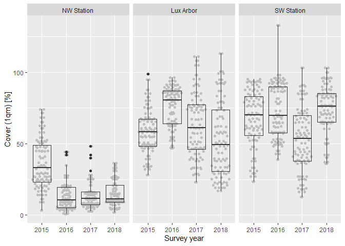<!-- -->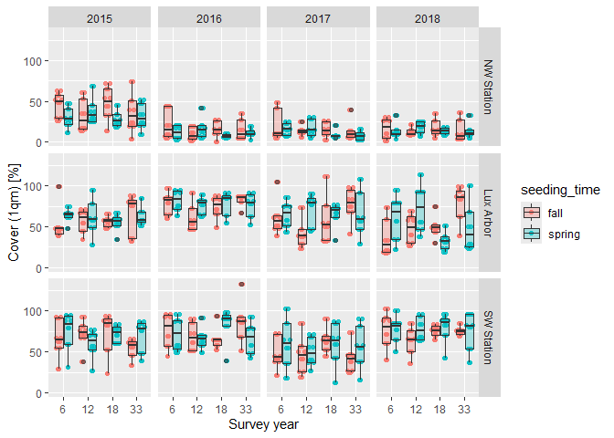<!-- -->

### Outliers, zero-inflation, transformations? (Step 1, 3, 4)

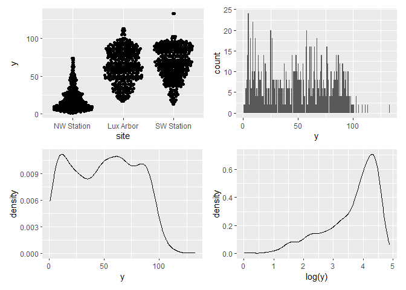<!-- -->

### Check collinearity part 1 (Step 5)

Exclude r \> 0.7 <br> Dormann et al. 2013 Ecography [DOI:
10.1111/j.1600-0587.2012.07348.x](https://doi.org/10.1111/j.1600-0587.2012.07348.x)

``` r
# sites %>%
#   select(where(is.numeric), -y, -starts_with("cwm.")) %>%
#   GGally::ggpairs(
#     lower = list(continuous = "smooth_loess")
#     ) +
#   theme(strip.text = element_text(size = 7))

# -> no continuous variables
```

## Models

> **NOTE:** Only here you have to modify the script to compare other
> models

``` r
load(file = here("outputs", "models", "model_cover_pool_full.Rdata"))
load(file = here("outputs", "models", "model_cover_pool_1.Rdata"))
m_1 <- m_full
m_2 <- m1
```

``` r
m_1@call
## lmer(formula = sqrt(y) ~ seeding_time * seeded_pool + (1 + year | 
##     site), data = sites)
m_2@call
## lmer(formula = sqrt(y) ~ seeding_time * seeded_pool * site + 
##     (1 | year), data = sites)
```

## Model check

### DHARMa

``` r
simulation_output_1 <- simulateResiduals(m_1, plot = TRUE)
```

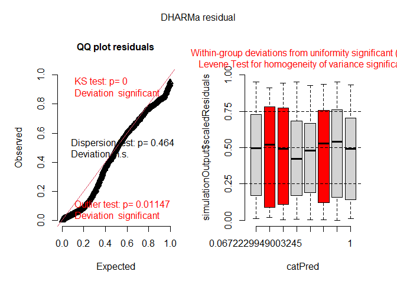<!-- -->

``` r
simulation_output_2 <- simulateResiduals(m_2, plot = TRUE)
```

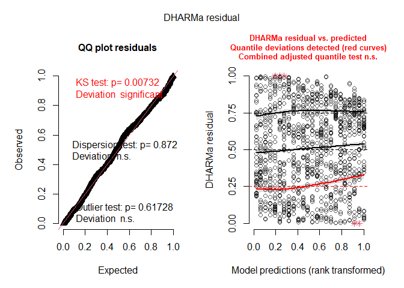<!-- -->

``` r
plotResiduals(simulation_output_1$scaledResiduals, sites$herbicide)
```

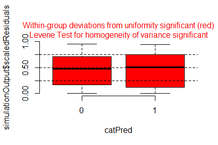<!-- -->

``` r
plotResiduals(simulation_output_2$scaledResiduals, sites$herbicide)
```

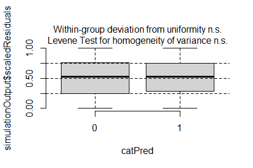<!-- -->

``` r
# plotResiduals(simulation_output_1$scaledResiduals, sites$seeded_pool)
# plotResiduals(simulation_output_2$scaledResiduals, sites$seeded_pool)
plotResiduals(simulation_output_1$scaledResiduals, sites$site)
```

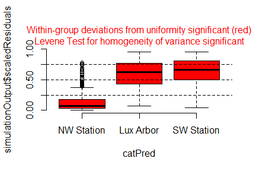<!-- -->

``` r
plotResiduals(simulation_output_2$scaledResiduals, sites$site)
```

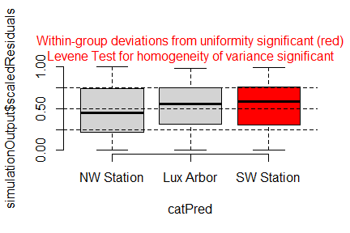<!-- -->

``` r
# plotResiduals(simulation_output_1$scaledResiduals, sites$year)
# plotResiduals(simulation_output_2$scaledResiduals, sites$year)
plotResiduals(simulation_output_1$scaledResiduals, sites$water_cap)
```

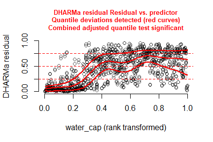<!-- -->

``` r
plotResiduals(simulation_output_2$scaledResiduals, sites$water_cap)
## Warning in newton(lsp = lsp, X = G$X, y = G$y, Eb = G$Eb, UrS = G$UrS, L = G$L,
## : Anpassung beendet mit Schrittweitenfehler - Ergebnisse sorgfältig prüfen
```

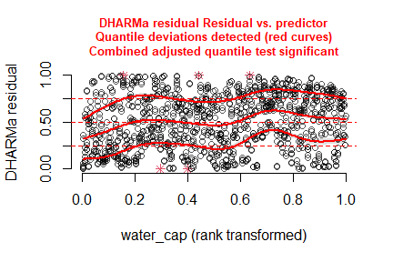<!-- -->

### Check collinearity part 2 (Step 5)

Remove VIF \> 3 or \> 10 <br> Zuur et al. 2010 Methods Ecol Evol [DOI:
10.1111/j.2041-210X.2009.00001.x](https://doi.org/10.1111/j.2041-210X.2009.00001.x)

``` r
car::vif(m_1)
```

    ##                              GVIF Df GVIF^(1/(2*Df))
    ## seeding_time             1.000019  1        1.000009
    ## seeded_pool              7.957905  3        1.412971
    ## seeding_time:seeded_pool 7.957980  3        1.412973

``` r
car::vif(m_2)
```

    ##                                      GVIF Df GVIF^(1/(2*Df))
    ## seeding_time                     2.994756  1        1.730536
    ## seeded_pool                    214.867342  3        2.447344
    ## site                             3.986017  2        1.412976
    ## seeding_time:seeded_pool       213.734685  3        2.445189
    ## seeding_time:site                7.958966  2        1.679632
    ## seeded_pool:site              1700.816219  6        1.858752
    ## seeding_time:seeded_pool:site 1691.919977  6        1.857940

## Model comparison

### <i>R</i><sup>2</sup> values

``` r
MuMIn::r.squaredGLMM(m_1)
##              R2m       R2c
## [1,] 0.007681094 0.7035598
MuMIn::r.squaredGLMM(m_2)
##            R2m      R2c
## [1,] 0.6018506 0.636374
```

### AICc

Use AICc and not AIC since ratio n/K \< 40 <br> Burnahm & Anderson 2002
p. 66 ISBN: 978-0-387-95364-9

``` r
MuMIn::AICc(m_1, m_2) %>%
  arrange(AICc)
##     df     AICc
## m_1 19 3986.058
## m_2 26 4163.772
```

## Predicted values

### Summary table

``` r
car::Anova(m_1, type = 3)
```

    ## Analysis of Deviance Table (Type III Wald chisquare tests)
    ## 
    ## Response: sqrt(y)
    ##                              Chisq Df Pr(>Chisq)    
    ## (Intercept)              2349.6107  1  < 2.2e-16 ***
    ## seeding_time                0.1049  1  0.7459850    
    ## seeded_pool                19.0801  3  0.0002632 ***
    ## seeding_time:seeded_pool   26.4726  3  7.593e-06 ***
    ## ---
    ## Signif. codes:  0 '***' 0.001 '**' 0.01 '*' 0.05 '.' 0.1 ' ' 1

``` r
summary(m_1)
```

    ## Linear mixed model fit by REML ['lmerMod']
    ## Formula: sqrt(y) ~ seeding_time * seeded_pool + (1 + year | site)
    ##    Data: sites
    ## 
    ## REML criterion at convergence: 3947.4
    ## 
    ## Scaled residuals: 
    ##     Min      1Q  Median      3Q     Max 
    ## -3.1108 -0.6799 -0.0079  0.7464  2.5024 
    ## 
    ## Random effects:
    ##  Groups   Name        Variance Std.Dev. Corr          
    ##  site     (Intercept) 0.9874   0.9937                 
    ##           year2016    2.2452   1.4984   0.91          
    ##           year2017    1.9666   1.4024   0.57 0.80     
    ##           year2018    1.6522   1.2854   0.83 0.80 0.77
    ##  Residual             1.7317   1.3160                 
    ## Number of obs: 1150, groups:  site, 3
    ## 
    ## Fixed effects:
    ##                                  Estimate Std. Error t value
    ## (Intercept)                       7.19102    0.14835  48.473
    ## seeding_timespring                0.02514    0.07761   0.324
    ## seeded_pool.L                     0.19845    0.10966   1.810
    ## seeded_pool.Q                     0.25798    0.10966   2.352
    ## seeded_pool.C                    -0.35146    0.10966  -3.205
    ## seeding_timespring:seeded_pool.L -0.48663    0.15533  -3.133
    ## seeding_timespring:seeded_pool.Q -0.29722    0.15522  -1.915
    ## seeding_timespring:seeded_pool.C  0.55896    0.15511   3.604
    ## 
    ## Correlation of Fixed Effects:
    ##             (Intr) sdng_t sdd_.L sdd_.Q sdd_.C s_:_.L s_:_.Q
    ## sdng_tmsprn -0.259                                          
    ## seeded_pl.L  0.000  0.000                                   
    ## seeded_pl.Q  0.000  0.000  0.000                            
    ## seeded_pl.C  0.000  0.000  0.000  0.000                     
    ## sdng_tm:_.L  0.003  0.002 -0.706  0.000  0.000              
    ## sdng_tm:_.Q  0.002  0.002  0.000 -0.706  0.000  0.002       
    ## sdng_tm:_.C  0.001  0.001  0.000  0.000 -0.707  0.001  0.001

### Forest plot

``` r
dotwhisker::dwplot(
  list(m_1, m_2),
  ci = 0.95,
  show_intercept = FALSE,
  vline = geom_vline(xintercept = 0, colour = "grey60", linetype = 2)) +
  theme_classic()
```

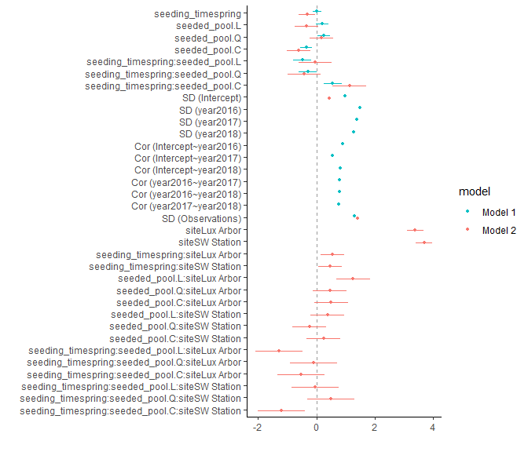<!-- -->

### Effect sizes

Effect sizes of chosen model just to get exact values of means etc. if
necessary.

#### ESY EUNIS Habitat type

``` r
(emm <- emmeans(
  m_1,
  revpairwise ~ seeding_time | seeded_pool,
  type = "response"
  ))
```

    ## $emmeans
    ## seeded_pool = 6:
    ##  seeding_time response   SE   df lower.CL upper.CL
    ##  fall             52.8 4.42 4.56     41.7     65.1
    ##  spring           53.9 4.47 4.56     42.7     66.4
    ## 
    ## seeded_pool = 12:
    ##  seeding_time response   SE   df lower.CL upper.CL
    ##  fall             46.0 4.13 4.56     35.7     57.6
    ##  spring           55.3 4.53 4.56     44.0     68.0
    ## 
    ## seeded_pool = 18:
    ##  seeding_time response   SE   df lower.CL upper.CL
    ##  fall             53.9 4.47 4.56     42.7     66.4
    ##  spring           49.5 4.28 4.56     38.8     61.4
    ## 
    ## seeded_pool = 33:
    ##  seeding_time response   SE   df lower.CL upper.CL
    ##  fall             54.4 4.49 4.56     43.2     66.9
    ##  spring           49.7 4.30 4.68     39.0     61.6
    ## 
    ## Degrees-of-freedom method: kenward-roger 
    ## Confidence level used: 0.95 
    ## Intervals are back-transformed from the sqrt scale 
    ## 
    ## $contrasts
    ## seeded_pool = 6:
    ##  contrast      estimate    SE   df t.ratio p.value
    ##  spring - fall    0.078 0.155 1131   0.503  0.6152
    ## 
    ## seeded_pool = 12:
    ##  contrast      estimate    SE   df t.ratio p.value
    ##  spring - fall    0.658 0.155 1131   4.240  <.0001
    ## 
    ## seeded_pool = 18:
    ##  contrast      estimate    SE   df t.ratio p.value
    ##  spring - fall   -0.310 0.155 1131  -1.999  0.0458
    ## 
    ## seeded_pool = 33:
    ##  contrast      estimate    SE   df t.ratio p.value
    ##  spring - fall   -0.325 0.156 1131  -2.087  0.0371
    ## 
    ## Note: contrasts are still on the sqrt scale. Consider using
    ##       regrid() if you want contrasts of back-transformed estimates. 
    ## Degrees-of-freedom method: kenward-roger

``` r
plot(emm, comparison = TRUE)
```

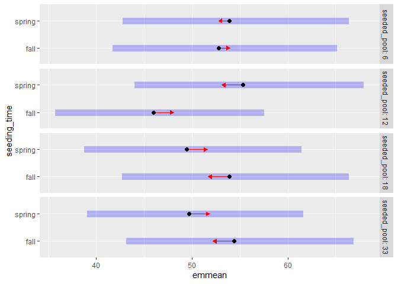<!-- -->

# Session info

    ## R version 4.5.0 (2025-04-11 ucrt)
    ## Platform: x86_64-w64-mingw32/x64
    ## Running under: Windows 11 x64 (build 26100)
    ## 
    ## Matrix products: default
    ##   LAPACK version 3.12.1
    ## 
    ## locale:
    ## [1] LC_COLLATE=German_Germany.utf8  LC_CTYPE=German_Germany.utf8   
    ## [3] LC_MONETARY=German_Germany.utf8 LC_NUMERIC=C                   
    ## [5] LC_TIME=German_Germany.utf8    
    ## 
    ## time zone: America/New_York
    ## tzcode source: internal
    ## 
    ## attached base packages:
    ## [1] stats     graphics  grDevices utils     datasets  methods   base     
    ## 
    ## other attached packages:
    ##  [1] emmeans_1.11.1   DHARMa_0.4.7     lme4_1.1-37      Matrix_1.7-3    
    ##  [5] patchwork_1.3.1  ggbeeswarm_0.7.2 lubridate_1.9.4  forcats_1.0.0   
    ##  [9] stringr_1.5.1    dplyr_1.1.4      purrr_1.1.0      readr_2.1.5     
    ## [13] tidyr_1.3.1      tibble_3.3.0     ggplot2_3.5.2    tidyverse_2.0.0 
    ## [17] here_1.0.1      
    ## 
    ## loaded via a namespace (and not attached):
    ##  [1] Rdpack_2.6.4           gridExtra_2.3          rlang_1.1.6           
    ##  [4] magrittr_2.0.3         compiler_4.5.0         mgcv_1.9-3            
    ##  [7] vctrs_0.6.5            pkgconfig_2.0.3        crayon_1.5.3          
    ## [10] fastmap_1.2.0          backports_1.5.0        labeling_0.4.3        
    ## [13] utf8_1.2.6             ggstance_0.3.7         promises_1.3.3        
    ## [16] rmarkdown_2.29         tzdb_0.5.0             nloptr_2.2.1          
    ## [19] bit_4.6.0              xfun_0.52              later_1.4.2           
    ## [22] broom_1.0.8            parallel_4.5.0         R6_2.6.1              
    ## [25] gap.datasets_0.0.6     stringi_1.8.7          qgam_2.0.0            
    ## [28] RColorBrewer_1.1-3     car_3.1-3              boot_1.3-31           
    ## [31] estimability_1.5.1     Rcpp_1.1.0             iterators_1.0.14      
    ## [34] knitr_1.50             parameters_0.27.0      httpuv_1.6.16         
    ## [37] splines_4.5.0          timechange_0.3.0       tidyselect_1.2.1      
    ## [40] rstudioapi_0.17.1      abind_1.4-8            yaml_2.3.10           
    ## [43] MuMIn_1.48.11          doParallel_1.0.17      codetools_0.2-20      
    ## [46] lattice_0.22-7         plyr_1.8.9             shiny_1.11.1          
    ## [49] withr_3.0.2            bayestestR_0.16.1      coda_0.19-4.1         
    ## [52] evaluate_1.0.4         marginaleffects_0.28.0 pillar_1.11.0         
    ## [55] gap_1.6                carData_3.0-5          foreach_1.5.2         
    ## [58] stats4_4.5.0           reformulas_0.4.1       insight_1.3.1         
    ## [61] generics_0.1.4         vroom_1.6.5            rprojroot_2.0.4       
    ## [64] hms_1.1.3              scales_1.4.0           minqa_1.2.8           
    ## [67] xtable_1.8-4           glue_1.8.0             tools_4.5.0           
    ## [70] data.table_1.17.8      mvtnorm_1.3-3          grid_4.5.0            
    ## [73] rbibutils_2.3          datawizard_1.1.0       nlme_3.1-168          
    ## [76] Rmisc_1.5.1            performance_0.15.0     beeswarm_0.4.0        
    ## [79] vipor_0.4.7            Formula_1.2-5          cli_3.6.5             
    ## [82] gtable_0.3.6           digest_0.6.37          pbkrtest_0.5.4        
    ## [85] farver_2.1.2           htmltools_0.5.8.1      lifecycle_1.0.4       
    ## [88] mime_0.13              bit64_4.6.0-1          dotwhisker_0.8.4      
    ## [91] MASS_7.3-65
