Analysis of XXX et al. (submitted) GREEEN project: <br> Effects of extra
herbicide treatment and seeding time on establishment of seeded species
================
<b>Markus Bauer</b> <br>
<b>2025-08-08</b>

- [Preparation](#preparation)
- [Statistics](#statistics)
  - [Data exploration](#data-exploration)
    - [Means and deviations](#means-and-deviations)
    - [Graphs of raw data (Step 2, 6,
      7)](#graphs-of-raw-data-step-2-6-7)
    - [Outliers, zero-inflation, transformations? (Step 1, 3,
      4)](#outliers-zero-inflation-transformations-step-1-3-4)
    - [Check collinearity part 1 (Step
      5)](#check-collinearity-part-1-step-5)
  - [Models](#models)
  - [Model check](#model-check)
    - [DHARMa](#dharma)
    - [Check collinearity part 2 (Step
      5)](#check-collinearity-part-2-step-5)
  - [Model comparison](#model-comparison)
    - [<i>R</i><sup>2</sup> values](#r2-values)
    - [AICc](#aicc)
  - [Predicted values](#predicted-values)
    - [Summary table](#summary-table)
    - [Forest plot](#forest-plot)
    - [Effect sizes](#effect-sizes)
- [Session info](#session-info)

<br/> <br/> <b>Markus Bauer</b>

Technichal University of Munich, TUM School of Life Sciences, Chair of
Restoration Ecology, Emil-Ramann-Straße 6, 85354 Freising, Germany

<markus1.bauer@tum.de>

ORCiD ID: [0000-0001-5372-4174](https://orcid.org/0000-0001-5372-4174)
<br> [Google
Scholar](https://scholar.google.de/citations?user=oHhmOkkAAAAJ&hl=de&oi=ao)
<br> GitHub: [markus1bauer](https://github.com/markus1bauer)

> **NOTE:** To compare different models, you only have to change the
> models in the section ‘Load models’

# Preparation

Protocol of data exploration (Steps 1-8) used from Zuur et al. (2010)
Methods Ecol Evol [DOI:
10.1111/2041-210X.12577](https://doi.org/10.1111/2041-210X.12577)

#### Packages

``` r
library(here)
library(tidyverse)
library(ggbeeswarm)
library(patchwork)
library(lme4)
library(DHARMa)
library(emmeans)
```

#### Load data

``` r
sites <- read_csv(
  here("data", "processed", "data_processed_sites.csv"),
  col_names = TRUE, na = c("na", "NA", ""), col_types = cols(
    .default = "?",
    id_plot_year = "f",
    id_plot = "f",
    site = col_factor(
      levels = c("NW Station", "Lux Arbor", "SW Station"), ordered = FALSE
    ),
    year = "f",
    seeding_time = col_factor(
      levels = c("unseeded", "fall", "spring"), ordered = FALSE
      ),
    herbicide = col_factor(levels = c("0", "1"), ordered = FALSE),
    seeded_pool = col_factor(
      levels = c("0", "6", "12", "18", "33"), ordered = TRUE
      ),
    treatment_id = "f",
    treatment_description = "c",
    richness_type = "f"
  )
) %>%
  filter(
    year %in% c("2015", "2016", "2017", "2018"),
    richness_type == "seeded_richness",
    treatment_id %in% c("1", "2", "3", "4")
  ) %>%
  mutate(
    treatment = str_c(seeding_time, herbicide, seeded_pool, sep = "_"),
    cover_total = cover_non_seeded + cover_seeded_grass + cover_seeded_forbs,
    non_seeded_ratio = cover_non_seeded / cover_total,
    y = cover_non_seeded
    ) %>%
  select(
    id_plot_year, id_plot, site, year, treatment, water_cap, seeded_pool,
    cover_non_seeded, cover_total, non_seeded_ratio, y
  )
```

# Statistics

## Data exploration

### Means and deviations

``` r
Rmisc::CI(sites$y, ci = .95)
```

    ##    upper     mean    lower 
    ## 53.40859 49.98188 46.55517

``` r
median(sites$y)
```

    ## [1] 51.5

``` r
sd(sites$y)
```

    ## [1] 29.49363

``` r
quantile(sites$y, probs = c(0.05, 0.95), na.rm = TRUE)
```

    ##    5%   95% 
    ##  5.06 94.91

``` r
sites %>% count(site, year)
```

    ## # A tibble: 12 × 3
    ##    site       year      n
    ##    <fct>      <fct> <int>
    ##  1 NW Station 2015     24
    ##  2 NW Station 2016     24
    ##  3 NW Station 2017     24
    ##  4 NW Station 2018     24
    ##  5 Lux Arbor  2015     23
    ##  6 Lux Arbor  2016     24
    ##  7 Lux Arbor  2017     24
    ##  8 Lux Arbor  2018     24
    ##  9 SW Station 2015     24
    ## 10 SW Station 2016     24
    ## 11 SW Station 2017     24
    ## 12 SW Station 2018     24

``` r
sites %>% count(seeded_pool)
```

    ## # A tibble: 2 × 2
    ##   seeded_pool     n
    ##   <ord>       <int>
    ## 1 0              72
    ## 2 33            215

``` r
sites %>% count(treatment)
```

    ## # A tibble: 4 × 2
    ##   treatment        n
    ##   <chr>        <int>
    ## 1 fall_0_33       72
    ## 2 spring_0_33     72
    ## 3 spring_1_33     71
    ## 4 unseeded_0_0    72

### Graphs of raw data (Step 2, 6, 7)

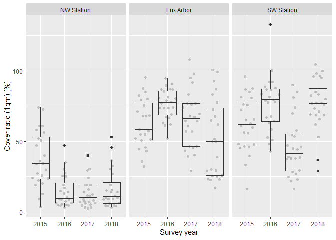<!-- -->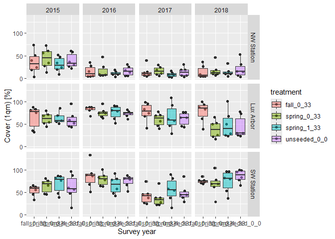<!-- -->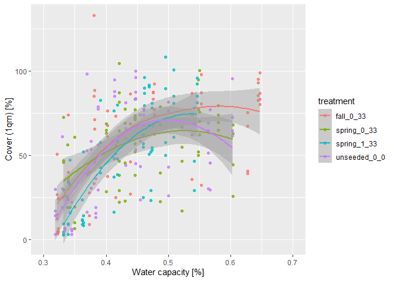<!-- -->

### Outliers, zero-inflation, transformations? (Step 1, 3, 4)

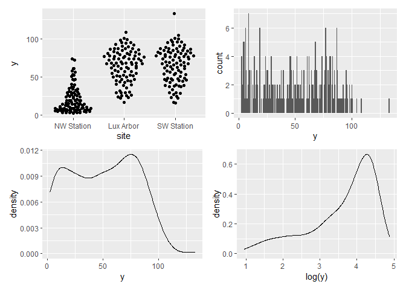<!-- -->

### Check collinearity part 1 (Step 5)

Exclude r \> 0.7 <br> Dormann et al. 2013 Ecography [DOI:
10.1111/j.1600-0587.2012.07348.x](https://doi.org/10.1111/j.1600-0587.2012.07348.x)

``` r
# sites %>%
#   select(where(is.numeric), -y, -starts_with("cwm.")) %>%
#   GGally::ggpairs(
#     lower = list(continuous = "smooth_loess")
#     ) +
#   theme(strip.text = element_text(size = 7))

# -> no continuous variables
```

## Models

> **NOTE:** Only here you have to modify the script to compare other
> models

``` r
load(file = here("outputs", "models", "model_cover_seeding_time_herbicide_full.Rdata"))
load(file = here("outputs", "models", "model_cover_seeding_time_herbicide_1.Rdata"))
m_1 <- m_full
m_2 <- m1
```

``` r
m_1@call
## lmer(formula = y ~ treatment + (1 | site) + (1 | year), data = sites)
m_2@call
## lmer(formula = sqrt(y) ~ treatment * site + (1 | year), data = sites)
```

## Model check

### DHARMa

``` r
simulation_output_1 <- simulateResiduals(m_1, plot = TRUE)
```

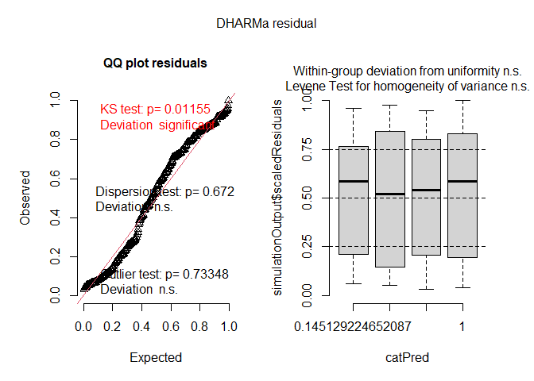<!-- -->

``` r
simulation_output_2 <- simulateResiduals(m_2, plot = TRUE)
```

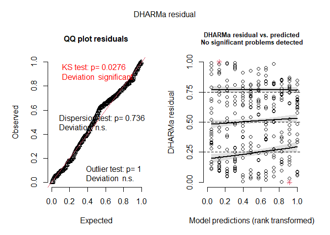<!-- -->

``` r
plotResiduals(simulation_output_1$scaledResiduals, sites$treatment)
## Warning in ensurePredictor(simulationOutput, form): DHARMa:::ensurePredictor:
## character string was provided as predictor. DHARMa has converted to factor
## automatically. To remove this warning, please convert to factor before
## attempting to plot with DHARMa.
```

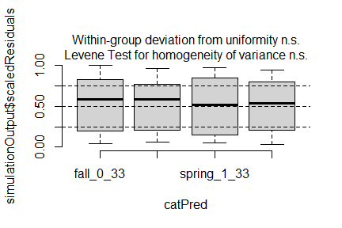<!-- -->

``` r
plotResiduals(simulation_output_2$scaledResiduals, sites$treatment)
## Warning in ensurePredictor(simulationOutput, form): DHARMa:::ensurePredictor:
## character string was provided as predictor. DHARMa has converted to factor
## automatically. To remove this warning, please convert to factor before
## attempting to plot with DHARMa.
```

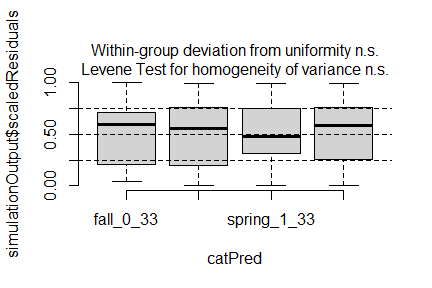<!-- -->

``` r
plotResiduals(simulation_output_1$scaledResiduals, sites$site)
```

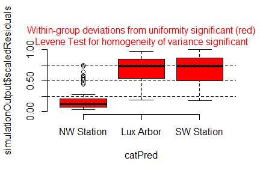<!-- -->

``` r
plotResiduals(simulation_output_2$scaledResiduals, sites$site)
```

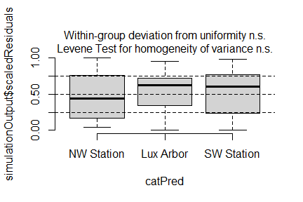<!-- -->

``` r
# plotResiduals(simulation_output_1$scaledResiduals, sites$year)
# plotResiduals(simulation_output_2$scaledResiduals, sites$year)
plotResiduals(simulation_output_1$scaledResiduals, sites$water_cap)
```

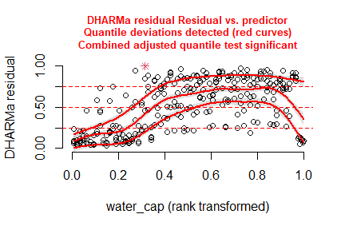<!-- -->

``` r
plotResiduals(simulation_output_2$scaledResiduals, sites$water_cap)
```

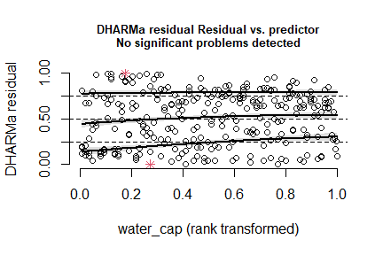<!-- -->

### Check collinearity part 2 (Step 5)

Remove VIF \> 3 or \> 10 <br> Zuur et al. 2010 Methods Ecol Evol [DOI:
10.1111/j.2041-210X.2009.00001.x](https://doi.org/10.1111/j.2041-210X.2009.00001.x)

``` r
# car::vif(m_1)
car::vif(m_2)
```

    ##                     GVIF Df GVIF^(1/(2*Df))
    ## treatment       26.71514  3        1.728992
    ## site            15.88746  2        1.996474
    ## treatment:site 212.20191  6        1.562773

## Model comparison

### <i>R</i><sup>2</sup> values

``` r
MuMIn::r.squaredGLMM(m_1)
##              R2m       R2c
## [1,] 0.003565545 0.6315446
MuMIn::r.squaredGLMM(m_2)
##            R2m       R2c
## [1,] 0.5585842 0.6001281
```

### AICc

Use AICc and not AIC since ratio n/K \< 40 <br> Burnahm & Anderson 2002
p. 66 ISBN: 978-0-387-95364-9

``` r
MuMIn::AICc(m_1, m_2) %>%
  arrange(AICc)
##     df     AICc
## m_2 14 1087.997
## m_1  7 2549.716
```

## Predicted values

### Summary table

``` r
car::Anova(m_2, type = 3)
```

    ## Analysis of Deviance Table (Type III Wald chisquare tests)
    ## 
    ## Response: sqrt(y)
    ##                   Chisq Df Pr(>Chisq)    
    ## (Intercept)    101.5944  1     <2e-16 ***
    ## treatment        4.0738  3     0.2536    
    ## site           125.5770  2     <2e-16 ***
    ## treatment:site  10.4249  6     0.1079    
    ## ---
    ## Signif. codes:  0 '***' 0.001 '**' 0.01 '*' 0.05 '.' 0.1 ' ' 1

``` r
summary(m_2)
```

    ## Linear mixed model fit by REML ['lmerMod']
    ## Formula: sqrt(y) ~ treatment * site + (1 | year)
    ##    Data: sites
    ## 
    ## REML criterion at convergence: 1058.5
    ## 
    ## Scaled residuals: 
    ##     Min      1Q  Median      3Q     Max 
    ## -2.9515 -0.7073  0.1190  0.6578  2.7179 
    ## 
    ## Random effects:
    ##  Groups   Name        Variance Std.Dev.
    ##  year     (Intercept) 0.2429   0.4928  
    ##  Residual             2.3379   1.5290  
    ## Number of obs: 287, groups:  year, 4
    ## 
    ## Fixed effects:
    ##                                      Estimate Std. Error t value
    ## (Intercept)                            4.0082     0.3977  10.079
    ## treatmentspring_0_33                   0.4928     0.4414   1.116
    ## treatmentspring_1_33                  -0.2994     0.4414  -0.678
    ## treatmentunseeded_0_0                  0.3845     0.4414   0.871
    ## siteLux Arbor                          4.5874     0.4414  10.393
    ## siteSW Station                         3.8955     0.4414   8.826
    ## treatmentspring_0_33:siteLux Arbor    -1.5433     0.6242  -2.472
    ## treatmentspring_1_33:siteLux Arbor    -0.4672     0.6276  -0.744
    ## treatmentunseeded_0_0:siteLux Arbor   -1.3823     0.6242  -2.214
    ## treatmentspring_0_33:siteSW Station   -0.6673     0.6242  -1.069
    ## treatmentspring_1_33:siteSW Station    0.4246     0.6242   0.680
    ## treatmentunseeded_0_0:siteSW Station  -0.1822     0.6242  -0.292
    ## 
    ## Correlation of Fixed Effects:
    ##             (Intr) t_0_33 t_1_33 tr_0_0 stLxAr stSWSt t_0_3A t_1_3A t_0_0A
    ## trtmnt_0_33 -0.555                                                        
    ## trtmnt_1_33 -0.555  0.500                                                 
    ## trtmntn_0_0 -0.555  0.500  0.500                                          
    ## siteLuxArbr -0.555  0.500  0.500  0.500                                   
    ## siteSWStatn -0.555  0.500  0.500  0.500  0.500                            
    ## trt_0_33:LA  0.392 -0.707 -0.354 -0.354 -0.707 -0.354                     
    ## trt_1_33:LA  0.390 -0.352 -0.703 -0.352 -0.703 -0.352  0.497              
    ## trtm_0_0:LA  0.392 -0.354 -0.354 -0.707 -0.707 -0.354  0.500  0.497       
    ## tr_0_33:SWS  0.392 -0.707 -0.354 -0.354 -0.354 -0.707  0.500  0.249  0.250
    ## tr_1_33:SWS  0.392 -0.354 -0.707 -0.354 -0.354 -0.707  0.250  0.497  0.250
    ## trt_0_0:SWS  0.392 -0.354 -0.354 -0.707 -0.354 -0.707  0.250  0.249  0.500
    ##             t_0_3S t_1_3S
    ## trtmnt_0_33              
    ## trtmnt_1_33              
    ## trtmntn_0_0              
    ## siteLuxArbr              
    ## siteSWStatn              
    ## trt_0_33:LA              
    ## trt_1_33:LA              
    ## trtm_0_0:LA              
    ## tr_0_33:SWS              
    ## tr_1_33:SWS  0.500       
    ## trt_0_0:SWS  0.500  0.500

### Forest plot

``` r
dotwhisker::dwplot(
  list(m_1, m_2),
  ci = 0.95,
  show_intercept = FALSE,
  vline = geom_vline(xintercept = 0, colour = "grey60", linetype = 2)) +
  theme_classic()
```

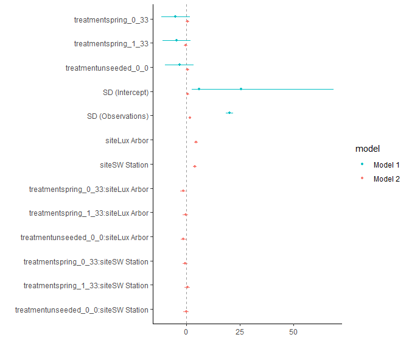<!-- -->

### Effect sizes

Effect sizes of chosen model just to get exact values of means etc. if
necessary.

``` r
(emm <- emmeans(
  m_2,
  revpairwise ~ treatment | site,
  type = "response"
  ))
```

    ## $emmeans
    ## site = NW Station:
    ##  treatment    response   SE   df lower.CL upper.CL
    ##  fall_0_33        16.1 3.19 15.5     10.0     23.6
    ##  spring_0_33      20.3 3.58 15.5     13.4     28.6
    ##  spring_1_33      13.8 2.95 15.5      8.2     20.7
    ##  unseeded_0_0     19.3 3.49 15.5     12.6     27.4
    ## 
    ## site = Lux Arbor:
    ##  treatment    response   SE   df lower.CL upper.CL
    ##  fall_0_33        73.9 6.84 15.5     60.1     89.1
    ##  spring_0_33      56.9 6.00 15.5     44.9     70.4
    ##  spring_1_33      61.3 6.31 16.4     48.7     75.4
    ##  unseeded_0_0     57.7 6.04 15.5     45.6     71.3
    ## 
    ## site = SW Station:
    ##  treatment    response   SE   df lower.CL upper.CL
    ##  fall_0_33        62.5 6.29 15.5     49.8     76.5
    ##  spring_0_33      59.7 6.15 15.5     47.4     73.5
    ##  spring_1_33      64.5 6.39 15.5     51.6     78.7
    ##  unseeded_0_0     65.7 6.45 15.5     52.7     80.1
    ## 
    ## Degrees-of-freedom method: kenward-roger 
    ## Confidence level used: 0.95 
    ## Intervals are back-transformed from the sqrt scale 
    ## 
    ## $contrasts
    ## site = NW Station:
    ##  contrast                   estimate    SE  df t.ratio p.value
    ##  spring_0_33 - fall_0_33      0.4928 0.441 272   1.116  0.6798
    ##  spring_1_33 - fall_0_33     -0.2994 0.441 272  -0.678  0.9053
    ##  spring_1_33 - spring_0_33   -0.7922 0.441 272  -1.795  0.2781
    ##  unseeded_0_0 - fall_0_33     0.3845 0.441 272   0.871  0.8197
    ##  unseeded_0_0 - spring_0_33  -0.1082 0.441 272  -0.245  0.9948
    ##  unseeded_0_0 - spring_1_33   0.6839 0.441 272   1.550  0.4095
    ## 
    ## site = Lux Arbor:
    ##  contrast                   estimate    SE  df t.ratio p.value
    ##  spring_0_33 - fall_0_33     -1.0505 0.441 272  -2.380  0.0834
    ##  spring_1_33 - fall_0_33     -0.7666 0.446 272  -1.718  0.3162
    ##  spring_1_33 - spring_0_33    0.2839 0.446 272   0.636  0.9203
    ##  unseeded_0_0 - fall_0_33    -0.9977 0.441 272  -2.260  0.1100
    ##  unseeded_0_0 - spring_0_33   0.0528 0.441 272   0.120  0.9994
    ##  unseeded_0_0 - spring_1_33  -0.2311 0.446 272  -0.518  0.9548
    ## 
    ## site = SW Station:
    ##  contrast                   estimate    SE  df t.ratio p.value
    ##  spring_0_33 - fall_0_33     -0.1745 0.441 272  -0.395  0.9790
    ##  spring_1_33 - fall_0_33      0.1252 0.441 272   0.284  0.9920
    ##  spring_1_33 - spring_0_33    0.2997 0.441 272   0.679  0.9050
    ##  unseeded_0_0 - fall_0_33     0.2023 0.441 272   0.458  0.9680
    ##  unseeded_0_0 - spring_0_33   0.3768 0.441 272   0.854  0.8286
    ##  unseeded_0_0 - spring_1_33   0.0771 0.441 272   0.175  0.9981
    ## 
    ## Note: contrasts are still on the sqrt scale. Consider using
    ##       regrid() if you want contrasts of back-transformed estimates. 
    ## Degrees-of-freedom method: kenward-roger 
    ## P value adjustment: tukey method for comparing a family of 4 estimates

``` r
plot(emm, comparison = TRUE)
```

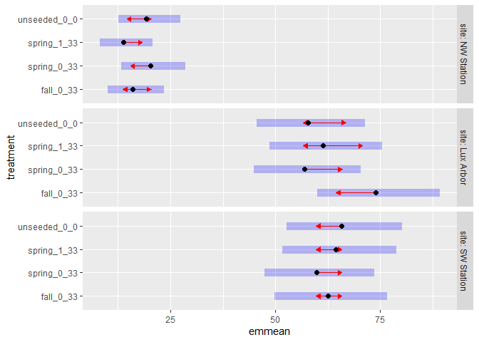<!-- -->

# Session info

    ## R version 4.5.0 (2025-04-11 ucrt)
    ## Platform: x86_64-w64-mingw32/x64
    ## Running under: Windows 11 x64 (build 26100)
    ## 
    ## Matrix products: default
    ##   LAPACK version 3.12.1
    ## 
    ## locale:
    ## [1] LC_COLLATE=German_Germany.utf8  LC_CTYPE=German_Germany.utf8   
    ## [3] LC_MONETARY=German_Germany.utf8 LC_NUMERIC=C                   
    ## [5] LC_TIME=German_Germany.utf8    
    ## 
    ## time zone: America/New_York
    ## tzcode source: internal
    ## 
    ## attached base packages:
    ## [1] stats     graphics  grDevices utils     datasets  methods   base     
    ## 
    ## other attached packages:
    ##  [1] emmeans_1.11.1   DHARMa_0.4.7     lme4_1.1-37      Matrix_1.7-3    
    ##  [5] patchwork_1.3.1  ggbeeswarm_0.7.2 lubridate_1.9.4  forcats_1.0.0   
    ##  [9] stringr_1.5.1    dplyr_1.1.4      purrr_1.1.0      readr_2.1.5     
    ## [13] tidyr_1.3.1      tibble_3.3.0     ggplot2_3.5.2    tidyverse_2.0.0 
    ## [17] here_1.0.1      
    ## 
    ## loaded via a namespace (and not attached):
    ##   [1] mnormt_2.1.1           Rdpack_2.6.4           gridExtra_2.3         
    ##   [4] sandwich_3.1-1         rlang_1.1.6            magrittr_2.0.3        
    ##   [7] compiler_4.5.0         mgcv_1.9-3             vctrs_0.6.5           
    ##  [10] quadprog_1.5-8         pkgconfig_2.0.3        crayon_1.5.3          
    ##  [13] fastmap_1.2.0          backports_1.5.0        labeling_0.4.3        
    ##  [16] pbivnorm_0.6.0         utf8_1.2.6             ggstance_0.3.7        
    ##  [19] promises_1.3.3         rmarkdown_2.29         tzdb_0.5.0            
    ##  [22] nloptr_2.2.1           bit_4.6.0              xfun_0.52             
    ##  [25] later_1.4.2            broom_1.0.8            lavaan_0.6-19         
    ##  [28] parallel_4.5.0         R6_2.6.1               gap.datasets_0.0.6    
    ##  [31] stringi_1.8.7          qgam_2.0.0             RColorBrewer_1.1-3    
    ##  [34] car_3.1-3              boot_1.3-31            numDeriv_2016.8-1.1   
    ##  [37] estimability_1.5.1     Rcpp_1.1.0             iterators_1.0.14      
    ##  [40] knitr_1.50             zoo_1.8-14             parameters_0.27.0     
    ##  [43] httpuv_1.6.16          splines_4.5.0          timechange_0.3.0      
    ##  [46] tidyselect_1.2.1       rstudioapi_0.17.1      abind_1.4-8           
    ##  [49] yaml_2.3.10            MuMIn_1.48.11          doParallel_1.0.17     
    ##  [52] codetools_0.2-20       nonnest2_0.5-8         lattice_0.22-7        
    ##  [55] plyr_1.8.9             shiny_1.11.1           withr_3.0.2           
    ##  [58] bayestestR_0.16.1      coda_0.19-4.1          evaluate_1.0.4        
    ##  [61] marginaleffects_0.28.0 CompQuadForm_1.4.4     pillar_1.11.0         
    ##  [64] gap_1.6                carData_3.0-5          foreach_1.5.2         
    ##  [67] stats4_4.5.0           reformulas_0.4.1       insight_1.3.1         
    ##  [70] generics_0.1.4         vroom_1.6.5            rprojroot_2.0.4       
    ##  [73] hms_1.1.3              scales_1.4.0           minqa_1.2.8           
    ##  [76] xtable_1.8-4           glue_1.8.0             tools_4.5.0           
    ##  [79] data.table_1.17.8      mvtnorm_1.3-3          grid_4.5.0            
    ##  [82] rbibutils_2.3          datawizard_1.1.0       nlme_3.1-168          
    ##  [85] Rmisc_1.5.1            performance_0.15.0     beeswarm_0.4.0        
    ##  [88] vipor_0.4.7            Formula_1.2-5          cli_3.6.5             
    ##  [91] gtable_0.3.6           digest_0.6.37          pbkrtest_0.5.4        
    ##  [94] farver_2.1.2           htmltools_0.5.8.1      lifecycle_1.0.4       
    ##  [97] mime_0.13              bit64_4.6.0-1          dotwhisker_0.8.4      
    ## [100] MASS_7.3-65
