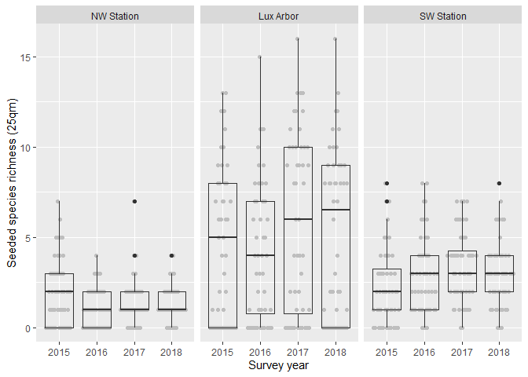
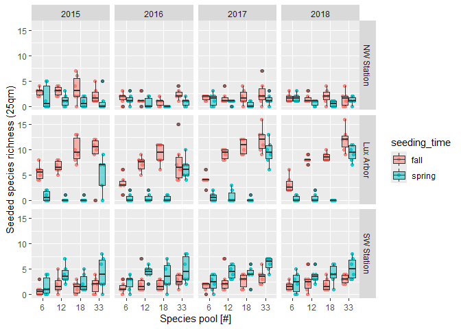
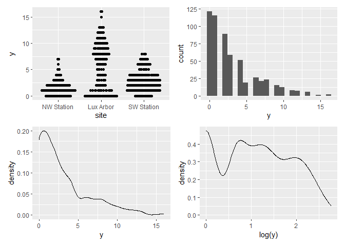
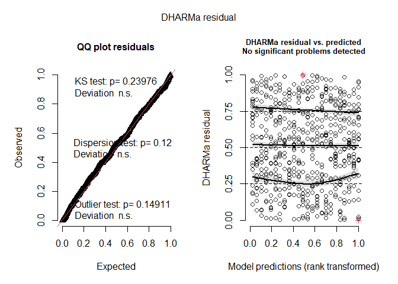
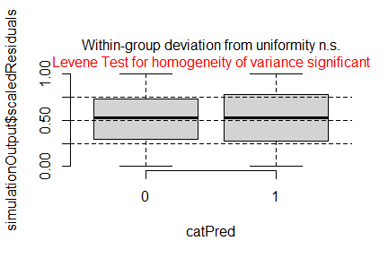
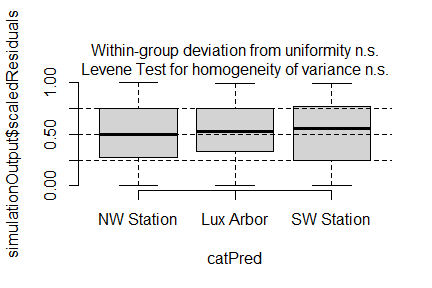
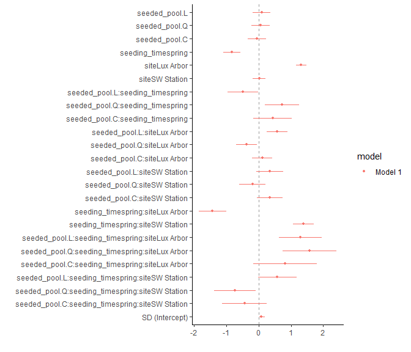
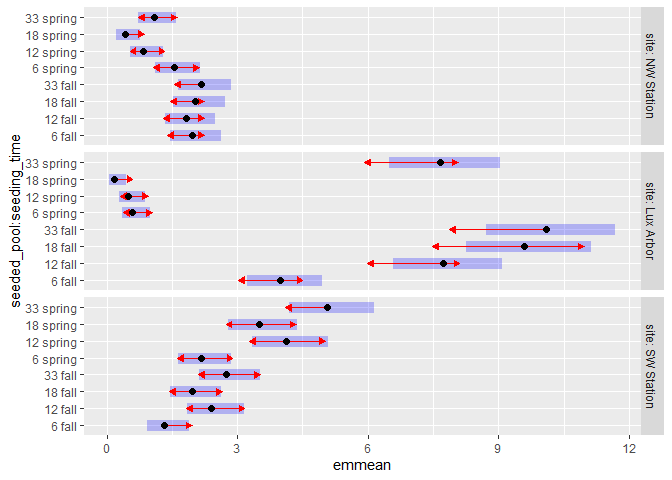

Analysis of XXX et al. (submitted) GREEEN project: <br> Effects of
species pool size and seeding approach on establishment of seeded
species
================
<b>Markus Bauer</b> <br>
<b>2025-07-17</b>

- [Preparation](#preparation)
- [Statistics](#statistics)
  - [Data exploration](#data-exploration)
    - [Means and deviations](#means-and-deviations)
    - [Graphs of raw data (Step 2, 6,
      7)](#graphs-of-raw-data-step-2-6-7)
    - [Outliers, zero-inflation, transformations? (Step 1, 3,
      4)](#outliers-zero-inflation-transformations-step-1-3-4)
    - [Check collinearity part 1 (Step
      5)](#check-collinearity-part-1-step-5)
  - [Models](#models)
  - [Model check](#model-check)
    - [DHARMa](#dharma)
    - [Check collinearity part 2 (Step
      5)](#check-collinearity-part-2-step-5)
  - [Model comparison](#model-comparison)
    - [<i>R</i><sup>2</sup> values](#r2-values)
    - [AICc](#aicc)
  - [Predicted values](#predicted-values)
    - [Summary table](#summary-table)
    - [Forest plot](#forest-plot)
    - [Effect sizes](#effect-sizes)
- [Session info](#session-info)

<br/> <br/> <b>Markus Bauer</b>

Technichal University of Munich, TUM School of Life Sciences, Chair of
Restoration Ecology, Emil-Ramann-Straße 6, 85354 Freising, Germany

<markus1.bauer@tum.de>

ORCiD ID: [0000-0001-5372-4174](https://orcid.org/0000-0001-5372-4174)
<br> [Google
Scholar](https://scholar.google.de/citations?user=oHhmOkkAAAAJ&hl=de&oi=ao)
<br> GitHub: [markus1bauer](https://github.com/markus1bauer)

> **NOTE:** To compare different models, you only have to change the
> models in the section ‘Load models’

# Preparation

Protocol of data exploration (Steps 1-8) used from Zuur et al. (2010)
Methods Ecol Evol [DOI:
10.1111/2041-210X.12577](https://doi.org/10.1111/2041-210X.12577)

#### Packages

``` r
library(here)
library(tidyverse)
library(ggbeeswarm)
library(patchwork)
library(lme4)
library(DHARMa)
library(emmeans)
```

#### Load data

``` r
sites <- read_csv(
  here("data", "processed", "data_processed_sites.csv"),
  col_names = TRUE, na = c("na", "NA", ""), col_types = cols(
    .default = "?",
    id_plot_year = "f",
    id_plot = "f",
    site = col_factor(
      levels = c("NW Station", "Lux Arbor", "SW Station"), ordered = FALSE
    ),
    year = "f",
    seeding_time = col_factor(
      levels = c("unseeded", "fall", "spring"), ordered = FALSE
      ),
    herbicide = col_factor(levels = c("0", "1"), ordered = FALSE),
    seeded_pool = col_factor(
      levels = c("0", "6", "12", "18", "33"), ordered = TRUE
      ),
    treatment_id = "f",
    treatment_description = "c",
    richness_type = "f"
  )
) %>%
  filter(
    year %in% c("2015", "2016", "2017", "2018"),
    richness_type == "seeded_richness",
    !(treatment_id %in% c("2", "4"))
  ) %>%
  select(
    id_plot_year, id_plot, site, year, herbicide, seeding_time, seeded_pool,
    richness_1qm, richness_25qm, treatment_id
    ) %>%
  mutate(y = richness_1qm + richness_25qm)
```

# Statistics

## Data exploration

### Means and deviations

``` r
Rmisc::CI(sites$y, ci = .95)
```

    ##    upper     mean    lower 
    ## 3.413263 3.144348 2.875432

``` r
median(sites$y)
```

    ## [1] 2

``` r
sd(sites$y)
```

    ## [1] 3.283105

``` r
quantile(sites$y, probs = c(0.05, 0.95), na.rm = TRUE)
```

    ##  5% 95% 
    ##   0  10

``` r
sites %>% count(site, year)
```

    ## # A tibble: 12 × 3
    ##    site       year      n
    ##    <fct>      <fct> <int>
    ##  1 NW Station 2015     48
    ##  2 NW Station 2016     48
    ##  3 NW Station 2017     48
    ##  4 NW Station 2018     48
    ##  5 Lux Arbor  2015     47
    ##  6 Lux Arbor  2016     48
    ##  7 Lux Arbor  2017     48
    ##  8 Lux Arbor  2018     48
    ##  9 SW Station 2015     48
    ## 10 SW Station 2016     48
    ## 11 SW Station 2017     48
    ## 12 SW Station 2018     48

``` r
sites %>% count(seeded_pool)
```

    ## # A tibble: 4 × 2
    ##   seeded_pool     n
    ##   <ord>       <int>
    ## 1 6             144
    ## 2 12            144
    ## 3 18            144
    ## 4 33            143

``` r
sites %>% count(seeding_time)
```

    ## # A tibble: 2 × 2
    ##   seeding_time     n
    ##   <fct>        <int>
    ## 1 fall           288
    ## 2 spring         287

``` r
sites %>% count(herbicide)
```

    ## # A tibble: 2 × 2
    ##   herbicide     n
    ##   <fct>     <int>
    ## 1 0           288
    ## 2 1           287

### Graphs of raw data (Step 2, 6, 7)

<!-- --><!-- -->

### Outliers, zero-inflation, transformations? (Step 1, 3, 4)

<!-- -->

### Check collinearity part 1 (Step 5)

Exclude r \> 0.7 <br> Dormann et al. 2013 Ecography [DOI:
10.1111/j.1600-0587.2012.07348.x](https://doi.org/10.1111/j.1600-0587.2012.07348.x)

``` r
# sites %>%
#   select(where(is.numeric), -y, -starts_with("cwm.")) %>%
#   GGally::ggpairs(
#     lower = list(continuous = "smooth_loess")
#     ) +
#   theme(strip.text = element_text(size = 7))

# -> no continuous variables
```

## Models

> **NOTE:** Only here you have to modify the script to compare other
> models

``` r
load(file = here("outputs", "models", "model_pool_full.Rdata"))
#load(file = here("outputs", "models", "model_sla_esy4_3.Rdata"))
m_1 <- m_full
#m_2 <- m3
```

``` r
m_1@call
## glmer(formula = y ~ seeded_pool * seeding_time * site + (1 | 
##     year), data = sites, family = poisson(link = "log"))
# m_2@call
```

## Model check

### DHARMa

``` r
simulation_output_1 <- simulateResiduals(m_1, plot = TRUE)
```

<!-- -->

``` r
# simulation_output_2 <- simulateResiduals(m_2, plot = TRUE)
```

``` r
plotResiduals(simulation_output_1$scaledResiduals, sites$herbicide)
```

<!-- -->

``` r
# plotResiduals(simulation_output_2$scaledResiduals, sites$herbicide)
# plotResiduals(simulation_output_1$scaledResiduals, sites$seeding_time)
# plotResiduals(simulation_output_2$scaledResiduals, sites$seeding_time)
plotResiduals(simulation_output_1$scaledResiduals, sites$site)
```

<!-- -->

``` r
# plotResiduals(simulation_output_2$scaledResiduals, sites$site)
# plotResiduals(simulation_output_1$scaledResiduals, sites$year)
# plotResiduals(simulation_output_2$scaledResiduals, sites$year)
```

### Check collinearity part 2 (Step 5)

Remove VIF \> 3 or \> 10 <br> Zuur et al. 2010 Methods Ecol Evol [DOI:
10.1111/j.2041-210X.2009.00001.x](https://doi.org/10.1111/j.2041-210X.2009.00001.x)

``` r
car::vif(m_1)
```

    ##                                       GVIF Df GVIF^(1/(2*Df))
    ## seeded_pool                     684.297869  3        2.968526
    ## seeding_time                      7.818934  1        2.796236
    ## site                              3.715018  2        1.388322
    ## seeded_pool:seeding_time       1115.992733  3        3.220650
    ## seeded_pool:site               7545.219663  6        2.104453
    ## seeding_time:site                45.386826  2        2.595568
    ## seeded_pool:seeding_time:site 11004.219499  6        2.171684

``` r
# car::vif(m_2)
```

## Model comparison

### <i>R</i><sup>2</sup> values

``` r
MuMIn::r.squaredGLMM(m_1)
## Warning: the null model is only correct if all the variables it uses are identical 
## to those used in fitting the original model.
##                 R2m       R2c
## delta     0.7594719 0.7637810
## lognormal 0.7838639 0.7883113
## trigamma  0.7292288 0.7333663
# MuMIn::r.squaredGLMM(m_2)
```

### AICc

Use AICc and not AIC since ratio n/K \< 40 <br> Burnahm & Anderson 2002
p. 66 ISBN: 978-0-387-95364-9

``` r
# MuMIn::AICc(m_1, m_2) %>%
#   arrange(AICc)
```

## Predicted values

### Summary table

``` r
car::Anova(m_1, type = 3)
```

    ## Analysis of Deviance Table (Type III Wald chisquare tests)
    ## 
    ## Response: y
    ##                                  Chisq Df Pr(>Chisq)    
    ## (Intercept)                    70.9528  1  < 2.2e-16 ***
    ## seeded_pool                     0.7081  3   0.871288    
    ## seeding_time                   36.6505  1  1.413e-09 ***
    ## site                          408.3261  2  < 2.2e-16 ***
    ## seeded_pool:seeding_time       11.0611  3   0.011400 *  
    ## seeded_pool:site               20.0294  6   0.002736 ** 
    ## seeding_time:site             241.7279  2  < 2.2e-16 ***
    ## seeded_pool:seeding_time:site  92.2767  6  < 2.2e-16 ***
    ## ---
    ## Signif. codes:  0 '***' 0.001 '**' 0.01 '*' 0.05 '.' 0.1 ' ' 1

``` r
summary(m_1)
```

    ## Generalized linear mixed model fit by maximum likelihood (Laplace
    ##   Approximation) [glmerMod]
    ##  Family: poisson  ( log )
    ## Formula: y ~ seeded_pool * seeding_time * site + (1 | year)
    ##    Data: sites
    ## 
    ##       AIC       BIC    logLik -2*log(L)  df.resid 
    ##    2005.6    2114.4    -977.8    1955.6       550 
    ## 
    ## Scaled residuals: 
    ##     Min      1Q  Median      3Q     Max 
    ## -3.1312 -0.6977 -0.1619  0.5951  3.8578 
    ## 
    ## Random effects:
    ##  Groups Name        Variance Std.Dev.
    ##  year   (Intercept) 0.005802 0.07617 
    ## Number of obs: 575, groups:  year, 4
    ## 
    ## Fixed effects:
    ##                                                 Estimate Std. Error z value
    ## (Intercept)                                      0.68839    0.08172   8.423
    ## seeded_pool.L                                    0.09194    0.14273   0.644
    ## seeded_pool.Q                                    0.06268    0.14456   0.434
    ## seeded_pool.C                                   -0.04958    0.14637  -0.339
    ## seeding_timespring                              -0.82753    0.13669  -6.054
    ## siteLux Arbor                                    1.31204    0.08209  15.983
    ## siteSW Station                                   0.02216    0.10261   0.216
    ## seeded_pool.L:seeding_timespring                -0.48369    0.23941  -2.020
    ## seeded_pool.Q:seeding_timespring                 0.72264    0.27338   2.643
    ## seeded_pool.C:seeding_timespring                 0.43564    0.30356   1.435
    ## seeded_pool.L:siteLux Arbor                      0.57950    0.16551   3.501
    ## seeded_pool.Q:siteLux Arbor                     -0.36804    0.16417  -2.242
    ## seeded_pool.C:siteLux Arbor                      0.11190    0.16283   0.687
    ## seeded_pool.L:siteSW Station                     0.34659    0.20776   1.668
    ## seeded_pool.Q:siteSW Station                    -0.19025    0.20522  -0.927
    ## seeded_pool.C:siteSW Station                     0.35252    0.20264   1.740
    ## seeding_timespring:siteLux Arbor                -1.42193    0.21408  -6.642
    ## seeding_timespring:siteSW Station                1.38130    0.16455   8.394
    ## seeded_pool.L:seeding_timespring:siteLux Arbor   1.29613    0.34008   3.811
    ## seeded_pool.Q:seeding_timespring:siteLux Arbor   1.57529    0.42815   3.679
    ## seeded_pool.C:seeding_timespring:siteLux Arbor   0.81550    0.50098   1.628
    ## seeded_pool.L:seeding_timespring:siteSW Station  0.58051    0.30585   1.898
    ## seeded_pool.Q:seeding_timespring:siteSW Station -0.73041    0.32909  -2.219
    ## seeded_pool.C:seeding_timespring:siteSW Station -0.43766    0.35080  -1.248
    ##                                                 Pr(>|z|)    
    ## (Intercept)                                      < 2e-16 ***
    ## seeded_pool.L                                   0.519479    
    ## seeded_pool.Q                                   0.664587    
    ## seeded_pool.C                                   0.734791    
    ## seeding_timespring                              1.41e-09 ***
    ## siteLux Arbor                                    < 2e-16 ***
    ## siteSW Station                                  0.829032    
    ## seeded_pool.L:seeding_timespring                0.043351 *  
    ## seeded_pool.Q:seeding_timespring                0.008208 ** 
    ## seeded_pool.C:seeding_timespring                0.151258    
    ## seeded_pool.L:siteLux Arbor                     0.000463 ***
    ## seeded_pool.Q:siteLux Arbor                     0.024978 *  
    ## seeded_pool.C:siteLux Arbor                     0.491956    
    ## seeded_pool.L:siteSW Station                    0.095268 .  
    ## seeded_pool.Q:siteSW Station                    0.353889    
    ## seeded_pool.C:siteSW Station                    0.081929 .  
    ## seeding_timespring:siteLux Arbor                3.10e-11 ***
    ## seeding_timespring:siteSW Station                < 2e-16 ***
    ## seeded_pool.L:seeding_timespring:siteLux Arbor  0.000138 ***
    ## seeded_pool.Q:seeding_timespring:siteLux Arbor  0.000234 ***
    ## seeded_pool.C:seeding_timespring:siteLux Arbor  0.103566    
    ## seeded_pool.L:seeding_timespring:siteSW Station 0.057695 .  
    ## seeded_pool.Q:seeding_timespring:siteSW Station 0.026453 *  
    ## seeded_pool.C:seeding_timespring:siteSW Station 0.212171    
    ## ---
    ## Signif. codes:  0 '***' 0.001 '**' 0.01 '*' 0.05 '.' 0.1 ' ' 1

    ## 
    ## Correlation matrix not shown by default, as p = 24 > 12.
    ## Use print(x, correlation=TRUE)  or
    ##     vcov(x)        if you need it

### Forest plot

``` r
dotwhisker::dwplot(
  list(m_1),
  ci = 0.95,
  show_intercept = FALSE,
  vline = geom_vline(xintercept = 0, colour = "grey60", linetype = 2)) +
  theme_classic()
```

<!-- -->

### Effect sizes

Effect sizes of chosen model just to get exact values of means etc. if
necessary.

#### ESY EUNIS Habitat type

``` r
(emm <- emmeans(
  m_1,
  revpairwise ~ seeded_pool * seeding_time | site,
  type = "response"
  ))
```

    ## $emmeans
    ## site = NW Station:
    ##  seeded_pool seeding_time   rate     SE  df asymp.LCL asymp.UCL
    ##  6           fall          1.953 0.2940 Inf    1.4531     2.624
    ##  12          fall          1.828 0.2840 Inf    1.3479     2.479
    ##  18          fall          2.036 0.3010 Inf    1.5237     2.720
    ##  33          fall          2.160 0.3110 Inf    1.6299     2.864
    ##  6           spring        1.537 0.2590 Inf    1.1044     2.140
    ##  12          spring        0.831 0.1880 Inf    0.5328     1.296
    ##  18          spring        0.415 0.1320 Inf    0.2226     0.775
    ##  33          spring        1.080 0.2160 Inf    0.7302     1.598
    ## 
    ## site = Lux Arbor:
    ##  seeded_pool seeding_time   rate     SE  df asymp.LCL asymp.UCL
    ##  6           fall          3.988 0.4340 Inf    3.2217     4.938
    ##  12          fall          7.727 0.6390 Inf    6.5721     9.086
    ##  18          fall          9.597 0.7300 Inf    8.2683    11.139
    ##  33          fall         10.096 0.7530 Inf    8.7222    11.686
    ##  6           spring        0.582 0.1570 Inf    0.3427     0.987
    ##  12          spring        0.499 0.1450 Inf    0.2818     0.882
    ##  18          spring        0.166 0.0833 Inf    0.0622     0.444
    ##  33          spring        7.663 0.6460 Inf    6.4959     9.039
    ## 
    ## site = SW Station:
    ##  seeded_pool seeding_time   rate     SE  df asymp.LCL asymp.UCL
    ##  6           fall          1.330 0.2400 Inf    0.9329     1.895
    ##  12          fall          2.410 0.3290 Inf    1.8433     3.150
    ##  18          fall          1.953 0.2940 Inf    1.4532     2.624
    ##  33          fall          2.742 0.3530 Inf    2.1301     3.530
    ##  6           spring        2.160 0.3110 Inf    1.6297     2.864
    ##  12          spring        4.113 0.4420 Inf    3.3318     5.077
    ##  18          spring        3.490 0.4030 Inf    2.7826     4.377
    ##  33          spring        5.069 0.4980 Inf    4.1811     6.145
    ## 
    ## Confidence level used: 0.95 
    ## Intervals are back-transformed from the log scale 
    ## 
    ## $contrasts
    ## site = NW Station:
    ##  contrast                                      ratio       SE  df null z.ratio
    ##  seeded_pool12 fall / seeded_pool6 fall       0.9362  0.19600 Inf    1  -0.314
    ##  seeded_pool18 fall / seeded_pool6 fall       1.0426  0.21300 Inf    1   0.204
    ##  seeded_pool18 fall / seeded_pool12 fall      1.1137  0.23100 Inf    1   0.518
    ##  seeded_pool33 fall / seeded_pool6 fall       1.1065  0.22300 Inf    1   0.503
    ##  seeded_pool33 fall / seeded_pool12 fall      1.1819  0.24200 Inf    1   0.816
    ##  seeded_pool33 fall / seeded_pool18 fall      1.0613  0.21100 Inf    1   0.299
    ##  seeded_pool6 spring / seeded_pool6 fall      0.7873  0.17300 Inf    1  -1.088
    ##  seeded_pool6 spring / seeded_pool12 fall     0.8409  0.18800 Inf    1  -0.777
    ##  seeded_pool6 spring / seeded_pool18 fall     0.7551  0.16400 Inf    1  -1.290
    ##  seeded_pool6 spring / seeded_pool33 fall     0.7115  0.15300 Inf    1  -1.583
    ##  seeded_pool12 spring / seeded_pool6 fall     0.4255  0.11400 Inf    1  -3.201
    ##  seeded_pool12 spring / seeded_pool12 fall    0.4546  0.12300 Inf    1  -2.925
    ##  seeded_pool12 spring / seeded_pool18 fall    0.4082  0.10800 Inf    1  -3.378
    ##  seeded_pool12 spring / seeded_pool33 fall    0.3846  0.10100 Inf    1  -3.633
    ##  seeded_pool12 spring / seeded_pool6 spring   0.5405  0.15000 Inf    1  -2.217
    ##  seeded_pool18 spring / seeded_pool6 fall     0.2128  0.07410 Inf    1  -4.445
    ##  seeded_pool18 spring / seeded_pool12 fall    0.2273  0.07960 Inf    1  -4.231
    ##  seeded_pool18 spring / seeded_pool18 fall    0.2041  0.07080 Inf    1  -4.581
    ##  seeded_pool18 spring / seeded_pool33 fall    0.1923  0.06640 Inf    1  -4.776
    ##  seeded_pool18 spring / seeded_pool6 spring   0.2703  0.09630 Inf    1  -3.672
    ##  seeded_pool18 spring / seeded_pool12 spring  0.5000  0.19400 Inf    1  -1.790
    ##  seeded_pool33 spring / seeded_pool6 fall     0.5532  0.13500 Inf    1  -2.423
    ##  seeded_pool33 spring / seeded_pool12 fall    0.5909  0.14600 Inf    1  -2.128
    ##  seeded_pool33 spring / seeded_pool18 fall    0.5306  0.12900 Inf    1  -2.613
    ##  seeded_pool33 spring / seeded_pool33 fall    0.4999  0.12000 Inf    1  -2.887
    ##  seeded_pool33 spring / seeded_pool6 spring   0.7026  0.18000 Inf    1  -1.380
    ##  seeded_pool33 spring / seeded_pool12 spring  1.2999  0.38700 Inf    1   0.882
    ##  seeded_pool33 spring / seeded_pool18 spring  2.5998  0.96700 Inf    1   2.568
    ##  p.value
    ##   1.0000
    ##   1.0000
    ##   0.9996
    ##   0.9997
    ##   0.9923
    ##   1.0000
    ##   0.9594
    ##   0.9943
    ##   0.9029
    ##   0.7608
    ##   0.0298
    ##   0.0678
    ##   0.0167
    ##   0.0068
    ##   0.3411
    ##   0.0002
    ##   0.0006
    ##   0.0001
    ##   <.0001
    ##   0.0059
    ##   0.6268
    ##   0.2300
    ##   0.3968
    ##   0.1511
    ##   0.0751
    ##   0.8668
    ##   0.9877
    ##   0.1675
    ## 
    ## site = Lux Arbor:
    ##  contrast                                      ratio       SE  df null z.ratio
    ##  seeded_pool12 fall / seeded_pool6 fall       1.9374  0.24300 Inf    1   5.264
    ##  seeded_pool18 fall / seeded_pool6 fall       2.4062  0.29200 Inf    1   7.233
    ##  seeded_pool18 fall / seeded_pool12 fall      1.2419  0.12200 Inf    1   2.200
    ##  seeded_pool33 fall / seeded_pool6 fall       2.5312  0.30500 Inf    1   7.706
    ##  seeded_pool33 fall / seeded_pool12 fall      1.3065  0.12700 Inf    1   2.745
    ##  seeded_pool33 fall / seeded_pool18 fall      1.0520  0.09660 Inf    1   0.551
    ##  seeded_pool6 spring / seeded_pool6 fall      0.1458  0.04170 Inf    1  -6.732
    ##  seeded_pool6 spring / seeded_pool12 fall     0.0753  0.02090 Inf    1  -9.336
    ##  seeded_pool6 spring / seeded_pool18 fall     0.0606  0.01670 Inf    1 -10.188
    ##  seeded_pool6 spring / seeded_pool33 fall     0.0576  0.01580 Inf    1 -10.387
    ##  seeded_pool12 spring / seeded_pool6 fall     0.1250  0.03830 Inf    1  -6.794
    ##  seeded_pool12 spring / seeded_pool12 fall    0.0645  0.01920 Inf    1  -9.205
    ##  seeded_pool12 spring / seeded_pool18 fall    0.0520  0.01540 Inf    1  -9.992
    ##  seeded_pool12 spring / seeded_pool33 fall    0.0494  0.01460 Inf    1 -10.176
    ##  seeded_pool12 spring / seeded_pool6 spring   0.8571  0.33700 Inf    1  -0.392
    ##  seeded_pool18 spring / seeded_pool6 fall     0.0417  0.02130 Inf    1  -6.230
    ##  seeded_pool18 spring / seeded_pool12 fall    0.0215  0.01090 Inf    1  -7.600
    ##  seeded_pool18 spring / seeded_pool18 fall    0.0173  0.00873 Inf    1  -8.046
    ##  seeded_pool18 spring / seeded_pool33 fall    0.0165  0.00830 Inf    1  -8.150
    ##  seeded_pool18 spring / seeded_pool6 spring   0.2857  0.16200 Inf    1  -2.210
    ##  seeded_pool18 spring / seeded_pool12 spring  0.3333  0.19200 Inf    1  -1.903
    ##  seeded_pool33 spring / seeded_pool6 fall     1.9213  0.24300 Inf    1   5.153
    ##  seeded_pool33 spring / seeded_pool12 fall    0.9916  0.10400 Inf    1  -0.080
    ##  seeded_pool33 spring / seeded_pool18 fall    0.7985  0.07970 Inf    1  -2.253
    ##  seeded_pool33 spring / seeded_pool33 fall    0.7590  0.07500 Inf    1  -2.791
    ##  seeded_pool33 spring / seeded_pool6 spring  13.1740  3.66000 Inf    1   9.289
    ##  seeded_pool33 spring / seeded_pool12 spring 15.3699  4.58000 Inf    1   9.163
    ##  seeded_pool33 spring / seeded_pool18 spring 46.1077 23.30000 Inf    1   7.579
    ##  p.value
    ##   <.0001
    ##   <.0001
    ##   0.3515
    ##   <.0001
    ##   0.1094
    ##   0.9994
    ##   <.0001
    ##   <.0001
    ##   <.0001
    ##   <.0001
    ##   <.0001
    ##   <.0001
    ##   <.0001
    ##   <.0001
    ##   0.9999
    ##   <.0001
    ##   <.0001
    ##   <.0001
    ##   <.0001
    ##   0.3453
    ##   0.5485
    ##   <.0001
    ##   1.0000
    ##   0.3198
    ##   0.0972
    ##   <.0001
    ##   <.0001
    ##   <.0001
    ## 
    ## site = SW Station:
    ##  contrast                                      ratio       SE  df null z.ratio
    ##  seeded_pool12 fall / seeded_pool6 fall       1.8124  0.39900 Inf    1   2.701
    ##  seeded_pool18 fall / seeded_pool6 fall       1.4686  0.33600 Inf    1   1.677
    ##  seeded_pool18 fall / seeded_pool12 fall      0.8103  0.15900 Inf    1  -1.072
    ##  seeded_pool33 fall / seeded_pool6 fall       2.0623  0.44400 Inf    1   3.361
    ##  seeded_pool33 fall / seeded_pool12 fall      1.1379  0.20500 Inf    1   0.718
    ##  seeded_pool33 fall / seeded_pool18 fall      1.4042  0.26800 Inf    1   1.779
    ##  seeded_pool6 spring / seeded_pool6 fall      1.6248  0.36500 Inf    1   2.161
    ##  seeded_pool6 spring / seeded_pool12 fall     0.8965  0.17100 Inf    1  -0.572
    ##  seeded_pool6 spring / seeded_pool18 fall     1.1063  0.22300 Inf    1   0.502
    ##  seeded_pool6 spring / seeded_pool33 fall     0.7879  0.14600 Inf    1  -1.286
    ##  seeded_pool12 spring / seeded_pool6 fall     3.0935  0.62900 Inf    1   5.555
    ##  seeded_pool12 spring / seeded_pool12 fall    1.7069  0.28200 Inf    1   3.234
    ##  seeded_pool12 spring / seeded_pool18 fall    2.1064  0.37300 Inf    1   4.207
    ##  seeded_pool12 spring / seeded_pool33 fall    1.5000  0.23800 Inf    1   2.552
    ##  seeded_pool12 spring / seeded_pool6 spring   1.9039  0.32600 Inf    1   3.761
    ##  seeded_pool18 spring / seeded_pool6 fall     2.6248  0.54500 Inf    1   4.647
    ##  seeded_pool18 spring / seeded_pool12 fall    1.4483  0.24700 Inf    1   2.170
    ##  seeded_pool18 spring / seeded_pool18 fall    1.7872  0.32500 Inf    1   3.189
    ##  seeded_pool18 spring / seeded_pool33 fall    1.2727  0.20900 Inf    1   1.467
    ##  seeded_pool18 spring / seeded_pool6 spring   1.6154  0.28500 Inf    1   2.719
    ##  seeded_pool18 spring / seeded_pool12 spring  0.8485  0.12600 Inf    1  -1.108
    ##  seeded_pool33 spring / seeded_pool6 fall     3.8123  0.75700 Inf    1   6.740
    ##  seeded_pool33 spring / seeded_pool12 fall    2.1035  0.33500 Inf    1   4.664
    ##  seeded_pool33 spring / seeded_pool18 fall    2.5958  0.44600 Inf    1   5.558
    ##  seeded_pool33 spring / seeded_pool33 fall    1.8485  0.28200 Inf    1   4.022
    ##  seeded_pool33 spring / seeded_pool6 spring   2.3463  0.38800 Inf    1   5.151
    ##  seeded_pool33 spring / seeded_pool12 spring  1.2323  0.16700 Inf    1   1.545
    ##  seeded_pool33 spring / seeded_pool18 spring  1.4524  0.20600 Inf    1   2.633
    ##  p.value
    ##   0.1221
    ##   0.7020
    ##   0.9626
    ##   0.0177
    ##   0.9965
    ##   0.6343
    ##   0.3757
    ##   0.9992
    ##   0.9997
    ##   0.9042
    ##   <.0001
    ##   0.0268
    ##   0.0007
    ##   0.1738
    ##   0.0042
    ##   0.0001
    ##   0.3701
    ##   0.0310
    ##   0.8253
    ##   0.1168
    ##   0.9553
    ##   <.0001
    ##   0.0001
    ##   <.0001
    ##   0.0015
    ##   <.0001
    ##   0.7829
    ##   0.1440
    ## 
    ## P value adjustment: tukey method for comparing a family of 8 estimates 
    ## Tests are performed on the log scale

``` r
plot(emm, comparison = TRUE)
```

<!-- -->

# Session info

    ## R version 4.5.0 (2025-04-11 ucrt)
    ## Platform: x86_64-w64-mingw32/x64
    ## Running under: Windows 11 x64 (build 26100)
    ## 
    ## Matrix products: default
    ##   LAPACK version 3.12.1
    ## 
    ## locale:
    ## [1] LC_COLLATE=German_Germany.utf8  LC_CTYPE=German_Germany.utf8   
    ## [3] LC_MONETARY=German_Germany.utf8 LC_NUMERIC=C                   
    ## [5] LC_TIME=German_Germany.utf8    
    ## 
    ## time zone: America/New_York
    ## tzcode source: internal
    ## 
    ## attached base packages:
    ## [1] stats     graphics  grDevices utils     datasets  methods   base     
    ## 
    ## other attached packages:
    ##  [1] emmeans_1.11.1   DHARMa_0.4.7     lme4_1.1-37      Matrix_1.7-3    
    ##  [5] patchwork_1.3.1  ggbeeswarm_0.7.2 lubridate_1.9.4  forcats_1.0.0   
    ##  [9] stringr_1.5.1    dplyr_1.1.4      purrr_1.1.0      readr_2.1.5     
    ## [13] tidyr_1.3.1      tibble_3.3.0     ggplot2_3.5.2    tidyverse_2.0.0 
    ## [17] here_1.0.1      
    ## 
    ## loaded via a namespace (and not attached):
    ##  [1] mnormt_2.1.1           Rdpack_2.6.4           gridExtra_2.3         
    ##  [4] sandwich_3.1-1         rlang_1.1.6            magrittr_2.0.3        
    ##  [7] compiler_4.5.0         mgcv_1.9-3             vctrs_0.6.5           
    ## [10] quadprog_1.5-8         pkgconfig_2.0.3        crayon_1.5.3          
    ## [13] fastmap_1.2.0          backports_1.5.0        labeling_0.4.3        
    ## [16] pbivnorm_0.6.0         utf8_1.2.6             ggstance_0.3.7        
    ## [19] promises_1.3.3         rmarkdown_2.29         tzdb_0.5.0            
    ## [22] nloptr_2.2.1           bit_4.6.0              xfun_0.52             
    ## [25] later_1.4.2            lavaan_0.6-19          parallel_4.5.0        
    ## [28] R6_2.6.1               gap.datasets_0.0.6     stringi_1.8.7         
    ## [31] qgam_2.0.0             RColorBrewer_1.1-3     car_3.1-3             
    ## [34] boot_1.3-31            numDeriv_2016.8-1.1    estimability_1.5.1    
    ## [37] Rcpp_1.1.0             iterators_1.0.14       knitr_1.50            
    ## [40] zoo_1.8-14             parameters_0.27.0      httpuv_1.6.16         
    ## [43] splines_4.5.0          timechange_0.3.0       tidyselect_1.2.1      
    ## [46] rstudioapi_0.17.1      abind_1.4-8            yaml_2.3.10           
    ## [49] MuMIn_1.48.11          doParallel_1.0.17      codetools_0.2-20      
    ## [52] nonnest2_0.5-8         lattice_0.22-7         plyr_1.8.9            
    ## [55] shiny_1.11.1           withr_3.0.2            bayestestR_0.16.1     
    ## [58] coda_0.19-4.1          evaluate_1.0.4         marginaleffects_0.28.0
    ## [61] CompQuadForm_1.4.4     pillar_1.11.0          gap_1.6               
    ## [64] carData_3.0-5          foreach_1.5.2          stats4_4.5.0          
    ## [67] reformulas_0.4.1       insight_1.3.1          generics_0.1.4        
    ## [70] vroom_1.6.5            rprojroot_2.0.4        hms_1.1.3             
    ## [73] scales_1.4.0           minqa_1.2.8            xtable_1.8-4          
    ## [76] glue_1.8.0             tools_4.5.0            data.table_1.17.8     
    ## [79] mvtnorm_1.3-3          grid_4.5.0             rbibutils_2.3         
    ## [82] datawizard_1.1.0       nlme_3.1-168           Rmisc_1.5.1           
    ## [85] performance_0.15.0     beeswarm_0.4.0         vipor_0.4.7           
    ## [88] Formula_1.2-5          cli_3.6.5              gtable_0.3.6          
    ## [91] digest_0.6.37          farver_2.1.2           htmltools_0.5.8.1     
    ## [94] lifecycle_1.0.4        mime_0.13              bit64_4.6.0-1         
    ## [97] dotwhisker_0.8.4       MASS_7.3-65
